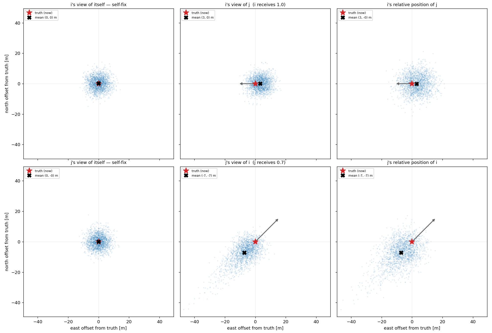
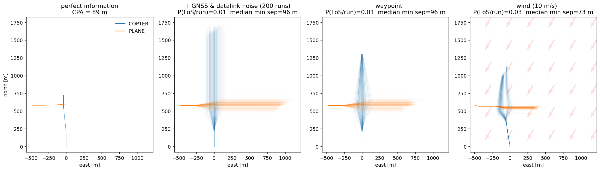

# OpenCDaRR

OpenCDaRR evaluates the safety and efficiency of **conflict detection, resolution, and recovery**
(CDaRR) algorithms under **communication, navigation, and surveillance (CNS) uncertainty**, for air
traffic management (ATM) and uncrewed traffic management (UTM) applications. Write your CDaRR
algorithm, get your CDaRR performance.

Separation standards are held to a target level of safety on the order of 10⁻⁹ per flight hour.
Plain Monte Carlo needs on the order of 10¹¹ runs to resolve a probability that small, so this
platform ships the pieces needed to actually run that test: a **kinematics** model, a **separation
manager** framework, an environment with **CNS** uncertainty and **wind**, and a **rare-event
simulation** that reaches the tail with far fewer runs.

The scope is deliberately narrow: a few aircraft in one encounter, run thousands of times. For
**air traffic simulation at airspace scale**, with real navaid, airport and route data, whole-day
traffic scenarios, ATC-style scenario commands, a live GUI, and a mature plugin ecosystem, please
visit [BlueSky](https://github.com/TUDelft-CNS-ATM/bluesky).

The user-facing handbook, covering installation, how the loop works, a first run, and every
swappable module, lives at **[opencdarr.github.io](https://opencdarr.github.io)**.

> Status: **pre-release, in active development.** The CDaRR stack, the CNS layer, wind, and the
> rare-event estimator all run, but the API is not frozen. See [`docs/roadmap.md`](docs/roadmap.md)
> for the milestone trajectory and [`vault/`](vault/) for the decisions behind it.

## Overview



Separation algorithms act on what CNS delivers, never on the ground truth, and what an aircraft
perceives about itself is not what the intruder perceives about it. That gap, **asymmetric
situational awareness**, is what measurement noise and a missed or late broadcast add up to: two
aircraft in the same encounter, neither seeing the other where it is, nor seeing it the same way
the other does. A resolver evaluated on ground truth never meets that gap, so modelling it is the
point of this platform.



The same crossing, a multirotor heading north and a fixed-wing spawned straight into conflict, run
four times, each panel adding a layer. **Perfect information:** one deterministic run, `MVP`
resolves and `PastCPA` recovers, closest point of approach (CPA) 89 m. **GNSS and datalink noise:**
200 noise realisations, intrusion prevention rate (IPR) 0.99 at a median CPA of 96 m. **Waypoint:**
the multirotor re-intercepts its mission after avoiding, closing the spread at the same IPR.
**Wind:** a steady 10 m/s (arrows point downwind) crabs both tracks and drops the IPR to 0.96, with
the median CPA down to 73 m. All four panels share one set of axis limits, so the spread between
them is the spread the model produces.

Both figures come out of the shipped models. Regenerate the second with:

```bash
PYTHONPATH=. python scripts/readme_overview.py     # -> docs/img/overview.png
```

The notebook that walks through those four steps one cell at a time is
[`examples/handbook/a_first_run.ipynb`](examples/handbook/a_first_run.ipynb); the CNS chain behind
the first is at [opencdarr.github.io](https://opencdarr.github.io) under *Modules → CNS*.

## Install

Using conda (recommended):

```bash
conda create -n opencdarr python=3.11
conda activate opencdarr
pip install -e ".[dev]"
```

Or using venv:

```bash
python -m venv .venv && source .venv/bin/activate
pip install -e ".[dev]"
```

## Test

```bash
pytest        # run the test suite — 426 tests, green
mypy          # type-check (strict; type hints everywhere)
ruff check    # lint
```

`pytest` is the gate that passes. `mypy` and `ruff` are aimed at the whole tree rather than at
shipping code alone, so both currently report findings — 94% of them in `scripts/` and the example
notebooks, which [`docs/design-philosophy.md`](docs/design-philosophy.md) #12 deliberately holds to
speed rather than rigor. Scoping the two tools to that same split is a post-freeze task; see
[`vault/TODO.md`](vault/TODO.md).

## Documentation

If you want to *use* OpenCDaRR, read the handbook:
**[opencdarr.github.io](https://opencdarr.github.io)**. It covers installation, one full simulation
step, a first run, and a page per swappable module (kinematics, autopilot, conflict detection /
resolution / recovery, CNS, wind, rare events). Runnable notebooks for the same material are in
[`examples/`](examples/).

If you want to *extend* it, the **why / what / how** live in [`docs/`](docs/); the linked knowledge
vault lives in [`vault/`](vault/).

- [`docs/design_brief.md`](docs/design_brief.md): **what** to build (goal and architecture). A
  historical record of the intent the project started from, not a description of the code as built.
- [`docs/design-philosophy.md`](docs/design-philosophy.md): **how** to write it (the standards;
  the tiebreaker).
- [`docs/how-to-step-by-step.md`](docs/how-to-step-by-step.md): the **build order** and the process
  for each step, as it was followed.
- [`docs/roadmap.md`](docs/roadmap.md): the milestone trajectory (v0.1 to v1.0).
- [`docs/fixedwing-vs-bluesky.md`](docs/fixedwing-vs-bluesky.md): the fixed-wing equations of
  motion, compared term by term against
  [BlueSky](https://github.com/TUDelft-CNS-ATM/bluesky)'s.
- [`docs/lesson-learnt.md`](docs/lesson-learnt.md): **why** the project is built this way.

`vault/` is the contributor-facing knowledge base: decisions (architecture decision records, ADRs),
derivations, and observations. The architecture as built is in
[`vault/architecture-dataflow.md`](vault/architecture-dataflow.md). Reference papers are kept out of
git, and experiment provenance cards are written at run time rather than committed.

## License

[MIT](LICENSE).
