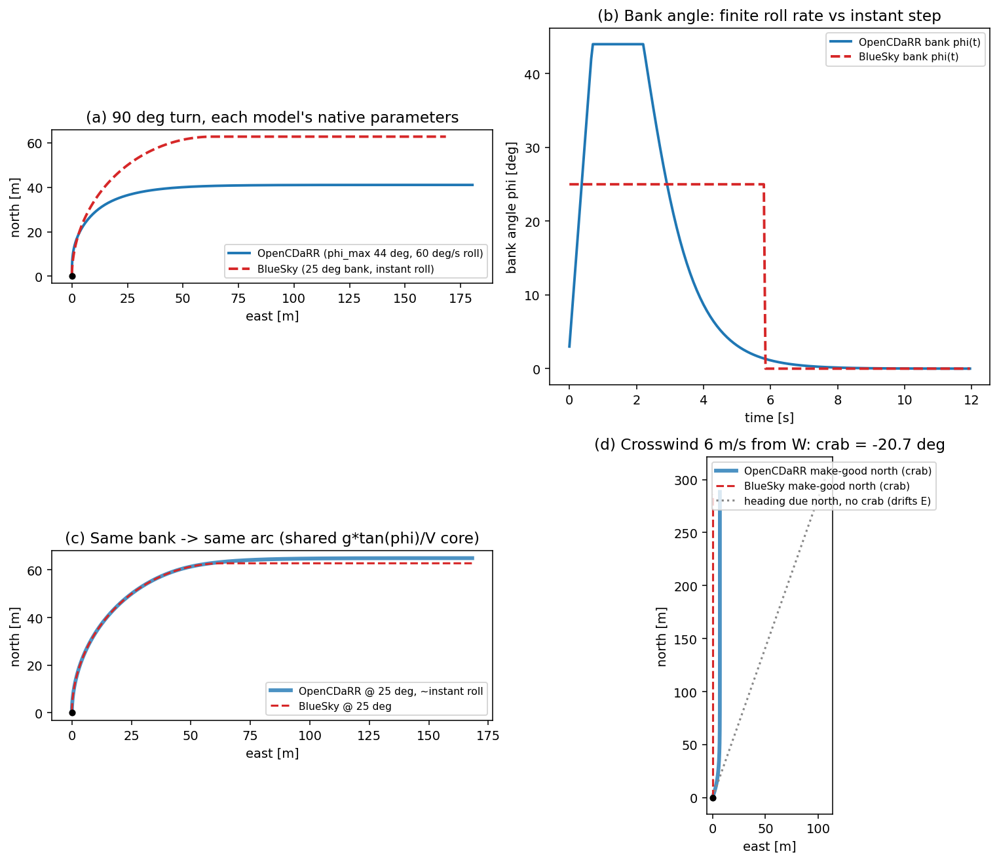

# Fixed-wing kinematics: OpenCDaRR vs BlueSky

How does OpenCDaRR's fixed-wing model differ from [BlueSky](https://github.com/TUDelft-CNS-ATM/bluesky)'s,
what equations of motion does each integrate, and how does wind enter them? This note answers those
three questions and backs the comparison with both a real headless BlueSky run and a
parameter-matched numerical experiment.

Sources read for this comparison:

- **OpenCDaRR** — [`opencdarr/kinematics/fixedwing.py`](../opencdarr/kinematics/fixedwing.py),
  [`opencdarr/relative.py`](../opencdarr/relative.py), [`opencdarr/wind.py`](../opencdarr/wind.py),
  and the derivation [`vault/derivations/fixedwing-coordinated-turn.md`](../vault/derivations/fixedwing-coordinated-turn.md).
- **BlueSky** — the fork the `cdarr` conda env runs, `~/Projects/bluesky`:
  `bluesky/traffic/traffic.py` (`update_airspeed`, `update_groundspeed`, `update_pos`),
  `bluesky/traffic/autopilot.py`, and `bluesky/traffic/aporasas.py` (the wind-crab step).

## TL;DR

Both models are **2D horizontal point masses whose lateral channel is the same coordinated turn**,
`ψ̇ = g·tan φ / V_TAS`, and both build ground velocity as the **same wind-triangle vector sum**,
`V_ground = V_air(ψ) + wind`. Their crab law under wind is *algebraically identical* — I verified
this against a live BlueSky run (both give a −20.67° crab for the same case). So the physics *core*
is shared.

They differ in how the bank angle is produced and limited, and in the software around the integrator:

| | OpenCDaRR `FixedWing` | BlueSky (stock fixed-wing) |
|---|---|---|
| Lateral EOM | `ψ̇ = g·tan φ / V` | `ψ̇ = g·tan φ / V` (identical) |
| Bank angle φ | **Variable**, proportional to heading error, capped by `phi_max` (44°) | **Fixed** at `bankdef` = 25° (or an FMS turn-specific bank), applied at full value |
| Roll kinematics | **Finite roll rate** (`roll_rate_max` = 60°/s); `bank` is a state variable that ramps | **Instantaneous** — no roll state; bank is 25° or 0°, switched immediately |
| Stall-in-turn | Bank tightened by the load factor, `φ ≤ arccos[(V_s/V)²]` | None |
| Airspeed | Bang-bang ramp at `ax` toward commanded EAS, clamped to `[v_min, v_max]` | Bang-bang ramp at `axmax` toward commanded TAS, then `perf.limits` (OpenAP/BADA envelope) |
| Wind → ground vel | `V_ground = V_air(ψ) + wind` (Eq 9) | Same, but only applied when airborne (alt > 50 ft) |
| Wind → crab | `ψ = χ + arcsin[(V_w/V)·sin(θ_wa − χ)]`, clamped to ±90° | `hdg = trk + arcsin[clip(V_w·sin(trk − winddir)/V, −1, 1)]` — same law |
| Lateral guidance | L1 path-follower (nulls cross-track), analytic loiter law | FMS LNAV: direct-to bearing (`qdr` to waypoint), fly-by / fly-turn scheduling |
| Command interface | PX4-shaped `MotionCommand` (`target_course`, `target_airspeed_direction`, `target_airspeed`) | FMS route + `HDG`/`SPD` stack commands |
| Position step | Great-circle (`geo.forward`) | Flat-earth equirectangular (`lat += …`, `lon += …`) |
| Provenance | Re-derived from Reyner & Liem (PX4-facing), *not ported*; validated analytically | TU Delft open ATM simulator; OpenAP/BADA performance |

The short version: **BlueSky's stock fixed-wing turn is a bang-bang, fixed-bank coordinated turn**;
**OpenCDaRR's is a PX4-faithful coordinated turn with a variable, rate-limited, stall-aware bank**.
Everything else about the kinematics — and all of the wind handling — is the same relation, and in
the wind case the *same formula*.

## OpenCDaRR's equations of motion

`FixedWing.step` is a pure map `(state, command, perf, dt, wind) → state`
([`fixedwing.py`](../opencdarr/kinematics/fixedwing.py)). In the inertial ENU frame (x = east,
y = north, angles clockwise from north), one step is:

**Airspeed** — clamp the commanded equivalent airspeed to the envelope, then ramp:

```
V_t = clip(V_cmd, v_min, v_max)
V   = V + clip(V_t − V, ±a_x·dt)
```

**Bank authority** — the structural cap `phi_max`, tightened by the stall-in-turn load factor
`n = 1/cos φ` (a turn raises the stall speed to `V_s·√(1/cos φ)`):

```
φ_max,eff = min(phi_max, arccos[(v_min/V)²])
```

**Heading target and desired bank** — a proportional controller on the shortest-way heading error
caps the *turn rate* at `ω_max = g·tan φ_max,eff / V`, and the desired bank realises it:

```
e       = shortest_angle(ψ_cmd − ψ)
ω_des   = clip(e, ±ω_max)
φ_des   = arctan(ω_des·V / g)
```

**Finite roll** — bank is a state; it moves toward `φ_des` by at most `roll_rate_max·dt`:

```
φ' = clip(φ + clip(φ_des − φ, ±p_max·dt), ±φ_max,eff)
```

**Heading** — integrate the coordinated turn (or snap onto target if reachable this step):

```
ψ' = (ψ + dt·ω')  where  ω' = g·tan φ' / V      (deg/s)
```

**Position** — air-relative velocity plus wind, then ground speed and course as *outputs*, and a
great-circle step:

```
ẋ = V·sin ψ' + w_x ,   ẏ = V·cos ψ' + w_y
V_GS = √(ẋ² + ẏ²) ,    χ' = atan2(ẋ, ẏ)
(lat, lon) = geo.forward(lat, lon, χ', V_GS·dt)
```

The airframe flies its **airspeed vector** (heading ψ), turns by **banking**, and cannot stop or
side-slip — non-holonomic. The model was re-derived from the kinematic point-mass model of Reyner &
Liem (*Energy-Efficient Trochoidal Path Planning…*, Drones 2026, 10, 426), the same model PX4's
`fw_lateral_longitudinal_control` implements. It is validated **analytically against the paper's
closed forms**, not against BlueSky — the BlueSky trajectory anchor was retired when the old Dubins
model was deleted ([ADR 0013](../vault/decisions/0013-fixedwing-coordinated-turn.md),
[ADR 0005](../vault/decisions/0005-trajectory-validated-against-bluesky.md)).

## BlueSky's equations of motion

BlueSky advances all aircraft as vectorised NumPy arrays. `Traffic.update` calls, in order,
`update_airspeed`, `update_groundspeed`, `update_pos` (`bluesky/traffic/traffic.py`).

**Airspeed and heading** (`update_airspeed`) — bang-bang airspeed, then the turn:

```python
# airspeed toward the pilot's commanded TAS at the performance ceiling axmax
need_ax = abs(delta_spd) > abs(dt*axmax)
tas     = tas + need_ax*sign(delta_spd)*axmax*dt        # else snap to target

# stock (non-UAV) turn rate: fixed bank, applied instantly
turnrate = sign(hdg_err) * degrees(g*tan(phi) / tas)    # phi = turnphi or bankdef (25°)
hdg      = where(abs(hdg_err) > abs(dt*turnrate), hdg + dt*turnrate, hdg_cmd)
```

`phi` is `ap.bankdef` = `radians(25)` on a straight leg, or a turn-specific `turnphi` the FMS
computes for a scheduled fly-by turn. There is **no roll state and no roll-rate limit**: the bank is
either its full value or zero. I confirmed this on a live headless run — an A320 commanded from
heading 0 to 90 turns at a *constant* `g·tan(25°)/V = 1.5159 deg/s` from the very first step, i.e.
full bank instantly, no roll-in transient.

> This fork also carries a **custom UAV turn-rate limiter** (`max_tr`, `max_dtr2`, `prev_turnrate`)
> selected by a finite-`max_tr` mask. It rate-limits the *turn rate* and its derivative for the
> multirotor M600, and is a different code path from the stock fixed-wing turn above — it is not the
> fixed-wing model, and the M600 point-mass rotor kinematics are the part OpenCDaRR *did* validate
> against BlueSky (ADR 0005).

**Ground speed** (`update_groundspeed`) — the wind-triangle vector sum, wind applied only when
airborne:

```python
gsnorth = tas*cos(hdg) + windnorth*applywind    # applywind = alt > 50 ft
gseast  = tas*sin(hdg) + windeast *applywind
gs  = sqrt(gsnorth**2 + gseast**2)
trk = degrees(atan2(gseast, gsnorth))
```

**Position** (`update_pos`) — flat-earth (equirectangular) integration:

```python
lat = lat + degrees(dt*gsnorth / Rearth)
lon = lon + degrees(dt*gseast / (cos(lat)*Rearth))
```

Speed and altitude are additionally clipped each step by the **performance model** — OpenAP (open,
default) or BADA — through `perf.limits`, which is where realistic envelope, thrust, and phase logic
live. OpenCDaRR folds the horizontal envelope into a small `Performance` value object instead.

## How wind affects each model

This is where the two models are closest — the wind kinematics are the *same equations*.

**Ground velocity is the wind triangle.** Both compute ground velocity as the airspeed vector plus
the wind vector, `V_ground = V_air(ψ) + wind`. In OpenCDaRR this is Eq 9 in
[`relative.py`](../opencdarr/relative.py) (`air_to_ground`); in BlueSky it is the `gsnorth`/
`gseast` lines above. Consequences are identical: under wind, ground speed ≠ airspeed and track ≠
heading.

**To hold a ground track, both crab by the same angle.** Neither model changes an aircraft's
*heading command* into a crab automatically at the raw-heading layer — a commanded heading is flown
as a heading, and the wind blows the track off it. The crab appears only when guidance asks the
aircraft to *make good a ground course*:

- OpenCDaRR `_heading_for_course` → `wind_correction_angle`:
  `θ_w = arcsin[(V_w/V_TAS)·sin(θ_wa − χ)]`, then `ψ = χ + θ_w`, where `θ_wa` is the meteorological
  *coming-from* bearing. Unachievable (downwind-dominated) courses clamp the crab to ±90°.
- BlueSky `aporasas.update`: `steer = arcsin[clip(V_w·sin(trk − winddir)/V_TAS, −1, 1)]`, then
  `hdg = trk + steer`, where `winddir = atan2(w_east, w_north)` is the *blowing-toward* direction.

Coming-from and blowing-toward differ by 180°, and `sin(trk − winddir) = sin(θ_wa − trk)`, so the
two expressions are the same crab. The saturation handling matches too: BlueSky clips the arcsin
argument to give exactly ±90°; OpenCDaRR returns "unachievable" and sets ±90°.

I checked this against a **live BlueSky run** (`cdarr` env), a 6 m/s wind from the west while making
good a due-north course:

```
OpenCDaRR crab: -20.667 deg
BlueSky   crab: -20.667 deg     # arcsin(6*sin(...)/17), identical to 3 d.p.
```

Two second-order differences remain. BlueSky only applies wind above 50 ft (a ground-roll guard);
OpenCDaRR's 2D model always applies it. And OpenCDaRR's wind is a
[steady, uniform field](../opencdarr/wind.py) threaded as a read-only argument
([ADR 0016](../vault/decisions/0016-steady-uniform-wind.md)), whereas BlueSky supports a full
`(lat, lon, alt) → vector` gridded/layered windfield — a generalisation OpenCDaRR deliberately
defers behind the `WindField` type.

## The comparison, in pictures



The figure drives OpenCDaRR's real `FixedWing` step against a source-faithful transcription of
BlueSky's fixed-wing kinematics (anchored to the live-run turn rate above), at a matched 17 m/s
airspeed, standard gravity, and BlueSky's 0.05 s step:

- **(a) A 90° turn at each model's native settings.** OpenCDaRR (44° bank cap, 60°/s roll) carves a
  much tighter arc than BlueSky (fixed 25° bank) — steady radii `V²/(g·tan φ)` of 30.5 m vs 63.2 m.
  OpenCDaRR overshoots its steady radius slightly on entry because it must *roll into* the bank.
- **(b) Bank angle over the turn** makes the mechanism explicit: OpenCDaRR ramps bank up at 60°/s,
  holds, then rolls *out* proportionally as the heading error shrinks; BlueSky is a square pulse —
  25° instantly, then 0° the moment the heading is captured. This finite-roll, proportional-bank
  behaviour is OpenCDaRR's main departure from stock BlueSky.
- **(c) Force both to a 25° bank and near-instant roll and the arcs coincide** — the proof that the
  underlying `ψ̇ = g·tan φ / V` coordinated turn is the same in both. The only residual is a hair of
  roll-out at capture (OpenCDaRR eases the bank off; BlueSky snaps).
- **(d) A 6 m/s crosswind from the west.** Commanding a make-good-north course, both models crab
  their heading 20.7° into wind and track dead north — the blue and red paths overlay. The grey
  dotted path is the same aircraft holding a *heading* of north with no crab: the wind carries its
  track ~20° east. Same wind, same crab, same Eq-9 sum.

## Why they differ at all

OpenCDaRR's M600 *multirotor* point mass was ported from and validated against BlueSky
([ADR 0005](../vault/decisions/0005-trajectory-validated-against-bluesky.md): `|Δtrack| = 0.000°`).
The **fixed-wing model was not** — it replaced an earlier Dubins model, and with it the BlueSky
fixed-wing anchor was retired on purpose
([ADR 0013](../vault/decisions/0013-fixedwing-coordinated-turn.md)). The reasoning: a fixed-wing's
turn radius is speed-dependent and bounded by stall, which BlueSky's stock fixed-bank turn does not
express, and OpenCDaRR wants a **PX4-faithful** lateral/longitudinal setpoint interface
([`FixedWingLateralSetpoint`](https://docs.px4.io/main/en/msg_docs/FixedWingLateralSetpoint),
[`FixedWingLongitudinalSetpoint`](https://docs.px4.io/main/en/msg_docs/FixedWingLongitudinalSetpoint))
rather than an FMS route interface. So the model is re-derived from the PX4-facing Reyner & Liem
kinematics and checked analytically against that paper's closed forms, and the two simulators are
expected to agree on the shared core (coordinated turn, wind triangle, crab) but not on the
refinements BlueSky's stock model omits.

## Reproduce

```bash
# figure — needs opencdarr importable (any env with it; pure-Python BlueSky transcription)
PYTHONPATH=. python scripts/fixedwing_bluesky_comparison.py
# -> docs/img/fixedwing-eom-comparison.png, and prints the crab / turn-radius cross-checks

# the live BlueSky checks quoted above run from the cdarr conda env:
#   ~/anaconda3/envs/cdarr/bin/python  (BlueSky = ~/Projects/bluesky)
#   CRE FW1 A320 0 0 0 FL200 250 ; HDG FW1 90     -> constant 1.5159 deg/s turn (instant 25° bank)
#   WIND 0 0 270 50 ; LNAV making-good north       -> crab matches arcsin(Vw·sin(trk−winddir)/TAS)
```

The script is [`scripts/fixedwing_bluesky_comparison.py`](../scripts/fixedwing_bluesky_comparison.py);
BlueSky's kinematics are transcribed there with line-level references to the fork, and the
transcription is asserted against the measured live-run turn rate so it cannot silently drift from
the real simulator.
