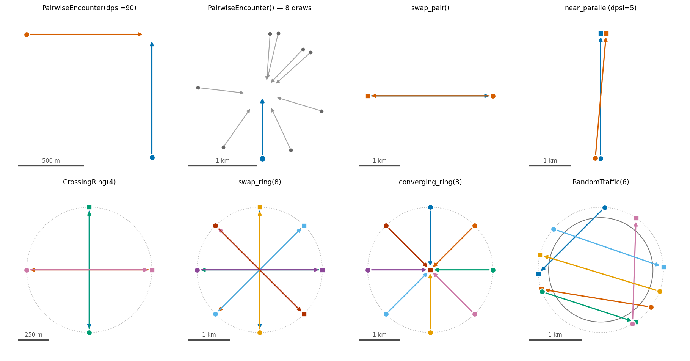
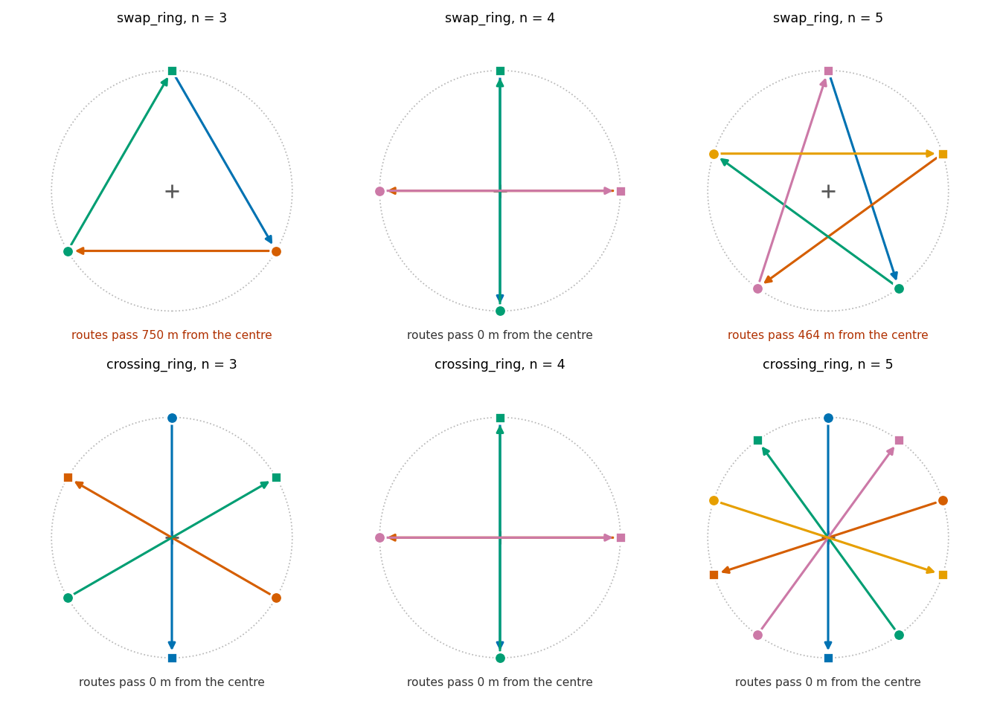

# Scenarios

A scenario makes one encounter from one seed. It is the only part that changes between an angle
study, a ring study and a traffic study. The rules, the two estimators, the cache and the report
stay the same. Thus a new experiment family costs one method.

The text of this document is in ASD-STE100 Simplified Technical English.

## The interface

```python
class Scenario(ABC):
    @abstractmethod
    def draw(self, rng, config) -> FleetScenario: ...

    def measurement_area(self): return None    # the area where you measure separation
    def size(self): return None                # the number of aircraft, if it is fixed
    def supports_splitting(self): return True  # can IPS run on this scenario
```

`draw` gives a list of `(state, goal)` pairs. A goal of `None` tells the aircraft to hold its
cruise. A goal of `(lat, lon)` gives the aircraft a `WaypointAutopilot` and a destination.

Two properties of `draw` are important:

- If the scenario **does not use** `rng`, the geometry is the same in each encounter. Only the CNS
  noise changes. `CrossingRing` is such a scenario.
- If the scenario **uses** `rng`, it takes a sample from a distribution of geometries.
  `RandomTraffic` is such a scenario.

Both are the same interface. The estimators do not know which one they have.

A scenario gives states, not aircraft. It does not select the airframe. `Methods` does that with
`perf`, `kinematics` or `airframes`. Thus you can fly the same ring with multirotors or with a
mixed fleet, and the geometry code does not change.

## The scenarios



In each panel, a circle shows where an aircraft starts. A square shows its goal. An arrow shows the
route. In the `swap_pair` panel, the two routes are on the same line. The figure moves them apart
to make them visible.

### PairwiseEncounter — two aircraft in one conflict

Two aircraft cross at an angle. The intruder is put in conflict with the ownship: it will come to
the protected zone in `tlos` seconds, with a closest approach of `dcpa` metres.

Four parameters control the geometry: `dpsi` (the crossing angle), `dcpa` (the miss distance),
`side` (which side the intruder passes) and `gs_intr` (the intruder speed). Each one has three
modes:

| value | result |
|---|---|
| `None` | the sampler draws it |
| a number | the value is fixed |
| a function `(rng) -> float` | your own distribution |

A fixed parameter still uses its draw. Thus `PairwiseEncounter(dpsi=90)` does not change the miss
distance or the side. The second panel shows eight draws with all four parameters free: the
ownship stays at the same place, and the intruder moves.

**Use it** for a response curve. It answers "how does the algorithm behave as one part of the
geometry changes". The shallow angle is the difficult case, not the head-on one.

### CrossingRing — the worst case that you build

`n` aircraft start on a circle. Each aircraft flies to the point on the opposite side. Thus each
route is a diameter, and all the aircraft come to the centre at the same moment.

The scenario is difficult for three reasons. Each aircraft has a conflict with all the others.
All the conflicts occur at the same moment. The geometry is symmetrical, thus no aircraft has
priority. Two aircraft that use the same rule on the same picture can move in the same direction.

`CrossingRing` does not use `rng`. Thus the geometry is the same in each encounter, and the CNS
noise is the only variable. This is the scenario that shows what uncertainty alone does.

**Use it** when you must know the behaviour in the worst arrangement.

### RandomTraffic — traffic that you draw

`n` aircraft cross a disc on random headings. This is the entry rule of Groot, Ellerbroek and
Hoekstra (2024).

Each aircraft takes a random heading. It also takes a perpendicular offset from the centre. The
offset is uniform across the diameter. This is important: if the entry *bearing* were uniform
around the circle, there would be more traffic at the edge of the disc than at the centre. A
uniform *offset* makes the traffic homogeneous across the area that you measure.

The aircraft start on a larger circle (`r_outer`) and enter the measured disc (`r_inner`) in
flight. The space between the two circles has a function. If you release `n` aircraft at the same
moment, two of them can start near each other: the entry bearings are uniform, thus this occurs
frequently. Such a pair has had no opportunity to separate. The run-in gives it that opportunity
before the measurement starts.

`RandomTraffic.measurement_area()` gives the disc. Thus the area travels with the scenario, and
you cannot declare an area that does not agree with the geometry.

**Use it** when the question is about a distribution of arrangements. A safety argument that uses
traffic density needs this form.

The derivation is in `vault/derivations/random-spawn-conflict-probability.md`. It includes the one
deliberate difference from the paper: this code takes the offset across the *inner* diameter, thus
all `n` aircraft cross the measured disc.

## The geometry functions

These functions give a `FleetScenario` directly. Use them when you do not need a declarable value.

| function | geometry |
|---|---|
| `create_conflict` | one intruder, in conflict with a given ownship |
| `sample_pairwise` | one pairwise encounter from one seed |
| `swap_pair` | two aircraft, head-on, each one flies to the other's start |
| `near_parallel` | two aircraft that cross at a shallow angle (5° by default) |
| `swap_ring` | `n` aircraft on a ring, each one flies to another aircraft's start |
| `crossing_ring` | `n` aircraft on a ring, each one flies to the opposite point |
| `converging_ring` | `n` aircraft on a ring, all fly to the centre |
| `random_traffic` | `n` aircraft that cross a disc on random headings |

Two of them have no scenario class yet, and both are useful:

**`near_parallel`** is the most difficult geometry in this project. At a shallow angle the relative
velocity is a small difference between two large velocities. Thus the measurement error controls
the closest approach, not the geometry. This scenario finds a class of error that no other
scenario finds. A loop that removes the noise by an average makes the shallow angle look like the
easiest case. See `vault/observations/near-parallel-ipr-inversion.md`.

**`converging_ring`** sends all the aircraft to one point. No algorithm can obey "stay 50 m apart"
and "all come to this point" at the same time. Thus the correct result is a failure. With eight
aircraft, the fleet stays at approximately 42 m, which is below the protected zone, for the
remainder of the run. Use it as a control: if your measurement shows this scenario as safe, the
measurement has an error. See `vault/observations/fleet-scenarios.md`.

## `swap_ring` and `crossing_ring` are not the same

The two ring builders are different in one line:

```python
swap_ring:     target = starts[(k + n // 2) % n]                  # another aircraft's start
crossing_ring: target = forward(centre, bearing + 180, radius)    # the opposite point
```



If `n` is **even**, index `k + n/2` is the aircraft on the opposite side. Thus the two builders
give the same geometry.

If `n` is **odd**, `n // 2` rounds down, and the two builders are different:

| n | swap_ring | crossing_ring |
|---|---|---|
| 3 | a triangle; the routes pass 750 m from the centre | three diameters through the centre |
| 4 | the same as crossing_ring | two diameters through the centre |
| 5 | a star; the routes pass 464 m from the centre | five diameters through the centre |

At an odd `n`, the `swap_ring` routes do not come to the centre. The property that gives the
scenario its purpose — all the aircraft at one point at one moment — is not there.

This is important if you change the number of aircraft. A sweep of 2, 3, 4, 5 with `swap_ring`
changes between two different geometries. A trend that you measure across that axis mixes a
fleet-size effect with a geometry effect. You cannot separate them later. `crossing_ring` gives the
same geometry at each `n`, thus the fleet-size axis has one meaning.

The docstring of `swap_ring` says "diametrically-opposite start". That is correct only for an even
`n`. The function keeps its behaviour, because published results use it. Use `crossing_ring` for
new work.

## A fleet with more than one type of aircraft

A scenario does not select the airframe. `Methods.airframes` does that. Give one `Airframe` for
each aircraft, in fleet order. An `Airframe` holds a `Performance` envelope and an integrator. To
make your own aircraft, make a `Performance` value; the notebook
`examples/03_build_your_own_performance.ipynb` shows how.

```python
MY_QUAD = dataclasses.replace(M600, v_max=14.0, v_min=-14.0, yaw_rate_max=120.0)

mix = ([Airframe(M600, Multirotor())] * 3
       + [Airframe(SMALL_FIXEDWING, FixedWing())] * 3
       + [Airframe(MY_QUAD, Multirotor())] * 2)
```

`agents_for` compares the number of airframes with the number of aircraft. A list of the wrong
length stops the run immediately.

**Give each aircraft its own speed.** Each envelope has a different speed range:

| airframe | speed range |
|---|---|
| `M600` | −18 to 18 m/s |
| `SMALL_FIXEDWING` | **12** to 25 m/s (12 m/s is the stall speed) |
| `MY_QUAD` | −14 to 14 m/s |

`Agent` refuses a speed that is outside the envelope of its airframe. Thus one speed for the fleet
is not sufficient. At 10 m/s the fixed-wing is below its stall speed, and the run stops with an
error. At 14 m/s all three types fly, but the multirotors then fly 40 % faster than their usual
cruise speed.

Give a sequence instead of a number. Each fleet builder accepts `speed: float | Sequence[float]`.
A number applies to all the aircraft. A sequence must have one value for each aircraft:

```python
ring = CrossingRing(8, radius=1500.0, speeds=(10.0,) * 3 + (20.0,) * 3 + (12.0,) * 2)
```

Now each airframe flies at a speed that is correct for it. This also makes the speed *difference*
available as a subject of study, which is necessary for an encounter between a general-aviation
aircraft and a UAS.

**A fixed-wing does not stop at its last waypoint.** It flies a circle around the waypoint at its
loiter radius, which is 80 m by default. It stays at that distance for the remainder of the run.
Thus `run_fleet(..., stop_within=50.0)` never sees a fixed-wing as arrived. Make `stop_within`
equal to the loiter radius or more.

## How to write a scenario

Make a subclass and write `draw`. The example below is an overtaking encounter: a fast aircraft
comes from behind a slow aircraft on almost the same heading.

```python
@dataclass(frozen=True)
class Overtaking(Scenario):
    lead_speed_ratio: float = 0.6
    offset: float = 30.0
    dpsi: float = 3.0
    time_to_pass: float = 200.0

    def draw(self, rng, config):
        speed = config.scenario.speed
        lead_speed = speed * self.lead_speed_ratio
        lead = AircraftState(id="LEAD", lat=52.0, lon=4.0, trk=0.0, gs=lead_speed)
        behind = forward(lead.lat, lead.lon, 180.0, self.time_to_pass * (speed - lead_speed))
        start = forward(behind[0], behind[1], 90.0, self.offset)
        follow = AircraftState(id="FOLLOW", lat=start[0], lon=start[1],
                               trk=(-self.dpsi) % 360.0, gs=speed)
        return [(lead, None), (follow, None)]

    def size(self):
        return 2
```

The scenario now works in each declaration: you can sweep it, compare it with the other scenarios,
and run it on both estimators. The notebook `examples/handbook/declaring_experiments.ipynb` shows
this.

Two errors are easy to make. This example shows both.

**Give a goal only when the mission is the subject.** A multirotor with a waypoint moves to a
position setpoint. It accelerates to the maximum speed of its envelope, which is 18 m/s for a
standard M600. It does not keep the speed in `gs`. Thus a goal would remove the speed difference
that this scenario must have. Use `goal=None` to hold the cruise.

**Give the time, not the distance.** A constant start distance is not correct here. If the two
speeds are almost the same, the aircraft do not meet before `t_max`, and the trend that you measure
is the end of the run and not the geometry. Calculate the start distance from the closing speed,
in the same way that `create_conflict` uses a `tlos`.

## Limits

A scenario has a **constant number of aircraft**. Aircraft cannot enter or leave during a run. Thus
you cannot make a traffic stream. See `vault/future-features/mid-run-arrivals.md`.

`supports_splitting()` tells the experiment layer if IPS can run on the scenario. A future stream
must give `False`. In a stream that continues for hours, "one loss of separation or more" is not a
rare event. The running minimum separation does not separate the particles. Thus IPS gives a value
near 1 after a large quantity of computation. The experiment layer refuses this combination before
the run starts.

## The files

| file | contents |
|---|---|
| `base.py` | the `Scenario` interface, `FleetScenario`, `Draw`, the shared helpers |
| `pairwise.py` | `create_conflict`, `sample_pairwise`, `swap_pair`, `near_parallel`, `PairwiseEncounter` |
| `ring.py` | `swap_ring`, `crossing_ring`, `converging_ring`, `CrossingRing` |
| `traffic.py` | `random_traffic`, `RandomTraffic` |

Each file holds one family of encounter, with its geometry function and its scenario class
together. The two change for the same reason, thus they stay in the same file.

`__init__.py` exports all the names. Therefore `from opencdarr.scenario import sample_pairwise`
continues to operate as before.
