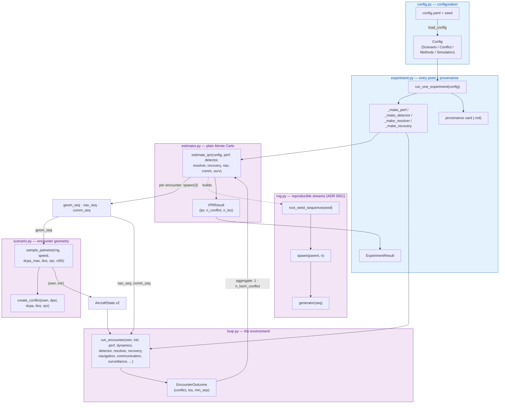
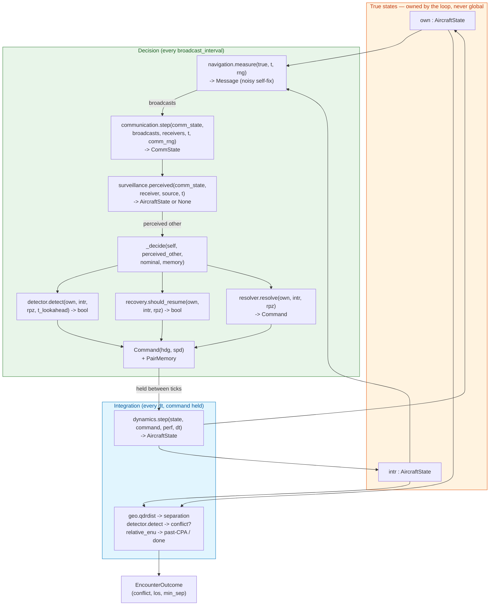
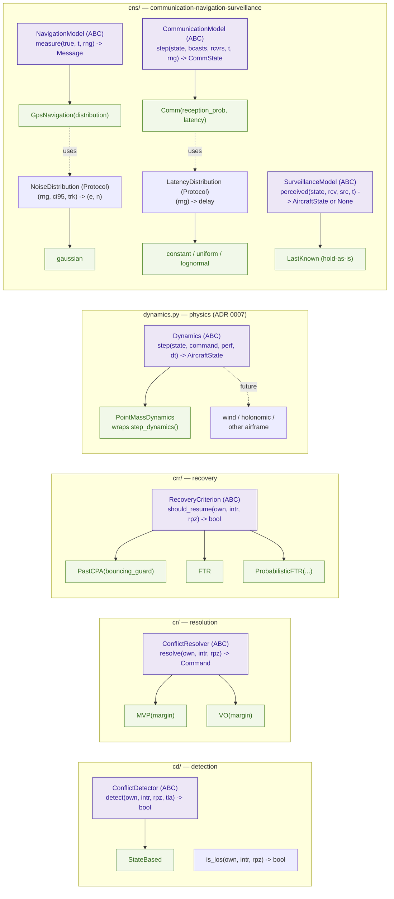
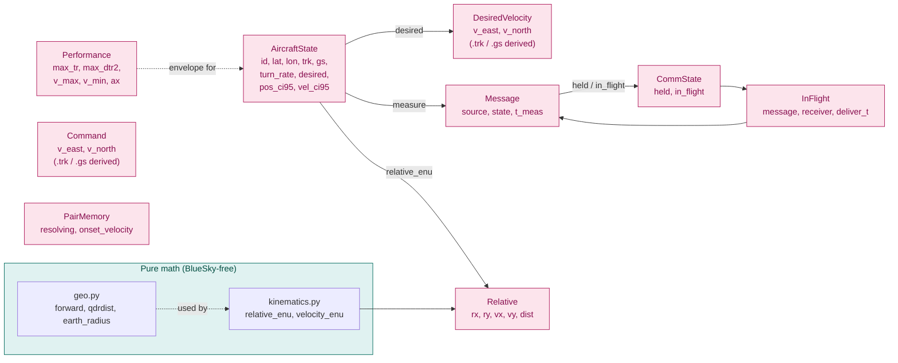

# Architecture & data flow — a complete simulation setup

How every module in `opencdarr/` connects in one full run: `config + seed → IPR`. The
spine is the design decision that *you own the state and the loop; BlueSky is a library of
stateless math* (`docs/design_brief.md`). Everything here is pure values threaded as arguments —
no globals, so any state is clonable for the interacting particle system later.

Read this top-to-bottom: **backbone flow** (the whole run), then **one tick** (the heart of the
loop), then the **pluggable interfaces** (the contribution surface), then a **module-by-module
I/O reference** so nothing is left implicit.

> Legend: rounded/box nodes are functions or classes; edge labels are the value passed. `(ABC)`
> = abstract base class (a model family); `(Protocol)` = a small compositional callable. ABCs are
> passed *into* `run_encounter` / `estimate_ipr`; swapping one is how a contributor adds an
> algorithm without forking the core.

---

## 1. Backbone — the complete run (`config + seed → IPR`)

The **estimator never sees the number of aircraft or the algorithms** — it sees `sample →
run_encounter → outcome`, then counts. This is what lets IPS (roadmap v0.4) replace plain Monte
Carlo without touching the loop (ADR 0004). The alternative CLI entry point,
`scripts/ipr_angle_sweep.py`, skips `estimate_ipr` and calls `run_encounter` directly per fixed
crossing angle (joblib-parallel), reusing the same substreams across resolvers for a fair
comparison.

---

## 2. One tick inside `run_encounter` — the heart of the loop

Two cadences: aircraft **decide** every `broadcast_interval` (the ADS-L/ASAS rate) on their
*perceived* view, then that `Command` is **held** while dynamics **integrate** every `dt`. Truth
is used only to score the encounter.

Key points the diagram encodes:

- **The CNS chain is `measure → communicate → perceive`.** Without a `communication` model, the
  perceived other *is* the broadcast directly (instant, perfect delivery). With one, a decision
  reads only what the link actually delivered — or `None` before first contact, which flies that
  pair nominal (ADR 0006 §5).
- **Directed everywhere.** Each arrow runs twice per tick — A→B and B→A are independent draws.
- **`dynamics.step` is the one swap point** for physics (ADR 0007): Dubins-car point mass today,
  a wind-aware or holonomic model later, without editing the loop.

---

## 3. The pluggable interfaces — the contribution surface

Every model family is an `ABC` threaded into the loop as a parameter; a new algorithm is a new
file implementing the interface, not a fork (`docs/design_brief.md`). `Protocol`s are the smaller
callables fed *into* those models.

---

## 4. Foundational values — what everything reads & writes

All are frozen dataclasses (clonable, no aliasing). `AircraftState` is the certain kinematic
core; `Command` is the one control message every resolver emits and every dynamics consumes.

---

## 5. Module-by-module I/O reference

Every `.py` in `opencdarr/`, its public surface, and what flows in/out.

### Orchestration

| Module | Symbol | Input | Output |
|---|---|---|---|
| `experiment.py` | `run_one_experiment(config, card_dir)` | `Config` | `ExperimentResult(ipr, card_path)` — and writes a provenance card |
| `estimator.py` | `estimate_ipr(config, perf, detector, resolver, recovery, nav?, comm?, surv?)` | config + built components | `IPRResult(ipr, n_conflict, n_los)` |
| `loop.py` | `run_encounter(own, intr, *, perf, dynamics, rpz, t_lookahead, dt, detector, resolver?, recovery?, navigation?, rng?, communication?, surveillance?, comm_rng?, t_max, done_timeout, broadcast_interval, share_intent)` | two `AircraftState` + all models | `EncounterOutcome(conflict, los, min_sep)` |
| `loop.py` | `_decide(ac, other, nominal, memory, rpz, tla, detector, resolver, recovery)` | one directed view | `(Command, PairMemory)` |
| `config.py` | `load_config(path)` | YAML path | validated `Config` |
| `rng.py` | `root_seed_sequence(seed)` / `spawn(parent, n)` / `generator(seq)` | int seed / seq | `SeedSequence` / list / `np.random.Generator` |

### Scenario & state

| Module | Symbol | Input | Output |
|---|---|---|---|
| `scenario.py` | `sample_pairwise(rng, speed, dcpa_max, tlos, rpz, ci95…)` | RNG + distribution params | `(own, intr): AircraftState` |
| `scenario.py` | `create_conflict(own, dpsi, dcpa, tlos, rpz, …)` | ownship + geometry | intruder `AircraftState` |
| `state.py` | `AircraftState` / `DesiredVelocity` | — | frozen kinematic value |
| `state.py` | `create_aircraft(perf, …)` | `Performance` + fields | envelope-validated `AircraftState` |
| `performance.py` | `Performance`, `M600` | — | frozen envelope limits |

### Dynamics (ADR 0007)

| Module | Symbol | Input | Output |
|---|---|---|---|
| `dynamics.py` | `Command` | — | control target: velocity vector `(v_east, v_north)`, ADR 0008 |
| `dynamics.py` | `Dynamics` (ABC) `.step(state, command, perf, dt)` | one aircraft + command | next `AircraftState` |
| `dynamics.py` | `PointMassDynamics` | — | default impl (wraps `step_dynamics`) |
| `dynamics.py` | `step_dynamics(state, command, perf, dt)` | one aircraft + command | next `AircraftState` |

### CD / CR / CRR

| Module | Symbol | Input | Output |
|---|---|---|---|
| `cd/base.py` | `ConflictDetector` (ABC) `.detect(own, intr, rpz, tla)` | directed pair | `bool` (conflict predicted) |
| `cd/base.py` | `is_los(own, intr, rpz)` | directed pair | `bool` (in loss of separation now) |
| `cd/statebased.py` | `StateBased` | — | CPA detector impl |
| `cr/base.py` | `ConflictResolver` (ABC) `.resolve(own, intr, rpz)` | directed pair | `Command` |
| `cr/mvp.py` / `cr/vo.py` | `MVP(margin)` / `VO(margin)` | — | resolver impls |
| `crr/base.py` | `RecoveryCriterion` (ABC) `.should_resume(own, intr, rpz)` | directed pair | `bool` (resume nominal?) |
| `crr/pastcpa.py` … | `PastCPA` / `FTR` / `ProbabilisticFTR` | — | recovery impls |

### CNS

| Module | Symbol | Input | Output |
|---|---|---|---|
| `cns/base.py` | `NavigationModel` (ABC) `.measure(true, t, rng)` | true state + RNG | `Message` (noisy self-fix) |
| `cns/navigation.py` | `GpsNavigation(distribution)` | — | nav impl (uses `geo`, `kinematics`, noise) |
| `cns/base.py` | `NoiseDistribution` (Protocol) `(rng, ci95, trk)` | — | `(east, north)` error |
| `cns/noise_distributions.py` | `gaussian`, `CI95_TO_SIGMA` | — | isotropic position noise |
| `cns/base.py` | `CommunicationModel` (ABC) `.step(state, bcasts, rcvrs, t, rng)` | comm state + broadcasts | new `CommState` |
| `cns/communication.py` | `Comm(reception_prob, latency)` | — | reception+latency impl |
| `cns/base.py` | `LatencyDistribution` (Protocol) `(rng)` | — | `delay` [s] |
| `cns/communication.py` | `constant_/uniform_/lognormal_latency` | params | a `LatencyDistribution` |
| `cns/base.py` | `SurveillanceModel` (ABC) `.perceived(state, rcv, src, t)` | comm state + link | `AircraftState` or `None` |
| `cns/surveillance.py` | `LastKnown`, `age(...)` | — | hold-as-is belief / staleness |
| `cns/base.py` | `Message`, `CommState`, `InFlight` | — | frozen comm values |

### Pure math

| Module | Symbol | Input | Output |
|---|---|---|---|
| `geo.py` | `forward(lat, lon, bearing, dist)` | point + vector | new `(lat, lon)` |
| `geo.py` | `qdrdist(lat1, lon1, lat2, lon2)` | two points | `(bearing, distance)` |
| `kinematics.py` | `relative_enu(own, intr)` | two states | `Relative(rx, ry, vx, vy, dist)` |
| `kinematics.py` | `velocity_enu(state)` | one state | `(v_east, v_north)` |

---

## Related

- [[decisions/0001-rng-per-particle-spawn]] — the substream tree wired in §1.
- [[decisions/0004-layered-directed-design-for-multiaircraft-and-ips]] — why the estimator is
  oblivious to N, and why every model is directed/pairwise-primitive.
- [[decisions/0006-communication-model-design]] — the `measure → communicate → perceive` chain in §2.
- [[decisions/0007-dynamics-as-pluggable-interface]] — the one swap point for physics in §2/§3.
- [[decisions/0008-velocity-vector-command]] — why `Command`/`DesiredVelocity` in §4 are velocity
  vectors, not polar.
- Governing equations per algorithm live under `vault/derivations/`.
