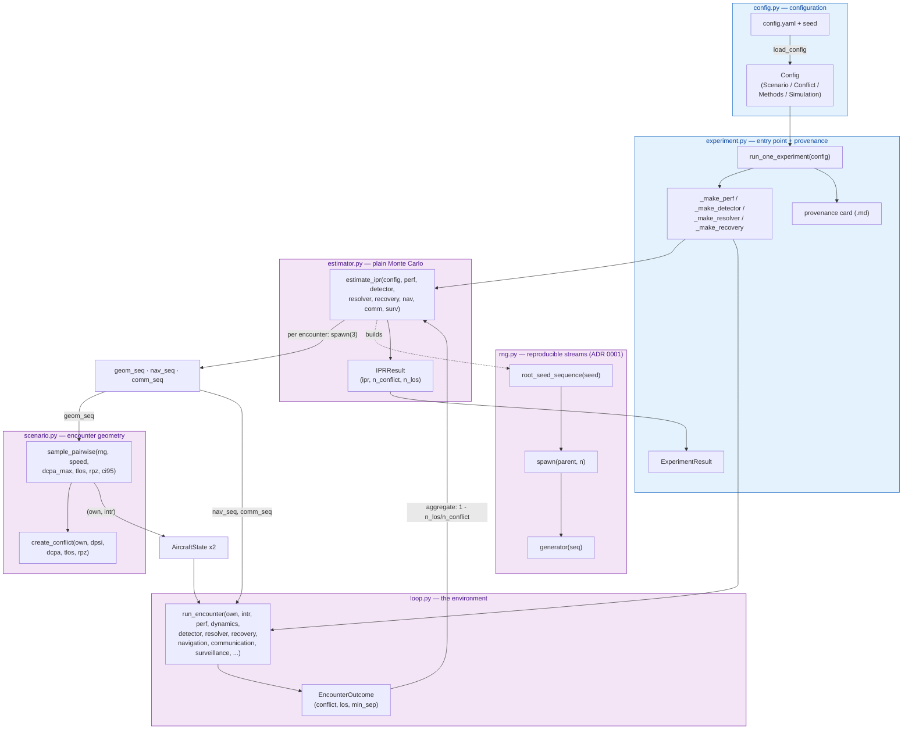
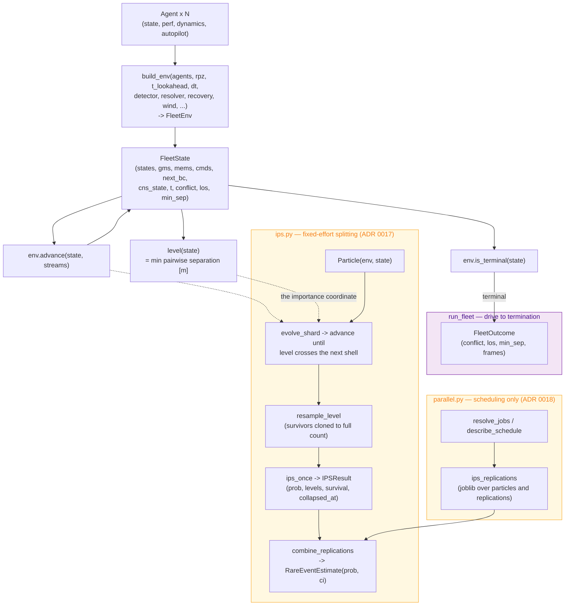
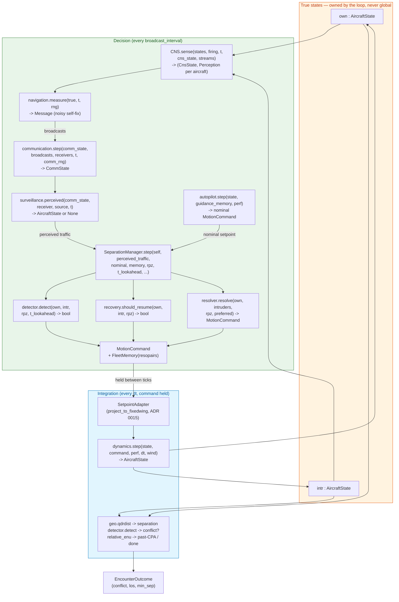
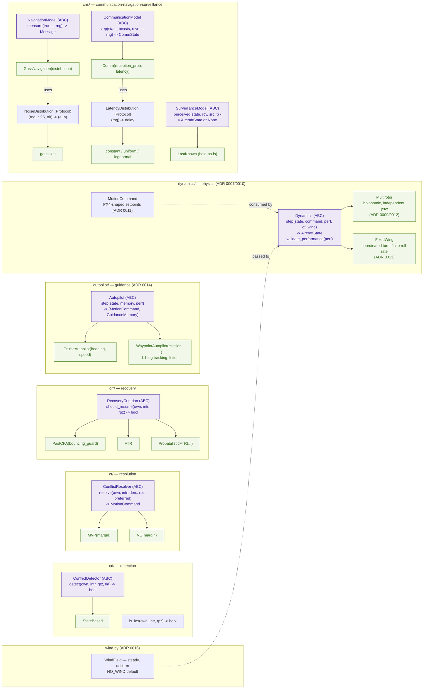
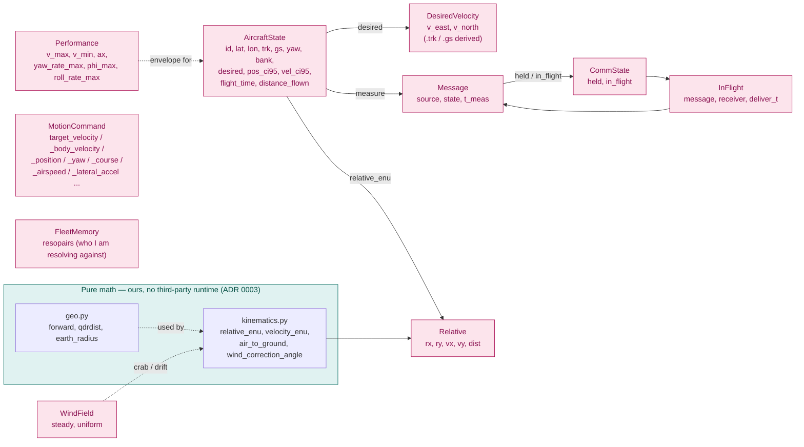

# Architecture & data flow — a complete simulation setup

How every module in `opencdarr/` connects in one full run: `config + seed → IPR`, and the
rare-event path beyond it. The spine is the design decision that *you own the state and the loop*
(`docs/design_brief.md`) — and, since ADR 0003 replaced the last
[BlueSky](https://github.com/TUDelft-CNS-ATM/bluesky) call with `opencdarr/geo.py`, you own the
math too: shipping code depends only on `numpy` and `pyyaml`. Everything here is pure values
threaded as arguments — no globals, so any state is clonable for the interacting particle system
(IPS).

Read this top-to-bottom: **backbone flow** (the whole run), then **one tick** (the heart of the
loop), then the **pluggable interfaces** (the contribution surface), then a **module-by-module
I/O reference** so nothing is left implicit.

> Legend: rounded/box nodes are functions or classes; edge labels are the value passed. `(ABC)`
> = abstract base class (a model family); `(Protocol)` = a small compositional callable. ABCs are
> passed *into* `run_encounter` / `estimate_ipr`; swapping one is how a contributor adds an
> algorithm without forking the core.

---

## 1. Backbone — the complete run (`config + seed → IPR`)

```mermaid
flowchart TB
    subgraph entry["config.py — configuration"]
        YAML["config.yaml + seed"]
        CFG["Config<br/>(Scenario / Conflict /<br/>Methods / Simulation)"]
        YAML -->|load_config| CFG
    end

    subgraph exp["experiment.py — entry point + provenance"]
        RUN1["run_one_experiment(config)"]
        COMPS["_make_perf / _make_detector /<br/>_make_resolver / _make_recovery"]
        CARD["provenance card (.md)"]
        RES["ExperimentResult"]
    end

    CFG --> RUN1 --> COMPS

    subgraph rng["rng.py — reproducible streams (ADR 0001)"]
        ROOT["root_seed_sequence(seed)"]
        SP["spawn(parent, n)"]
        GEN["generator(seq)"]
        ROOT --> SP --> GEN
    end

    subgraph est["estimator.py — plain Monte Carlo"]
        EST["estimate_ipr(config, perf, detector,<br/>resolver, recovery, nav, comm, surv)"]
        IPR["IPRResult<br/>(ipr, n_conflict, n_los)"]
    end

    COMPS --> EST
    EST -->|"per encounter: spawn(3)"| SEQS["geom_seq · nav_seq · comm_seq"]
    EST -. builds .-> ROOT

    subgraph scen["scenario.py — encounter geometry"]
        SAMP["sample_pairwise(rng, speed,<br/>dcpa_max, tlos, rpz, ci95)"]
        CREATE["create_conflict(own, dpsi,<br/>dcpa, tlos, rpz)"]
        SAMP --> CREATE
    end

    SEQS -->|geom_seq| SAMP
    SAMP -->|"(own, intr)"| PAIR["AircraftState x2"]

    subgraph loopy["loop.py — the environment"]
        LOOP["run_encounter(own, intr, perf, dynamics,<br/>detector, resolver, recovery,<br/>navigation, communication, surveillance, ...)"]
        OUT["EncounterOutcome<br/>(conflict, los, min_sep)"]
        LOOP --> OUT
    end

    PAIR --> LOOP
    SEQS -->|nav_seq, comm_seq| LOOP
    COMPS --> LOOP
    OUT -->|"aggregate: 1 - n_los/n_conflict"| EST
    EST --> IPR --> RES
    RUN1 --> CARD

    classDef entryc fill:#e3f2fd,stroke:#1565c0,color:#0d47a1
    classDef flowc fill:#f3e5f5,stroke:#7b1fa2,color:#4a148c
    class entry,exp entryc
    class est,scen,loopy,rng flowc
```

The **estimator never sees the number of aircraft or the algorithms** — it sees `sample →
run_encounter → outcome`, then counts. That is what let IPS replace plain Monte Carlo without
touching the loop (ADR 0004). The alternative CLI entry point, `scripts/ipr_angle_sweep.py`, skips
`estimate_ipr` and calls `run_encounter` directly per fixed crossing angle (joblib-parallel),
reusing the same substreams across resolvers for a fair comparison.

### 1b. The N-aircraft and rare-event path

`run_encounter` runs a pairwise encounter to completion in one call. IPS cannot use it: splitting
needs to **pause** a world, clone it, and resume the copies. `fleet.py` therefore exposes the same
simulation as a stepwise environment — the `advance` / `level` / `is_terminal` interface named in
`docs/design_brief.md` — and `run_fleet` is the convenience wrapper that drives it to termination.
At N=2 the two agree bit-for-bit (`tests/test_fleet.py`).

```mermaid
flowchart TB
    AGENTS["Agent x N<br/>(state, perf, dynamics, autopilot)"]
    ENV["build_env(agents, rpz, t_lookahead, dt,<br/>detector, resolver, recovery, wind, ...)<br/>-> FleetEnv"]
    S0["FleetState<br/>(states, gms, mems, cmds, next_bc,<br/>cns_state, t, conflict, los, min_sep)"]
    ADV["env.advance(state, streams)"]
    TERM["env.is_terminal(state)"]
    LVL["level(state)<br/>= min pairwise separation [m]"]

    AGENTS --> ENV --> S0
    S0 --> ADV --> S0
    S0 --> TERM
    S0 --> LVL

    subgraph mc["run_fleet — drive to termination"]
        FO["FleetOutcome<br/>(conflict, los, min_sep, frames)"]
    end
    TERM -->|"terminal"| FO

    subgraph ips["ips.py — fixed-effort splitting (ADR 0017)"]
        PART["Particle(env, state)"]
        EVOLVE["evolve_shard -> advance until<br/>level crosses the next shell"]
        RESAMP["resample_level<br/>(survivors cloned to full count)"]
        ONCE["ips_once -> IPSResult<br/>(prob, levels, survival, collapsed_at)"]
        COMB["combine_replications<br/>-> RareEventEstimate(prob, ci)"]
    end
    ADV -.-> EVOLVE
    LVL -.->|"the importance coordinate"| EVOLVE
    PART --> EVOLVE --> RESAMP --> ONCE --> COMB

    subgraph par["parallel.py — scheduling only (ADR 0018)"]
        SCHED["resolve_jobs / describe_schedule"]
        REPL["ips_replications<br/>(joblib over particles and replications)"]
    end
    SCHED --> REPL --> COMB

    classDef flowc fill:#f3e5f5,stroke:#7b1fa2,color:#4a148c
    classDef ipsc fill:#fff8e1,stroke:#f9a825,color:#f57f17
    class mc flowc
    class ips,par ipsc
```

`level(state)` is the **importance coordinate** IPS splits on — currently the fleet's minimum
pairwise separation, a pure read of the state and independent of N. `parallel.py` adds no
statistics: it is scheduling, and `parallel.estimate_rare_prob` returns the same
`RareEventEstimate` as the serial `ips.estimate_rare_prob` for the same seed.

---

## 2. One tick inside `run_encounter` — the heart of the loop

Two cadences: aircraft **decide** every `broadcast_interval` (the ADS-L/ASAS rate) on their
*perceived* view, then that `MotionCommand` is **held** while dynamics **integrate** every `dt`.
Truth is used only to score the encounter.

Three layers produce that command, in order (ADR 0011). The **autopilot** turns the mission into a
nominal setpoint; the **separation manager** overrides it when a conflict is detected and hands it
back when the recovery criterion fires; the **dynamics** tracks whatever setpoint survives, within
the airframe's envelope. Guidance produces, safety overrides, physics tracks.

```mermaid
flowchart TB
    subgraph truth["True states — owned by the loop, never global"]
        OWN["own : AircraftState"]
        INTR["intr : AircraftState"]
    end

    subgraph bcast["Decision (every broadcast_interval)"]
        SENSE["CNS.sense(states, firing, t,<br/>cns_state, streams)<br/>-> (CnsState, Perception per aircraft)"]
        MEAS["navigation.measure(true, t, rng)<br/>-> Message (noisy self-fix)"]
        COMM["communication.step(comm_state,<br/>broadcasts, receivers, t, comm_rng)<br/>-> CommState"]
        SURV["surveillance.perceived(comm_state,<br/>receiver, source, t)<br/>-> AircraftState or None"]
        AP["autopilot.step(state, guidance_memory, perf)<br/>-> nominal MotionCommand"]
        SEP["SeparationManager.step(self, perceived_traffic,<br/>nominal, memory, rpz, t_lookahead, ...)"]
        DET["detector.detect(own, intr,<br/>rpz, t_lookahead) -> bool"]
        REC["recovery.should_resume(own,<br/>intr, rpz) -> bool"]
        RESO["resolver.resolve(own, intruders,<br/>rpz, preferred) -> MotionCommand"]
        CMD["MotionCommand<br/>+ FleetMemory(resopairs)"]
    end

    OWN --> SENSE
    INTR --> SENSE
    SENSE --> MEAS
    MEAS -->|broadcasts| COMM --> SURV
    SURV -->|perceived traffic| SEP
    AP -->|nominal setpoint| SEP
    SEP --> DET --> CMD
    SEP --> REC --> CMD
    SEP --> RESO --> CMD

    subgraph integ["Integration (every dt, command held)"]
        ADAPT["SetpointAdapter<br/>(project_to_fixedwing, ADR 0015)"]
        DYN["dynamics.step(state, command, perf, dt, wind)<br/>-> AircraftState"]
        SCORE["geo.qdrdist -> separation<br/>detector.detect -> conflict?<br/>relative_enu -> past-CPA / done"]
    end

    CMD -->|held between ticks| ADAPT --> DYN
    DYN --> OWN
    DYN --> INTR
    OWN --> SCORE
    INTR --> SCORE
    SCORE --> OUTCOME["EncounterOutcome<br/>(conflict, los, min_sep)"]

    classDef truthc fill:#fff3e0,stroke:#e65100,color:#bf360c
    classDef decc fill:#e8f5e9,stroke:#2e7d32,color:#1b5e20
    classDef intc fill:#e1f5fe,stroke:#0277bd,color:#01579b
    class truth truthc
    class bcast decc
    class integ intc
```

Key points the diagram encodes:

- **The CNS chain is `measure → communicate → perceive`,** behind one `CNS.sense` call
  (`cns/stack.py`). Without a `communication` model, the perceived other *is* the broadcast
  directly (instant, perfect delivery). With one, a decision reads only what the link actually
  delivered — or `None` before first contact, which flies that pair nominal (ADR 0006 §5).
- **Directed everywhere.** Each arrow runs twice per tick — A→B and B→A are independent draws.
- **Own detection reads the ownship's own noisy self-fix,** not truth: `Perception.own` is the
  measured state. An aircraft is uncertain about itself as well as about its traffic, which is
  what makes the two aircraft's pictures asymmetric.
- **`dynamics.step` is the one swap point** for physics (ADR 0007): `Multirotor`, the holonomic
  point mass (ADRs 0009, 0012), or `FixedWing`, the coordinated-turn point mass (ADR 0013). Both
  take the same `wind` argument (ADR 0016) and the same `MotionCommand`.
- **A setpoint an airframe cannot fly is projected, not rejected.** A resolver emits a velocity
  vector; a fixed-wing cannot fly one directly, so `project_to_fixedwing` adapts it into a
  course-and-airspeed setpoint on the way to `dynamics.step` (ADR 0015). This is what lets one
  resolver serve a mixed fleet.
- **The transmit clock is state.** `BroadcastSchedule` carries a per-aircraft phase and optional
  jitter, so aircraft do not all broadcast on the same tick.

---

## 3. The pluggable interfaces — the contribution surface

Every model family is an `ABC` threaded into the loop as a parameter; a new algorithm is a new
file implementing the interface, not a fork (`docs/design_brief.md`). `Protocol`s are the smaller
callables fed *into* those models.

```mermaid
flowchart LR
    subgraph CDf["cd/ — detection"]
        CDABC["ConflictDetector (ABC)<br/>detect(own, intr, rpz, tla) -> bool"]
        SB["StateBased"]
        ISLOS["is_los(own, intr, rpz) -> bool"]
        CDABC --> SB
    end
    subgraph CRf["cr/ — resolution"]
        CRABC["ConflictResolver (ABC)<br/>resolve(own, intruders, rpz, preferred)<br/>-> MotionCommand"]
        CRABC --> MVPn["MVP(margin)"]
        CRABC --> VOn["VO(margin)"]
    end
    subgraph CRRf["crr/ — recovery"]
        CRRABC["RecoveryCriterion (ABC)<br/>should_resume(own, intr, rpz) -> bool"]
        CRRABC --> PC["PastCPA(bouncing_guard)"]
        CRRABC --> FTRn["FTR"]
        CRRABC --> PFTR["ProbabilisticFTR(...)"]
    end
    subgraph DYNf["dynamics/ — physics (ADR 0007/0010)"]
        DABC["Dynamics (ABC)<br/>step(state, command, perf, dt, wind)<br/>-> AircraftState<br/>validate_performance(perf)"]
        DABC --> MR["Multirotor<br/>holonomic, independent yaw<br/>(ADR 0009/0012)"]
        DABC --> FW["FixedWing<br/>coordinated turn, finite roll rate<br/>(ADR 0013)"]
        MC["MotionCommand<br/>PX4-shaped setpoints (ADR 0011)"]
        MC -. consumed by .-> DABC
    end
    subgraph APf["autopilot/ — guidance (ADR 0014)"]
        APABC["Autopilot (ABC)<br/>step(state, memory, perf)<br/>-> (MotionCommand, GuidanceMemory)"]
        APABC --> CRU["CruiseAutopilot(heading, speed)"]
        APABC --> WPT["WaypointAutopilot(mission, ...)<br/>L1 leg tracking, loiter"]
    end
    subgraph WNDf["wind.py (ADR 0016)"]
        WF["WindField — steady, uniform<br/>NO_WIND default"]
    end
    WF -. passed to .-> DABC
    subgraph CNSf["cns/ — communication-navigation-surveillance"]
        NAVABC["NavigationModel (ABC)<br/>measure(true, t, rng) -> Message"]
        NAVABC --> GPS["GnssNavigation(distribution)"]
        NDP["NoiseDistribution (Protocol)<br/>(rng, ci95, trk) -> (e, n)"]
        NDP --> GAUSS["gaussian"]
        GPS -. uses .-> NDP
        COMMABC["CommunicationModel (ABC)<br/>step(state, bcasts, rcvrs, t, rng) -> CommState"]
        COMMABC --> COMMc["Comm(reception_prob, latency)"]
        LDP["LatencyDistribution (Protocol)<br/>(rng) -> delay"]
        LDP --> LATc["constant / uniform / lognormal"]
        COMMc -. uses .-> LDP
        SURVABC["SurveillanceModel (ABC)<br/>perceived(state, rcv, src, t) -> AircraftState or None"]
        SURVABC --> LK["LastKnown (hold-as-is)"]
    end

    classDef abc fill:#ede7f6,stroke:#4527a0,color:#311b92
    classDef impl fill:#f1f8e9,stroke:#558b2f,color:#33691e
    class CDABC,CRABC,CRRABC,DABC,APABC,NAVABC,COMMABC,SURVABC abc
    class SB,MVPn,VOn,PC,FTRn,PFTR,MR,FW,CRU,WPT,GPS,GAUSS,COMMc,LATc,LK impl
```

`Performance` is the other contribution surface, and it is not an ABC — it is plain data. A new
airframe is a frozen `Performance` value (`M600`, `SMALL_FIXEDWING`), not a subclass;
`Dynamics.validate_performance` rejects an envelope that does not match the airframe, so a
fixed-wing envelope handed to a `Multirotor` fails loudly rather than flying wrong.

---

## 4. Foundational values — what everything reads & writes

All are frozen dataclasses (clonable, no aliasing). `AircraftState` is the certain kinematic
core; `MotionCommand` is the one setpoint message every autopilot and resolver emits and every
dynamics consumes.

```mermaid
flowchart LR
    AS["AircraftState<br/>id, lat, lon, trk, gs, yaw, bank,<br/>desired, pos_ci95, vel_ci95,<br/>flight_time, distance_flown"]
    DV["DesiredVelocity<br/>v_east, v_north<br/>(.trk / .gs derived)"]
    CMD["MotionCommand<br/>target_velocity / _body_velocity /<br/>_position / _yaw / _course /<br/>_airspeed / _lateral_accel ..."]
    MSG["Message<br/>source, state, t_meas"]
    CS["CommState<br/>held, in_flight"]
    IF["InFlight<br/>message, receiver, deliver_t"]
    FM["FleetMemory<br/>resopairs (who I am resolving against)"]
    REL["Relative<br/>rx, ry, vx, vy, dist"]
    PERF["Performance<br/>v_max, v_min, ax,<br/>yaw_rate_max, phi_max, roll_rate_max"]
    WFv["WindField<br/>steady, uniform"]

    AS -->|desired| DV
    AS -->|measure| MSG
    MSG -->|held / in_flight| CS
    CS --> IF
    IF --> MSG
    AS -->|relative_enu| REL
    PERF -. envelope for .-> AS

    subgraph geo_km["Pure math — ours, no third-party runtime (ADR 0003)"]
        GEO["geo.py<br/>forward, qdrdist, earth_radius"]
        KM["kinematics.py<br/>relative_enu, velocity_enu,<br/>air_to_ground, wind_correction_angle"]
    end
    KM --> REL
    GEO -. used by .-> KM
    WFv -. crab / drift .-> KM

    classDef val fill:#fce4ec,stroke:#ad1457,color:#880e4f
    classDef math fill:#e0f2f1,stroke:#00695c,color:#004d40
    class AS,DV,CMD,MSG,CS,IF,FM,REL,PERF,WFv val
    class geo_km math
```

`yaw` and `bank` are *state*, not derived quantities: they must clone with the particle. `yaw` is
the nose heading, decoupled from track — a multirotor can translate one way while pointing another
(ADR 0012), and under wind it is the heading `ψ` whose difference from `trk` is the crab angle.
`bank` is the fixed-wing roll angle, which changes at a finite roll rate (ADR 0013).

---

## 5. Module-by-module I/O reference

Every `.py` in `opencdarr/`, its public surface, and what flows in/out.

### Orchestration

| Module | Symbol | Input | Output |
|---|---|---|---|
| `experiment.py` | `run_one_experiment(config, card_dir)` | `Config` | `ExperimentResult(ipr, card_path)` — and writes a provenance card |
| `estimator.py` | `estimate_ipr(config, perf, detector, resolver, recovery, nav?, comm?, surv?)` | config + built components | `IPRResult(ipr, n_conflict, n_los)` |
| `loop.py` | `run_encounter(own, intr, *, perf, dynamics, rpz, t_lookahead, dt, detector, resolver?, recovery?, navigation?, rng?, communication?, surveillance?, comm_rng?, t_max, done_timeout, broadcast_interval, share_intent)` | two `AircraftState` + all models | `EncounterOutcome(conflict, los, min_sep)` |
| `loop.py` | `_decide(ac, other, nominal, memory, rpz, tla, detector, resolver, recovery)` | one directed view | `(MotionCommand, FleetMemory)` — a shim that delegates to `SeparationManager.step` |
| `fleet.py` | `build_env(agents, …)` / `run_fleet(agents, …, record=False)` | N `Agent`s + all models | `FleetEnv` / `FleetOutcome(conflict, los, min_sep, frames)` |
| `fleet.py` | `FleetEnv.initial_state / .advance(state, streams) / .is_terminal(state)` | `FleetState` + `FleetStreams` | next `FleetState` / `bool` — the IPS-facing interface |
| `fleet.py` | `level(state)` | `FleetState` | minimum pairwise separation [m], the importance coordinate |
| `ips.py` | `estimate_rare_prob(build_initial, levels, *, n_particles, reps, seed)` | env factory + level shells | `RareEventEstimate(prob, ci, reps, n_collapsed)` |
| `ips.py` | `ips_once` / `evolve_shard` / `resample_level` / `replication_seeds` / `combine_replications` | particles + shells | `IPSResult(prob, levels, survival, n_particles, collapsed_at)` |
| `parallel.py` | `estimate_rare_prob(…, n_jobs, oversubscribe, min_shard)` / `ips_replications` / `resolve_jobs` / `describe_schedule` | same as `ips.py` + a job budget | same results, computed across cores (ADR 0018) |
| `config.py` | `load_config(path)` | YAML path | validated `Config` |
| `cache.py` | `run_key(...)` / `load_or_run(key, compute, cache_dir)` / `code_fingerprint()` | params + seed + source fingerprint | a cached result, or the freshly computed one |
| `viz.py` | `plot_pairwise(run, rpz)` / `plot_pairwise_montecarlo(runs)` / `extract_tracks(run)` | a recorded `FleetOutcome` | a matplotlib `Figure` / plain arrays |
| `rng.py` | `root_seed_sequence(seed)` / `spawn(parent, n)` / `child(seq, i)` / `children(seq, i, n)` / `generator(seq)` | int seed / seq | `SeedSequence` / list / `np.random.Generator` |

### Scenario & state

| Module | Symbol | Input | Output |
|---|---|---|---|
| `scenario.py` | `sample_pairwise(rng, speed, dcpa_max, tlos, rpz, ci95…)` | RNG + distribution params | `(own, intr): AircraftState` |
| `scenario.py` | `create_conflict(own, dpsi, dcpa, tlos, rpz, …)` | ownship + geometry | intruder `AircraftState` |
| `state.py` | `AircraftState` / `DesiredVelocity` | — | frozen kinematic value |
| `state.py` | `create_aircraft(perf, …)` | `Performance` + fields | envelope-validated `AircraftState` |
| `performance.py` | `Performance`, `M600`, `SMALL_FIXEDWING` | — | frozen envelope limits |
| `mission.py` | `Waypoint`, `Mission(goto, flight_plan)` | — | the route an autopilot flies (ADR 0014) |
| `scenario.py` | `swap_pair` / `swap_ring` / `converging_ring` / `near_parallel` | geometry params | N-aircraft `FleetScenario` builders |

### Dynamics (ADR 0007, 0010)

`opencdarr/dynamics.py` was split into the `opencdarr/dynamics/` package in Phase 4; the flat
module, `step_dynamics`, `HolonomicDynamics` and `DubinsDynamics` no longer exist.

| Module | Symbol | Input | Output |
|---|---|---|---|
| `dynamics/base.py` | `MotionCommand` | — | PX4-shaped setpoint bundle; `Command` is a backward-compatible alias (ADRs 0008, 0011) |
| `dynamics/base.py` | `MotionCommand.from_track_speed(hdg, spd)` / `.from_velocity(v_east, v_north)` | polar or vector | a `MotionCommand` |
| `dynamics/base.py` | `Dynamics` (ABC) `.step(state, command, perf, dt, wind)` | one aircraft + setpoint + wind | next `AircraftState` |
| `dynamics/base.py` | `Dynamics.validate_performance(perf)` | an envelope | raises if the envelope does not match the airframe |
| `dynamics/base.py` | `odometry_update(state, dt)` | one aircraft | accumulated `flight_time`, `distance_flown` |
| `dynamics/multirotor.py` | `Multirotor` | — | holonomic point mass, independent yaw (ADRs 0009, 0012) |
| `dynamics/fixedwing.py` | `FixedWing` | — | coordinated-turn point mass, finite roll rate (ADR 0013) |

### Guidance, safety and environment

| Module | Symbol | Input | Output |
|---|---|---|---|
| `autopilot/base.py` | `Autopilot` (ABC) `.step(state, memory, perf)` / `.goal()` | one aircraft + `GuidanceMemory` | `(MotionCommand, GuidanceMemory)` |
| `autopilot/base.py` | `nominal_velocity(state)` | one aircraft | the un-resolved setpoint to return to |
| `autopilot/cruise.py` | `CruiseAutopilot(heading, speed)` | — | hold a track and speed |
| `autopilot/waypoint.py` | `WaypointAutopilot(mission, cruise_airspeed, capture_radius, loiter_radius)` | a `Mission` | L1 leg tracking, capture and loiter (ADR 0014) |
| `separation.py` | `SeparationManager.step(state, perceived_traffic, nominal, memory, rpz, tla, detector, resolver, recovery, adapter)` | one aircraft's perceived world | `(MotionCommand, FleetMemory)` — the safety overlay on the nominal setpoint |
| `separation.py` | `FleetMemory(resopairs)`, `INACTIVE` | — | which intruders this aircraft is currently resolving against |
| `separation.py` | `project_to_fixedwing`, `SetpointAdapter` | a velocity setpoint | a setpoint the airframe can actually fly (ADR 0015) |
| `wind.py` | `WindField`, `NO_WIND` | — | steady, uniform wind (ADR 0016) |
| `cns/broadcast.py` | `BroadcastSchedule(interval, phase, jitter)` `.due / .advance` | a per-aircraft transmit clock | which aircraft transmit this tick |
| `cns/stack.py` | `CNS.sense(states, firing, t, cns_state, streams)` | true states + who is transmitting | `(CnsState, Perception per aircraft)` — the whole chain in one call |

### CD / CR / CRR

| Module | Symbol | Input | Output |
|---|---|---|---|
| `cd/base.py` | `ConflictDetector` (ABC) `.detect(own, intr, rpz, tla)` | directed pair | `bool` (conflict predicted) |
| `cd/base.py` | `is_los(own, intr, rpz)` | directed pair | `bool` (in loss of separation now) |
| `cd/statebased.py` | `StateBased` | — | CPA detector impl |
| `cr/base.py` | `ConflictResolver` (ABC) `.resolve(own, intruders, rpz, preferred)` | one aircraft + every intruder it sees | `MotionCommand` |
| `cr/mvp.py` / `cr/vo.py` | `MVP(margin)` / `VO(margin)` | — | resolver impls |
| `crr/base.py` | `RecoveryCriterion` (ABC) `.should_resume(own, intr, rpz)` | directed pair | `bool` (resume nominal?) |
| `crr/pastcpa.py` … | `PastCPA` / `FTR` / `ProbabilisticFTR` | — | recovery impls |

### CNS

| Module | Symbol | Input | Output |
|---|---|---|---|
| `cns/base.py` | `NavigationModel` (ABC) `.measure(true, t, rng)` | true state + RNG | `Message` (noisy self-fix) |
| `cns/navigation.py` | `GnssNavigation(distribution)` | — | nav impl (uses `geo`, `kinematics`, noise) |
| `cns/base.py` | `NoiseDistribution` (Protocol) `(rng, ci95, trk)` | — | `(east, north)` error |
| `cns/noise_distributions.py` | `gaussian`, `make_mixture_gaussian`, `make_anisotropic_gaussian`, `make_anisotropic_mixture_gaussian` | — | isotropic, mixture and along/cross-track position noise |
| `cns/base.py` | `CommunicationModel` (ABC) `.step(state, bcasts, rcvrs, t, rng)` | comm state + broadcasts | new `CommState` |
| `cns/communication.py` | `Comm(reception_prob, latency)` | — | reception+latency impl |
| `cns/base.py` | `LatencyDistribution` (Protocol) `(rng)` | — | `delay` [s] |
| `cns/communication.py` | `constant_/uniform_/lognormal_latency` | params | a `LatencyDistribution` |
| `cns/base.py` | `SurveillanceModel` (ABC) `.perceived(state, rcv, src, t)` | comm state + link | `AircraftState` or `None` |
| `cns/surveillance.py` | `LastKnown`, `age(...)` | — | hold-as-is belief / staleness |
| `cns/base.py` | `Message`, `CommState`, `InFlight` | — | frozen comm values |

### Pure math

| Module | Symbol | Input | Output |
|---|---|---|---|
| `geo.py` | `forward(lat, lon, bearing, dist)` | point + vector | new `(lat, lon)` |
| `geo.py` | `qdrdist(lat1, lon1, lat2, lon2)` | two points | `(bearing, distance)` |
| `kinematics.py` | `relative_enu(own, intr)` | two states | `Relative(rx, ry, vx, vy, dist)` |
| `kinematics.py` | `velocity_enu(state)` | one state | `(v_east, v_north)` |
| `kinematics.py` | `air_to_ground` / `ground_to_air` / `ground_track` / `ground_speed` / `wind_correction_angle` | airspeed vector + wind | ground velocity, track, crab angle |

---

## Related

- [[observations/experiment-layer-architecture]] — **the layer above this one.** This note stops at
  `estimate_ipr` / `estimate_rare_prob`; `opencdarr/experiment.py`'s `run_experiment` (added after it was written) declares
  *what varies* and fans conditions out across either estimator. That note also records how the
  entry points differ, and that plain MC now drives `fleet.run_fleet` rather than
  `loop.run_encounter` — so §1's backbone reaches the environment through the same seam §1b does.
- [[decisions/0001-rng-per-particle-spawn]] — the substream tree wired in §1.
- [[decisions/0003-own-the-geodesy-bluesky-free-runtime]] — why `geo.py` is ours and there is no
  BlueSky runtime dependency.
- [[decisions/0004-layered-directed-design-for-multiaircraft-and-ips]] — why the estimator is
  oblivious to N, and why every model is directed/pairwise-primitive.
- [[decisions/0006-communication-model-design]] — the `measure → communicate → perceive` chain in §2.
- [[decisions/0007-dynamics-as-pluggable-interface]] — the one swap point for physics in §2/§3.
- [[decisions/0008-velocity-vector-command]] — why `DesiredVelocity` in §4 is a velocity vector,
  not polar.
- [[decisions/0009-holonomic-dynamics]] — the holonomic model that became `Multirotor`; see also
  `vault/observations/controlling-dubins-vs-holonomic.md` for a trajectory comparison.
- [[decisions/0010-dynamics-subpackage-and-odometry-state]] — the split of `dynamics.py` into the
  package described in §5.
- [[decisions/0011-motioncommand-and-guidance-separation]] — the guidance / safety / physics layer
  split in §2.
- [[decisions/0013-fixedwing-coordinated-turn]] — the `FixedWing` equations of motion; compared
  against BlueSky's in `docs/fixedwing-vs-bluesky.md`.
- [[decisions/0015-velocity-to-fixedwing-projection]] — why a resolver's velocity setpoint is
  projected rather than rejected.
- [[decisions/0016-steady-uniform-wind]] — the `WindField` threaded through `dynamics.step`.
- [[decisions/0017-ips-level-and-splitting]] — the importance coordinate and shells in §1b.
- [[decisions/0018-parallel-ips-scheduling]] — why `parallel.py` is scheduling only, with no
  statistics of its own.
- Governing equations per algorithm live under `vault/derivations/`.
