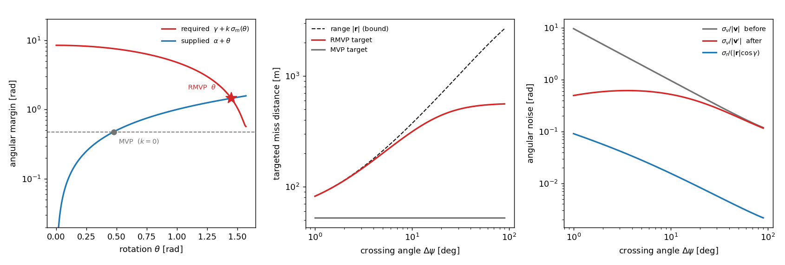
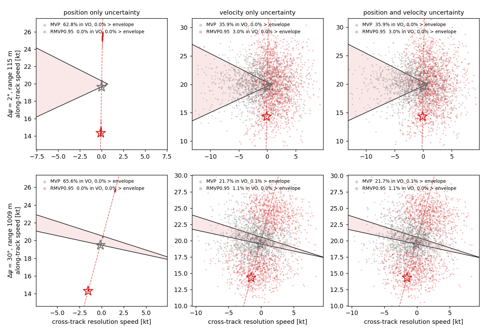
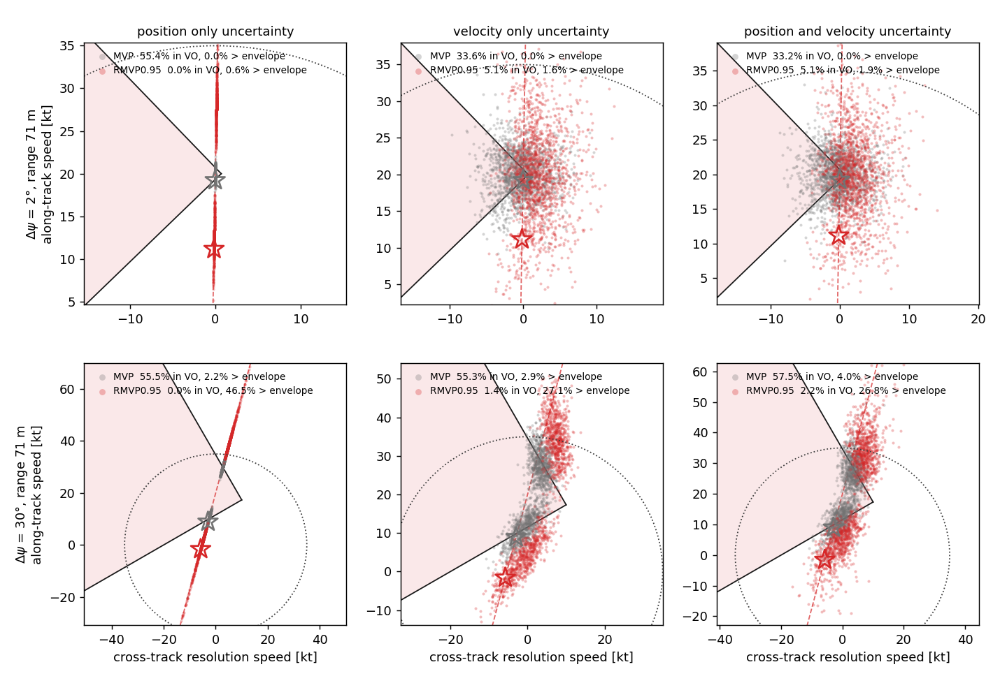
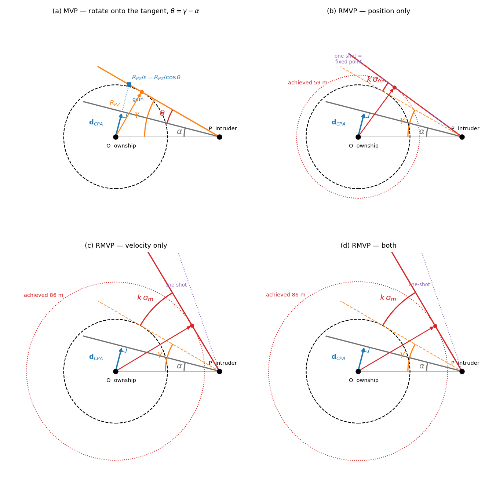

# Derivation — Robust MVP resolution (RMVP), 2D directed

MVP under navigation uncertainty, re-derived in the coordinate the problem actually lives in. The
short version: the miss distance depends on the *direction* of the relative velocity and on nothing
else about it, so the uncertainty that matters is an **angle**, and a chance constraint written on
the angle is bounded and always feasible where the same constraint written on the distance is
neither.

- Implemented by: [`robust-mvp/rmvp.py`](../../robust-mvp/rmvp.py) (`RMVP`) — a prototype, not yet
  in `opencdarr/`
- Walked through step by step, against MVP at each step, in
  [`robust-mvp/rmvp_explained.ipynb`](../../robust-mvp/rmvp_explained.ipynb) — start there if this
  note is the first thing you have read on it
- Checked by: [`robust-mvp/verify_rmvp.py`](../../robust-mvp/verify_rmvp.py)
- Measured by: [`robust-mvp/ips_run.py`](../../robust-mvp/ips_run.py) (§8)
- The exact-quantile variant that prices §9.1:
  [`robust-mvp/rmvp_exact.py`](../../robust-mvp/rmvp_exact.py) (§8.5)
- Extends [`mvp-resolution.md`](mvp-resolution.md); shares the CPA algebra of
  [`cpa-detection.md`](cpa-detection.md) and the uncertainty model of
  [`gps-noise.md`](gps-noise.md) and [`probabilistic-ftr-recovery.md`](probabilistic-ftr-recovery.md)
- Supersedes the offset-domain attempt in
  [`uncertainty-aware-mvp/`](../../uncertainty-aware-mvp/README.md) (UAMVP), which §7 dissects

## Symbols

| symbol | meaning | unit |
|--------|---------|------|
| $\mathbf r,\ \mathbf v$ | relative position / velocity, intr − own | m, m/s |
| $R$ | resolution zone $=\texttt{rpz}\times\texttt{margin}$ | m |
| $\alpha$ | angle between $\mathbf v$ and the line of sight, $\in[0,\pi/2]$; **floored**, §2 | rad |
| $\varepsilon$ | the paper's grazing correction, Eq. (12); $=\cos(\gamma-\alpha)$ by §2.3 | — |
| $d_\text{floor}$ | MVP's head-on floor on the miss distance, `_BIAS_EPS` = 0.1 m | m |
| $\gamma$ | the angle at which the miss distance equals $R$, $\arcsin(R/|\mathbf r|)$ | rad |
| $\theta$ | rotation applied to $\mathbf v$ by the manoeuvre | rad |
| $\sigma_r,\ \sigma_v$ | relative position / velocity noise, per axis | m, m/s |
| $\sigma_m$ | standard deviation of the achieved angular margin | rad |
| $k$ | $\Phi^{-1}(\texttt{confidence})$ | — |

$\sigma_r,\sigma_v$ come from the two aircraft's declared `pos_ci95`/`vel_ci95` through the same
`CI95_TO_SIGMA` conversion `GnssNavigation` and `ProbabilisticFTR` use, summed over both sides
(independent errors). Resolver and recovery criterion therefore size the same uncertainty from the
same two numbers.

## 1. One angle carries the whole problem

Write $\mathbf v = |\mathbf v|\,(\cos\alpha\,(-\hat{\mathbf r}) + \sin\alpha\,\hat{\mathbf n})$ with
$\hat{\mathbf n}\perp\hat{\mathbf r}$. Then

$$ t_\text{cpa} = -\frac{\mathbf r\cdot\mathbf v}{|\mathbf v|^2} = \frac{|\mathbf r|\cos\alpha}{|\mathbf v|}, \qquad \mathbf c = \mathbf r + \mathbf v\,t_\text{cpa}, \qquad d = |\mathbf c| = |\mathbf r|\sin\alpha $$

using $\mathbf c\cdot\hat{\mathbf r} = |\mathbf r|\sin^2\alpha$ and
$\mathbf c\cdot\hat{\mathbf n} = |\mathbf r|\sin\alpha\cos\alpha$. So

$$ \boxed{\ d < R \iff \sin\alpha < \sin\gamma \iff \alpha < \gamma\ } \qquad \alpha,\gamma\in[0,\pi/2] $$

**The velocity obstacle is the sub-level set $\{\alpha<\gamma\}$ of one scalar.** Its legs are
$\{\alpha=\gamma\}$. Nothing has to be constructed, intersected or projected — which is what makes
this a *geometric* rule in the sense the study asked for, and why the same test appears in
`fig_vo_frame.py` as three lines of arithmetic rather than a cone.

This section is the exact geometry. From §2.1 on, $\alpha$ means the *floored* angle MVP and RMVP
both actually compute, $\arcsin(\max(d_m, d_\text{floor})/|\mathbf r|)$ — which at `dcpa` = 0 is what
every number in this note was produced with.

## 2. MVP, derived from the paper's own equations

`mvp-resolution.md` derives MVP from the BlueSky implementation. This section derives the same
result from the paper's Eq. (11)–(13), because that is the formulation the study is written against
and the two use different sign conventions. Nothing is asserted here that is not shown.

### 2.1 Conventions, and the one that has to be pinned

The paper's §3.1 sets $\mathbf x_\text{rel} = \mathbf x_i - \mathbf x_o$ but
$\mathbf V_\text{rel} = \mathbf V_o - \mathbf V_i$ — the two are mixed, and deliberately, because
only that pairing makes Eq. (2)

$$ t_\text{CPA} = \frac{\mathbf V_\text{rel}\cdot\mathbf x_\text{rel}}{\lVert\mathbf V_\text{rel}\rVert^2} $$

positive on a closing pair. Take the worked example used throughout this section: ownship at the
origin on $+x$ at 1 m/s, intruder at $(10,3)$ on $-x$ at 1 m/s, $R_\text{PZ}=5$ m. Then
$\mathbf x_\text{rel}=(10,3)$, $\mathbf V_\text{rel}=(2,0)$, $t_\text{CPA}=+5$ s. Pairing both as
$o-i$ instead gives $t_\text{CPA}=-5$ s, which Eq. (4) could not use.

This note's $\mathbf r,\mathbf v$ (§1) are both $i-o$, so
$\mathbf r=\mathbf x_\text{rel}$ and $\mathbf v=-\mathbf V_\text{rel}$. Magnitudes are unaffected,
$\lVert\mathbf v\rVert = \lVert\mathbf V_\text{rel}\rVert$, and so is $t_\text{CPA}$.

### 2.2 $\mathbf d_\text{CPA}$ is perpendicular to the relative velocity

Directly from Eq. (3), $\mathbf d_\text{CPA} = \mathbf x_\text{rel} - \mathbf V_\text{rel}t_\text{CPA}$:

$$ \mathbf d_\text{CPA}\cdot\mathbf V_\text{rel} = \mathbf x_\text{rel}\cdot\mathbf V_\text{rel} - \lVert\mathbf V_\text{rel}\rVert^2 t_\text{CPA} = \mathbf x_\text{rel}\cdot\mathbf V_\text{rel} - \lVert\mathbf V_\text{rel}\rVert^2\frac{\mathbf V_\text{rel}\cdot\mathbf x_\text{rel}}{\lVert\mathbf V_\text{rel}\rVert^2} = 0 $$

by substituting Eq. (2). Confirmed numerically on the example ($0.000\text{e}{+}00$).

### 2.3 The two angles are already inside Eq. (12)

Eq. (3) rearranges to an **orthogonal** decomposition, by §2.2:

$$ \mathbf x_\text{rel} = \mathbf V_\text{rel}\,t_\text{CPA} + \mathbf d_\text{CPA} $$

Let $\alpha$ be the angle between $\mathbf x_\text{rel}$ and $\mathbf V_\text{rel}$. Reading the two
legs of that right triangle,

$$ \lVert\mathbf d_\text{CPA}\rVert = \lVert\mathbf x_\text{rel}\rVert\sin\alpha, \qquad \lVert\mathbf V_\text{rel}\rVert\,t_\text{CPA} = \lVert\mathbf x_\text{rel}\rVert\cos\alpha $$

and define $\gamma$ by $R_\text{PZ} = \lVert\mathbf x_\text{rel}\rVert\sin\gamma$. Then Eq. (12) is

$$ \varepsilon = \cos\left(\arcsin\frac{R_\text{PZ}}{\lVert\mathbf x_\text{rel}\rVert} - \arcsin\frac{\lVert\mathbf d_\text{CPA}\rVert}{\lVert\mathbf x_\text{rel}\rVert}\right) = \cos(\gamma-\alpha) $$

**$\alpha$ and $\gamma$ are not new symbols.** They are the two arcsines the paper already evaluates
inside $\varepsilon$; it simply does not name them. Everything below is bookkeeping on quantities
Eq. (12) computes.

### 2.4 The magnitude of the resolution vector

Eq. (11) is $\mathbf{dV}$ parallel to $\mathbf d_\text{CPA}$, so its norm divides out one factor of
$\lVert\mathbf d_\text{CPA}\rVert$:

$$ \lVert\mathbf{dV}\rVert = \frac{R_\text{PZ}/\varepsilon - \lVert\mathbf d_\text{CPA}\rVert}{t_\text{CPA}\,\lVert\mathbf d_\text{CPA}\rVert}\cdot\lVert\mathbf d_\text{CPA}\rVert = \frac{R_\text{PZ}/\varepsilon - \lVert\mathbf d_\text{CPA}\rVert}{t_\text{CPA}} $$

Substitute all four quantities from §2.3 — $R_\text{PZ}=\lVert\mathbf x_\text{rel}\rVert\sin\gamma$,
$\lVert\mathbf d_\text{CPA}\rVert=\lVert\mathbf x_\text{rel}\rVert\sin\alpha$,
$t_\text{CPA}=\lVert\mathbf x_\text{rel}\rVert\cos\alpha/\lVert\mathbf V_\text{rel}\rVert$,
$\varepsilon=\cos(\gamma-\alpha)$ — and $\lVert\mathbf x_\text{rel}\rVert$ cancels:

$$ \lVert\mathbf{dV}\rVert = \frac{\lVert\mathbf V_\text{rel}\rVert}{\cos\alpha}\left(\frac{\sin\gamma}{\cos(\gamma-\alpha)} - \sin\alpha\right) = \frac{\lVert\mathbf V_\text{rel}\rVert}{\cos\alpha}\cdot\frac{\sin\gamma - \sin\alpha\cos(\gamma-\alpha)}{\cos(\gamma-\alpha)} $$

Expand the numerator by writing $\gamma = (\gamma-\alpha)+\alpha$:

$$ \sin\gamma = \sin(\gamma-\alpha)\cos\alpha + \cos(\gamma-\alpha)\sin\alpha $$
$$ \Rightarrow\quad \sin\gamma - \sin\alpha\cos(\gamma-\alpha) = \sin(\gamma-\alpha)\cos\alpha $$

The $\sin\alpha\cos(\gamma-\alpha)$ terms cancel exactly, $\cos\alpha$ divides out, and

$$ \boxed{\;\lVert\mathbf{dV}\rVert = \lVert\mathbf V_\text{rel}\rVert\,\frac{\sin(\gamma-\alpha)}{\cos(\gamma-\alpha)} = \lVert\mathbf V_\text{rel}\rVert\tan(\gamma-\alpha)\;} $$

Equivalently in one step by sum-to-product,
$\sin\gamma-\sin(2\alpha-\gamma)=2\cos\alpha\sin(\gamma-\alpha)$. Checked both ways: `sympy`
reduces the difference of the two forms to exactly `0` under `expand_trig`, and `mpmath` at 25
digits agrees to $\le2\times10^{-26}$ across $\alpha\in\{0.001,0.29,0.9\}$, $\gamma\in\{0.48,0.50,1.2\}$.

### 2.5 The rotation, and what $\varepsilon$ is for

$\mathbf{dV}\perp\mathbf V_\text{rel}$ by §2.2, so it **rotates** the relative velocity rather than
lengthening it along its own direction:

$$ \theta = \arctan\frac{\lVert\mathbf{dV}\rVert}{\lVert\mathbf V_\text{rel}\rVert} = \gamma-\alpha, \qquad \lVert\mathbf V'_\text{rel}\rVert = \frac{\lVert\mathbf V_\text{rel}\rVert}{\cos\theta} $$

The post-manoeuvre angle is $\alpha+\theta = \gamma$ exactly, so by §2.3 the achieved miss distance
is $\lVert\mathbf x_\text{rel}\rVert\sin\gamma = R_\text{PZ}$ — the relative velocity ends up
**tangent** to the protected zone. **MVP is the exact rotation onto the cone edge, with no
overshoot and no undershoot.**

That is precisely what $\varepsilon$ buys, and it is measurable. On the worked example:

| | $\lVert\mathbf{dV}\rVert$ | achieved miss |
|---|---|---|
| Eq. (11) as written | 0.422020 | **5.000000 m** |
| same with $\varepsilon=1$ | 0.400000 | 4.902903 m |

Dropping $\varepsilon$ falls 0.097 m short of $R_\text{PZ}=5$ m — the "grazing" the paper's §3.2.1
says it prevents, quantified.

### 2.6 A sign that does not compose

Eq. (13) reads $\mathbf V_\text{res} = \mathbf V_o + \mathbf{dV}$. Under §3.1's conventions that
steers the wrong way, and the reason is visible in §2.3's decomposition.

$\mathbf d_\text{CPA}$ is the component of $\mathbf x_\text{rel}$ *perpendicular* to
$\mathbf V_\text{rel}$ — it points from the ownship toward the intruder at CPA (checked on the
example: $\mathbf x_i(t_\text{CPA})-\mathbf x_o(t_\text{CPA}) = (0,3) = \mathbf d_\text{CPA}$).
Since $\mathbf V_\text{rel}=\mathbf V_o-\mathbf V_i$, adding $\mathbf{dV}\parallel+\mathbf
d_\text{CPA}$ to $\mathbf V_o$ adds it to $\mathbf V_\text{rel}$ as well, rotating $\mathbf
V_\text{rel}$ *toward* $\mathbf x_\text{rel}$ and so **decreasing** $\alpha$.

Measured on the example, with $R_\text{PZ}=5$ m:

| | achieved miss |
|---|---|
| no manoeuvre | 3.000 m |
| $\mathbf V_o + \mathbf{dV}$, as Eq. (13) is written | 0.871 m |
| $\mathbf V_o - \mathbf{dV}$ | **5.000 m** |

So either Eq. (11) should carry a leading minus or Eq. (13) should subtract. `opencdarr/cr/mvp.py`
subtracts (`v_own - dv`, with `dv` along $+\mathbf c$), and every number in the paper comes from the
implementation, so this is a presentational slip in the write-up and not a defect in any result.
Worth fixing in the manuscript.

### 2.7 The angle both rules actually rotate from

One implementation detail has to come into the algebra rather than sit beside it. MVP does not use
the raw miss distance. When $\lVert\mathbf d_\text{CPA}\rVert \le d_\text{floor}$ (`_BIAS_EPS` =
0.1 m) it **floors the magnitude and replaces the direction**, taking the step perpendicular to the
line of sight instead of from the ill-conditioned $\mathbf d_\text{CPA}$. So the angle every formula
above means in practice is

$$ \alpha \;=\; \arcsin\frac{\max(\lVert\mathbf d_\text{CPA}\rVert,\ d_\text{floor})}{\lVert\mathbf x_\text{rel}\rVert} $$

($d_\text{floor}$ rather than $\varepsilon$, which the paper has already taken for the cosine in
Eq. 12.) It cannot be dropped for tidiness, for two reasons.

**It is always active in this study's design calculations.** At `dcpa` = 0 the true miss distance is
$\sim10^{-9}$ m, so the floor fires in every noise-free figure and table here: $\alpha$ is
$\arcsin(d_\text{floor}/\lVert\mathbf x_\text{rel}\rVert) = 8.7\times10^{-4}$ rad at the 2°
geometry, not zero.

**It is what makes §2.4 exact against the code.** With the floor the angle form matches
`opencdarr/cr/mvp.py` to $3.8\times10^{-7}$ relative — float64 round-off between two algebraically
identical forms. Written with the raw $\lVert\mathbf d_\text{CPA}\rVert$ it is off by
$2.2\times10^{-3}$, four orders worse, and no longer an identity.

Under noise the floor is essentially inert, which is the opposite of the design case and worth
keeping straight: the *perceived* miss distance is dominated by position noise (median 81 m at 2°,
218 m at 30°, at `ci95` 10 m), so it fires in 0.03% and 0.10% of draws respectively.

$d_\text{floor}$ also bounds $\alpha$ away from zero, which §4 relies on to keep the step finite at
the rotation cap. `RMVP` keeps the whole tie-break verbatim — that is what makes $k=0$ reproduce MVP
at *every* geometry rather than merely away from a head-on.

### 2.8 Why this matters for the rest of the note

$\theta_\text{MVP} = \gamma - \alpha$ is a statement about **one scalar**. RMVP replaces that one
number with a larger one and changes nothing else: not the direction $\hat{\mathbf d}_\text{CPA}$,
not the head-on tie-break, not the sum over intruders. That is what makes $k=0$ reproduce MVP
exactly rather than approximately, and it is the whole reason the comparison in §8 is controlled.

## 3. The angular margin and its noise

Define the margin $m = \alpha - \gamma$. Both terms are computed from **perceived** states, so both
carry error. Decompose an isotropic position error $\mathbf e_r$ into its radial and tangential
components — independent, each $\sigma_r$:

$$ \delta\alpha = \underbrace{\frac{\mathbf e_v\cdot\hat{\mathbf n}_v}{|\mathbf v|}}_{\sigma_v/|\mathbf v|} - \underbrace{\frac{\mathbf e_r\cdot\hat{\mathbf n}_r}{|\mathbf r|}}_{\sigma_r/|\mathbf r|}, \qquad \delta\gamma = -\frac{\tan\gamma}{|\mathbf r|}\,\delta|\mathbf r| \quad\Rightarrow\quad \sigma_{\gamma} = \frac{\tan\gamma\,\sigma_r}{|\mathbf r|} $$

$\delta\gamma$ reads the *radial* component and $\delta\alpha$'s position part reads the
*tangential* one, so they are independent and add in quadrature:

$$ \sigma_m^2 = \left(\frac{\sigma_v}{|\mathbf v|}\right)^{\!2} + \frac{\sigma_r^2}{|\mathbf r|^2}\left(1+\tan^2\gamma\right) = \left(\frac{\sigma_v}{|\mathbf v|}\right)^{\!2} + \left(\frac{\sigma_r}{|\mathbf r|\cos\gamma}\right)^{\!2} $$

**The velocity term is an angular signal-to-noise ratio**, $\sigma_v/|\mathbf v|$. That single number
is the whole fragility of a shallow crossing: at $\Delta\psi=2^\circ$ between two 20 kt aircraft the
true relative speed is 0.359 m/s against $\sigma_v = 1.733$ m/s at `vel_ci95` 3 m/s, so
$\sigma_\varphi = 4.83$ rad. The direction of $\mathbf v$ is not noisy, it is **unknown**.

### 3.1 The manoeuvre changes its own uncertainty

The step is a real velocity change applied on top of a misperceived velocity, so the *true*
post-manoeuvre relative velocity is the intended $\mathbf v'$ plus the same error $\mathbf e_v$.
Its direction noise is $\sigma_v/|\mathbf v'|$, and §2 gives $|\mathbf v'| = |\mathbf v|/\cos\theta$:

$$ \boxed{\ \sigma_m(\theta)^2 = \left(\frac{\sigma_v\cos\theta}{|\mathbf v|}\right)^{\!2} + \left(\frac{\sigma_r}{|\mathbf r|\cos\gamma}\right)^{\!2}\ } $$

**Turning harder makes the outcome better known, not merely further away.** The position term
carries no $\theta$: no velocity change can re-measure where the aircraft are, which is why it sets
the floor on what confidence is available at a given range.

## 4. The constraint, and why it is implicit

Require $P(m>0)\ge c$. To first order $m$ is Gaussian, so this is a statement about its mean:

$$ \boxed{\ \alpha + \theta - \gamma \ \ge\ k\,\sigma_m(\theta), \qquad k=\Phi^{-1}(c)\ } $$

and `RMVP` takes the **smallest** $\theta\ge0$ satisfying it. Both sides move with $\theta$, so this
is a fixed point rather than a formula. It is well behaved:

$$ f(\theta) = \alpha+\theta-\gamma-k\sigma_m(\theta), \qquad \frac{\mathrm d\sigma_m}{\mathrm d\theta} = -\frac{\sigma_\varphi^2\cos\theta\sin\theta}{\sigma_m} \le 0 \ \text{on}\ [0,\tfrac\pi2] \ \Rightarrow\ f' \ge 1 $$

so $f$ is strictly increasing with slope bounded below by 1: the root is unique and Newton cannot
stall. `rotation()` runs Newton inside a bracket, falling back to bisection whenever a step would
leave it. Measured over the 316 root cases in `verify_rmvp.py` §3 that is a median of 11 $\sigma_m$
evaluations and 17 at worst — about five iterations, since each takes two evaluations and the two
branch checks take one each. Deterministic, and the residual is $9.8\times10^{-13}$ rad.

*(a) The fixed point at $\Delta\psi=2^\circ$, `ci95` (10 m, 3 m/s). The margin the confidence demands
(red) **falls** as the manoeuvre grows; the margin the manoeuvre supplies (blue) rises. MVP is where
the supplied margin reaches $\gamma$ alone. (b) The miss distance each rule ends up aiming at,
against the range — the largest miss the geometry permits, and a bound RMVP's target approaches but
never crosses. (c) The angular noise on the relative-velocity direction before and after the
manoeuvre, against the position term no velocity change can touch. Generated by
[`robust-mvp/fig_mechanism.py`](../../robust-mvp/fig_mechanism.py), which also prints the
offset-domain numbers §5 quotes without plotting them.*

Two branches close the problem at its ends:

- $f(0)\ge0$ — already robustly clear, no manoeuvre. With $k=0$ this is MVP's "no conflict".
- $f(\theta_\text{max})<0$ at $\theta_\text{max}=\pi/2-\alpha$ — the confidence is **not available at
  this geometry**, because a perpendicular relative velocity is the largest offset ($|\mathbf r|$)
  the range permits. The rule returns that best-available rotation, which is the paper's "maximise
  the distance at CPA" taken to its limit. It requires $\gamma + k\sigma_\text{los} > \pi/2$, so it
  is driven by *position* uncertainty at short range and never by velocity uncertainty.

$\theta_\text{max}$ is the *physical* cap: rotating past perpendicular reduces the offset again, so
nothing beyond it is worth asking for. At the cap the step is $|\mathbf v|\cot\alpha$, finite
because MVP's `_BIAS_EPS` floor bounds $\alpha$ away from zero — no arbitrary clamp near $\pi/2$ is
needed to keep $\tan$ finite, and one should not be used, since it truncates the step by a constant
factor wherever it binds (13% at the 2° geometry, $\cot(\pi/2-10^{-3})$ against $\cot\alpha$). That
effect is small and confined to the cap branch, which there needs $|\mathbf v|<2.3\times10^{-3}$ m/s
and never fires in the campaign; the reason to prefer the physical cap is that it is the one with a
geometric meaning, not that the alternative was measurably wrong.

## 5. Why not the offset domain

Mapping §3 through $d = |\mathbf r|\sin\alpha$ gives $\sigma_d = |\mathbf r|\cos\alpha\,\sigma_m$,
whose velocity part is $|\mathbf r|\cos\alpha\,\sigma_v/|\mathbf v| = t_\text{cpa}\sigma_v$ — exactly
UAMVP's $\sigma_d^2 = \sigma_r^2 + t_\text{cpa}^2\sigma_v^2$. The two models are the *same model*;
they differ only in the coordinate the constraint is written in. But the map is $\sin$, and $\sin$
is bounded:

$$ d = |\mathbf r|\sin\alpha \ \le\ |\mathbf r| \quad\text{always} $$

Linearising destroys that bound. At $\Delta\psi=2^\circ$ with `vel_ci95` 3 m/s the linearised
$\sigma_d$ is **553 m** for a quantity that cannot exceed the range of **114.6 m**, and the chance
constraint then asks for $R_\text{eff}=963$ m — 8.4× the range. No velocity achieves it, because
none can. Swept across crossing angles (`fig_mechanism.py`'s printout, which computes this without
plotting it), the offset-domain target exceeds the range for every $\Delta\psi<17^\circ$ and peaks
at **16.5×**. Panel (b) plots the other side of the same comparison: RMVP's target approaches the
range and reaches at most **0.999** of it.

Nothing about the physics changes between the two. Only the coordinate does, and the angle is the
one in which the feasible set is an interval rather than a half-line.

## 6. Consequences

1. **$c=0.5$ is MVP.** $k=0$ short-circuits to $\theta=\gamma-\alpha$.
   $\sigma\to0$ gives MVP at any confidence. Both to $3.8\times10^{-7}$ relative (§2).
2. **The step stays bounded as $|\mathbf v|\to0$.** With $\eta=\pi/2-\theta$ small (the residual
   angle to perpendicular; $\varepsilon$ is taken, §2.3),
   $\eta\,(1+k\sigma_v/|\mathbf v|) \approx \pi/2+\alpha-\gamma$, so
   $a = |\mathbf v|\cot\eta \to k\sigma_v/(\pi/2+\alpha-\gamma)$. Measured against the
   analytic limit 2.601 m/s: 5.80, 4.05, 3.40, 2.92, 2.70, 2.62 m/s as $|\mathbf v|$ falls
   5 → 0.01 m/s.
3. **A relative-speed floor is derived, not chosen.** $|\mathbf v'| \ge k\sigma_v/(\alpha+\theta-\gamma)$
   falls out of the constraint. `finding-best-cr`'s CVP imposes such a floor by hand and keys it on
   the *perceived* relative speed, which the noise itself inflates — so it backs off exactly when
   the noise grows.
4. **The rule is a potential field.** The N-aircraft resolve is the sum of pairwise $\mathbf{dv}$,
   as in MVP (ADR 0004). No union of cones, no minimum-norm projection.

## 7. Is this only MVP's margin, enlarged adaptively?

Worth answering carefully, because the first answer is yes and it is the less useful one.

**Yes, as a description of the output.** Any deterministic rule that returns a rotation can be
written as MVP aiming at some state-dependent target, here

$$ R_\text{eff} = |\mathbf r|\sin(\alpha+\theta^*) $$

That is true of RMVP and equally true of UAMVP, so on its own it separates nothing.

**No, as a description of the method.** The question with content is whether the margin can be
*computed* the way an adaptive margin is computed — as an explicit function of the current state,
evaluated once, then handed to MVP. Three reasons it cannot:

1. **The margin is bounded by construction, and an explicit one is not.** RMVP's target is
   $|\mathbf r|\sin(\gamma+k\sigma_m)\le|\mathbf r|$; the saturating nonlinearity is *inside* the
   margin and it is the correct one, because it is the map from angle to miss distance. An additive
   margin $\texttt{rpz}+k\sigma_d$ has no such ceiling and overshoots the range by up to 16.5×
   (§5). Panel (b) plots the RMVP half of this: the target rises toward the range and stops there.
2. **The margin depends on the manoeuvre that meets it.** $\sigma_m(\theta)$ is not a property of
   the state; it is a function of the answer. The explicit version — evaluate $\sigma_m$ once at
   $\theta=0$, then rotate — demands $\gamma-\alpha+k\sigma_m(0) = 8.41$ rad at the 2° geometry.
   That is 482°, past a full half-turn, and there is no such manoeuvre. The self-consistent answer
   at the same geometry is 1.448 rad (83°). **The explicit version is not less accurate, it has no
   solution.** Panel (a) is this claim.
3. **The uncertainty model is angular, not a rescaled metric one.** $\sigma_m$ and $\sigma_d$ agree
   only while $\sigma_\alpha\ll1$ rad (§5). Panel (c): the manoeuvre divides the velocity term by
   19.5× at $\Delta\psi=1^\circ$ and by 1.02× at 90°. The mechanism is active exactly where the
   metric model is invalid and dormant where the metric model is fine — so the difference between
   the two rules is not a tuning constant, it is confined to the regime the campaign is about.

One-line version: an adaptive margin asks *how much extra distance does the noise cost me?*; RMVP
asks *how much rotation makes the noise stop mattering?* The two coincide when the noise is small
and diverge when it is not.

## 8. What has been measured

Conditions throughout: both aircraft 20 kt (10.2889 m/s), `dcpa` 0, `rpz` 50 m, `margin` 1.05,
`t_lookahead` 120 s, `tlos` 180 s, `dt` 0.2 s, `t_max` 600 s, 1 Hz broadcast, M600 multirotor, GNSS
navigation noise, perfect datalink, recovery `ProbabilisticFTR(velocity_uncertainty="both")` at
threshold 0.95. `confidence` = 0.95, so $k=1.645$.

### 8.1 Delivered confidence, one manoeuvre

20 000 perception draws per cell through `GnssNavigation`, scored on the true geometry
(`verify_rmvp.py`). `ci95` (10 m, 3 m/s), design target 0.95:

| $\Delta\psi$ | 2° | 5° | 10° | 30° | 90° |
|---|---|---|---|---|---|
| MVP | 0.583 | 0.623 | 0.681 | 0.787 | 0.796 |
| UAMVP 0.95 | 0.798 | 0.867 | 0.910 | 0.976 | 0.984 |
| **RMVP 0.95** | **0.848** | **0.940** | **0.971** | **0.988** | **0.990** |
| RMVPExact 0.95 | 0.855 | 0.942 | — | 0.957 | — |

RMVP is above UAMVP in every cell *and* commands a smaller step at the shallow angles (2.48 against
2.95 m/s at 2°). It reaches its stated confidence from 10° up and falls short at 2°.

The last row is the same rule with the Gaussian quantile replaced by the exact projected-normal one
(`rmvp_exact.py`, §8.5). It matters because it **isolates** the approximation: whatever it does not
fix is not the approximation's fault.

### 8.2 In the velocity-obstacle frame, at the campaign range

10 000 samples per cell, resolution velocity tested against the true obstacle
(`fig_vo_frame.py`, the construction of the paper's §4.2). The declared accuracy is held at
(10 m, 3 m/s) in all three columns, so the resolvers size the same margin everywhere and the only
thing that changes is which input actually carries noise.

*Resolution velocity in the ownship's velocity space, at the campaign's own ranges — 114.6 m at
$\Delta\psi=2^\circ$ (obstacle half-angle 25.9°) and 1008.7 m at 30° (2.8°). Shaded wedge: the
velocity obstacle at `rpz`, apexed at the intruder's velocity. Dashed red line: the
$\mathbf d_\text{CPA}$ direction, which every one of these rules steps along, so both clouds must
lie on it. Open stars: the noise-free solution. Dotted circle: the M600's 18 m/s (35 kt) flight
envelope. At `dcpa` = 0 the perceived passing side is a coin flip (measured 48.5–52.0%), so each
cloud is genuinely bimodal — the two modes are the two obstacle legs, and under position-only noise
a mode is about 0.1 kt across, which is why it disappears inside the open star.*

| $\Delta\psi$, source | MVP in VO | RMVP in VO | MVP > envelope | RMVP > envelope |
|---|---|---|---|---|
| 2°, position only | 62.8% | 0.0% | 0.0% | 0.0% |
| 2°, velocity only | 35.9% | 3.0% | 0.0% | 0.0% |
| 2°, both | 35.9% | 3.0% | 0.0% | 0.0% |
| 30°, position only | 65.6% | 0.0% | 0.0% | 0.0% |
| 30°, velocity only | 21.7% | 1.1% | 0.1% | 0.0% |
| 30°, both | 21.7% | 1.1% | 0.1% | 0.0% |

At these ranges the envelope never binds — every commanded velocity is flyable — so the in-VO column
is the whole story. Two side findings, both explained by this derivation:

- **MVP exceeds 50% under position noise, and that is a bias rather than spread.** At `dcpa` = 0 the
  perceived $\tilde\alpha$ is a *folded* quantity, always positive, so MVP rotates to
  $\tilde\gamma-\tilde\alpha$ and credits itself with a miss it does not have. The shortfall is
  $\mathbb E|\tilde\alpha|\cdot|\mathbf r| = \sigma_r\sqrt{2/\pi} = 4.61$ m and it is
  **range-independent**, which is why 2° and 30° both read 63–66% against a 2.5 m margin. RMVP's
  $k\sigma_\text{los}$ term covers it.
- **Velocity uncertainty dominates position uncertainty by two orders of magnitude here.** The
  velocity-only and both columns agree to the printed precision (raw counts 3593 against 3586 in
  VO): $\sigma_\varphi = 4.83$ rad against 0.050 rad of line-of-sight noise at 2°.

### 8.3 The same frame at short range, where the obstacle is wide

Re-run with the range pinned so both crossing angles share a 45° obstacle half-angle
(`--gamma 45`, range 70.7 m for both). This isolates $\Delta\psi$: at the campaign's own `tlos` the
two rows differ in range *and* in relative speed at once.

*The same construction at 70.7 m, a 45° obstacle. Compare the axis scales with the previous figure:
the commanded velocities are an order of magnitude larger, and at $\Delta\psi=30^\circ$ a large
share of them fall outside the dotted envelope circle.*

| $\Delta\psi$, source | MVP in VO | RMVP in VO | MVP > envelope | RMVP > envelope |
|---|---|---|---|---|
| 2°, position only | 55.4% | 0.0% | 0.0% | 0.6% |
| 2°, velocity only | 33.6% | 5.1% | 0.0% | 1.6% |
| 2°, both | 33.2% | 5.1% | 0.0% | 1.9% |
| 30°, position only | 55.5% | 0.0% | 2.2% | **46.5%** |
| 30°, velocity only | 55.3% | 1.4% | 2.9% | **27.1%** |
| 30°, both | 57.5% | 2.2% | 4.0% | **26.8%** |

**MVP degrades sharply as the obstacle widens.** At 30° its in-VO share goes from 21.7% at 1008.7 m
to 57.5% at 70.7 m: a wide cone means $\gamma$ is large, and §8.2's folded-perception bias
$\sigma_r\sqrt{2/\pi}$ is a fixed 4.61 m of miss distance regardless, so the manoeuvre has less
room to absorb it.

**RMVP holds at 2.2%, and the bill arrives somewhere else.** At 30° and 70.7 m it commands
velocities outside the M600's envelope in **26.8%** of draws, against 4.0% for MVP. Those are
requests, not manoeuvres: the kinematics layer clamps them into $[v_\text{min}, v_\text{max}]$, the
aircraft flies the nearest speed it has, and the intended geometry is not achieved — so the in-VO
number for that cell is what the rule *asked for*, not what it would deliver. §9.5 keeps this as a
named limitation rather than folding it into the result. The 2° row at the same range stays under
2%, because a shallow crossing closes slowly enough that a 45° obstacle is still 57.7 s away, while
at 30° it is 3.9 s away.

### 8.4 P(LoS), by interacting particle system

`ips_run.py`, 600 particles × 8 replications, per-cell ladders, **0/8 collapses in every cell**.
Plain MC cannot do this job: 3200 probe encounters recorded zero losses of separation.

| $\Delta\psi$ | MVP | RMVP 0.95 | ratio |
|---|---|---|---|
| 2° | 1.112e-03 [8.28e-04, 1.34e-03] | **7.614e-05** [5.86e-05, 9.09e-05] | 15× |
| 30° | 1.915e-04 [9.15e-05, 2.50e-04] | **3.009e-06** [1.16e-06, 4.55e-06] | 64× |

and the exact-quantile arm at the 2° cell, run at the same settings: **6.083e-05**
[3.79e-05, 7.52e-05], 0/8 collapses. Its interval overlaps RMVP's, so the two are not separated by
this campaign.

The replication intervals are disjoint in both rows. This is not circular: the margin is sized from
*declared* accuracy while the loss of separation is measured on the **true** states, and the noise
realisation each aircraft flies is drawn independently of what it declares.

**The safety is not bought with manoeuvring.** Time-averaged deviation from nominal (400 probe
encounters per cell) falls from 8.16 to 7.25 m/s at 2° and from 6.35 to 5.34 m/s at 30°. A larger
step taken once costs less than a small one repeated for minutes.

**Methods note.** The first shell ladder — a geometric descent in excess over `rpz` — collapsed both
30°/(10 m, 1 m/s) cells. It stepped 139 → 113 → 95 → 82 → 72 → 66 m and lost every particle at the
sixth shell, because a step that large lets survivors pass CPA before the next split, and past CPA
the separation can only grow. Shells now sit at *quantiles* of the probe's own minimum-separation
distribution, so each level costs a constant fraction of the cloud. See ADR 0017 §2.

### 8.5 The exact quantile, and what it is worth

`rmvp_exact.py` keeps every part of the rule and replaces only the Gaussian quantile with the exact
projected-normal probability — `_p_offset_gt`, the same quadrature `ProbabilisticFTR` uses to decide
when to resume. So the resolver and the recovery criterion evaluate **one function**, once before
the manoeuvre and once after. It exists to price §9.1, and the price turns out to be small and to
run in both directions.

| | 2° | 5° | 30° | mean $\lVert\Delta v\rVert$ at 2° / 30° |
|---|---|---|---|---|
| RMVP 0.95 (Gaussian) | 0.848 | 0.940 | **0.988** | 2.48 / 2.71 m/s |
| RMVPExact 0.95 | **0.855** | 0.942 | **0.957** | 2.87 / **2.17** m/s |

- **At 30° the Gaussian rule was over-delivering** — 0.988 for a 0.95 design — and the exact one
  lands on 0.957 while commanding 20% *less*. That is the real gain, and it was not predicted.
- **At 2° it moves the delivered probability by 0.007.** The approximation was not what was binding
  there.

Two supporting checks. The quadrature itself is exact: against a 400 000-sample direct Monte Carlo
it agrees to $\le1.4\times10^{-3}$ across the SNR range, so it is not the error source. And
instrumenting the exact resolver, its own claimed probability averages **0.810** at 2° and is below
its 0.95 target in **64%** of draws — the rule is failing its own constraint, which no choice of
quantile can repair.

### 8.6 Why a shallow crossing resists both rules

Sweeping the *maximum* probability any rotation can reach, per perceived state:

| $\Delta\psi$, `ci95` (10 m, 3 m/s) | 0.95 unattainable | median ceiling |
|---|---|---|
| 2° | **63.5%** of draws | 0.876 |
| 5° | 43.4% | 0.969 |
| 30° | 0.0% | 1.000 |

The delivered 0.855 at 2° sits right at that 0.876 median ceiling. **The requested confidence is
simply not available in most decisions at that geometry**, and the shortfall is a statement about
what a rotation can buy, not about how the probability is approximated. Splitting the noise sources
confirms it: with position noise alone both rules deliver 0.961 / 0.965 at 2°, above target; with
velocity noise alone, 0.847 / 0.855.

The mechanism is the cap of §4. Rotating concentrates the relative-velocity direction, since
$\lvert\mathbf v'\rvert=\lvert\mathbf v\rvert/\cos\theta$ — but the rotation stops at perpendicular,
because past it the offset shrinks again. When the perceived velocity already points near-
perpendicular there is nowhere left to go, and with $\sigma_\varphi\approx4.8$ rad the direction is
close to uniform whatever the rotation.

## 9. Limitations

### 9.1 The Gaussian angular model is first order, and that costs calibration

$\delta\alpha$ is treated as Gaussian. The true angular perturbation of a 2D Gaussian velocity is a
**projected normal**, near-Gaussian only at high SNR and near-uniform at low. At $\Delta\psi=2^\circ$
with `vel_ci95` 3 m/s the pre-manoeuvre SNR is $|\mathbf v|/\sigma_v = 0.21$, so the quantile is
being read far outside the regime it is valid in. The linear $\sigma_m$ is also an over-estimate
wherever the angle is cramped against its own bound: `rmvp_explained.ipynb` step 5 recovers the
formula to 1% once the declared uncertainty is small enough that the true $\alpha$ sits several
$\sigma_m$ above zero, and measures ratios of 0.68 at 30° and 0.09 at 2° at the campaign's own
accuracy, where it does not. Conservative, which is the safe direction, but not accurate.

**What it actually costs, measured** (§8.5, by swapping in the exact quantile and changing nothing
else):

- at 30°, an **over**-delivery: 0.988 against a 0.95 design, and correcting it saves 20% of the
  commanded step;
- at 2°, 0.007 of delivered probability.

> **An earlier version of this note claimed the Gaussian approximation was the reason RMVP falls
> short at 2°. That was wrong.** The exact quantile moves the 2° cell from 0.848 to 0.855 and the
> shortfall survives. The binding limitation there is §9.6, not this one. The correction is recorded
> rather than quietly applied because the wrong version had a plausible mechanism behind it, and a
> plausible mechanism that does not survive measurement is worth leaving visible.

So the honest reading is: this approximation costs **calibration**, not safety. It makes the rule
over-conservative where the geometry is comfortable and it is not what limits the geometry where it
is not. Removing it costs the closed form — the rule becomes a quadrature inside a root find — and
buys a better-proportioned manoeuvre rather than a safer one. At 2° the two are statistically
indistinguishable in P(LoS) (§8.4).

### 9.2 Evaluated at the current geometry, not the post-manoeuvre one

$\sigma_m$ uses the current $|\mathbf r|$ and $\gamma$. The perpendicular step only grows
$|\mathbf v|$, so $t_\text{cpa}$ shrinks and the range at the next decision is smaller, making
$\gamma$ and $\sigma_\text{los}$ both larger. The rule is re-evaluated every timestep, so this is a
per-decision approximation and not a trajectory-level guarantee.

### 9.3 Isotropy

$\sigma_r,\sigma_v$ are per-axis sigmas of isotropic covariances built from declared 95% radial CIs.
The scalar collapse in §3 depends on that: an anisotropic covariance — a real GNSS geometry — makes
$\sigma_m$ direction-dependent and the quadrature sum no longer reduces to two terms.

### 9.4 The confidence is single-sided, the encounter is not

Both aircraft compute the same rotation and turn opposite ways, so the pair achieves $\approx2\theta$
while the constraint was sized for $\theta$. The pair is therefore more conservative than asked.
MVP has the same property, so the comparison stays controlled, but the absolute confidence is not
the delivered one.

### 9.5 No envelope awareness

The rule is pure geometry and returns a ground velocity with no knowledge of the airframe. At short
range with a wide obstacle it asks for velocities that cannot be flown — §8.3 measures it: at
$\Delta\psi=30^\circ$ and 70.7 m range, **26.8% of commanded velocities exceed the M600's 18 m/s
envelope**, against 4.0% for MVP, and 46.5% under position-only noise. The kinematics layer clamps
them, so the intended geometry is not achieved and the delivered confidence in that regime is
unknown. At 2° and the same range it is 1.9%, and at the campaign's own ranges it is 0.0%
everywhere — so this limitation bounds where the rule may be trusted, and does not touch §8.4.

The fix is not a clamp inside the resolver. A clamped rotation is no longer the rotation the
constraint sized, so the confidence it reports would be wrong in a way nothing downstream could
detect. The rule should instead report that the geometry is infeasible for the airframe, the same
way §4's second branch reports that the confidence is unavailable for the range.

### 9.6 The confidence is often not available at all — the binding limitation

**This is the one that decides the shallow-crossing result.** An earlier version of this note
treated it as a corner case needing $|\mathbf v|$ below $2.3\times10^{-3}$ m/s. That figure
describes only when the *rotation cap* binds arithmetically. The operationally relevant question is
different and much more common: **at what fraction of decisions can no rotation reach the requested
confidence at all?**

Measured (§8.6), at `ci95` (10 m, 3 m/s): **63.5%** of perceived geometries at 2°, 43.4% at 5°,
**0.0%** at 30°. The median ceiling at 2° is 0.876, and the delivered 0.855 sits against it.

The mechanism is the interaction of two facts already derived. Rotating buys angular SNR, since
$\lvert\mathbf v'\rvert=\lvert\mathbf v\rvert/\cos\theta$ (§3.1) — but the useful rotation stops at
perpendicular, because beyond it the offset shrinks again (§4). When $\sigma_\varphi\approx4.8$ rad
the direction of $\mathbf v$ is close to uniform, and a bounded rotation cannot concentrate a
near-uniform direction enough. In the fully uniform limit,
$P(d>\texttt{rpz}) = 1-\tfrac{2}{\pi}\arcsin(\texttt{rpz}/|\mathbf r|) = 0.71$ at 114.6 m, whatever
is commanded.

Three consequences worth keeping separate:

1. **The rule degrades correctly.** It returns the max-$\lVert\mathbf d_\text{CPA}\rVert$ rotation,
   which is the best available and is the paper's own principle at its limit. It does not saturate,
   diverge, or silently report success.
2. **The reported confidence becomes meaningless in those cells**, and no quantile fixes that
   (§8.5). A rule of this shape should *report* that the target is unreachable rather than return
   its best effort labelled 0.95.
3. **It is still worth doing.** P(LoS) at 2° falls 15× against MVP (§8.4) even though the stated
   confidence is not delivered. "Not achieving 0.95" and "not helping" are different claims, and
   only the first is true here.

**The open direction this points at.** Every rule in this family steps *perpendicular* to
$\mathbf v$, because that is the direction that changes the nominal miss distance. A step *parallel*
to $\mathbf v$ changes the miss distance not at all — and raises $\lvert\mathbf v'\rvert$, hence the
angular SNR, without consuming any of the rotation budget. The MVP family discards that direction as
useless, and under velocity uncertainty it is not. Untested here.

### 9.7 Untested claims

- **Multi-aircraft.** The sum is MVP's superposition and inherits its caveat: the summed velocity is
  not guaranteed to satisfy each pairwise constraint. Not exercised in any campaign here.
- **`vel_ci95` 1 m/s.** Only the 3 m/s half of the intended grid has been run. The 1 m/s cells need
  their own ladder pilot — they are the ones the first ladder collapsed.
- **Non-zero `dcpa`, unequal speeds, wind, communication loss.** All fixed in these campaigns.

## 10. The whole construction, in one picture

Everything §2 derives is one right-angle construction, and the picture explains $\varepsilon$ better
than the algebra does. Work in the **relative frame**: the ownship sits at $O$ carrying the
protected zone, and the intruder at $P$ slides down the relative-velocity ray. A conflict is that
ray passing within $R_\text{PZ}$ of $O$.

*(a) MVP. $\alpha$ is the angle at $P$ between the line of sight $P\!\to\!O$ and the current ray;
$\gamma$ is the angle of the ray that grazes the protected zone; $\theta=\gamma-\alpha$ is the
rotation MVP applies. $\mathbf d_\text{CPA}$ is the perpendicular from $O$ onto the ray (the right
angle is §2.2). The rotated ray crosses the $\mathbf d_\text{CPA}$ line at the blue square, a
distance $R_\text{PZ}/\varepsilon$ from $O$, and "gain" is the segment between the two — the
displacement Eq. (11) buys over $t_\text{CPA}$. (b)–(d) RMVP, with $\sigma_m$'s two terms switched
on separately: the red wedge is the $k\sigma_m$ of angle it asks for beyond the tangent, the dotted
red circle is the larger miss it therefore grazes, and the faint purple ray is what a rule that
evaluated $\sigma_m$ **once** at $\theta=0$ would have demanded. Drawn at $\lVert\mathbf
x_\text{rel}\rVert=100$ m, $R_\text{PZ}=50$ m, $\lVert\mathbf d_\text{CPA}\rVert=25$ m and
$\lVert\mathbf v\rVert=4$ m/s for legibility, with the study's own $\sigma_r=5.78$ m and
$\sigma_v=1.73$ m/s; the campaign's angles are $\gamma=27.3°$ with $\theta^*=83°$ at
$\Delta\psi=2°$ and $\gamma=3.0°$ at 30°, neither of which renders. Generated by
[`robust-mvp/fig_geometry.py`](../../robust-mvp/fig_geometry.py).*

| panel | $k\sigma_m$ | $\theta^*$ | one-shot | achieved miss |
|---|---|---|---|---|
| (a) MVP | — | 15.52° | — | 50.0 m $= R_\text{PZ}$ |
| (b) position only | 6.29° | 21.81° | **21.81°** | 59.2 m |
| (c) velocity only | 29.08° | 44.60° | 56.36° | 85.8 m |
| (d) both | 29.53° | 45.05° | 56.84° | 86.2 m |

**Panels (b) and (c) are why the rule is a fixed point rather than a formula.** Position uncertainty
enters $\sigma_m$ through $\sigma_r/(\lVert\mathbf r\rVert\cos\gamma)$, which carries **no**
$\theta$: it is a constant angular buffer, and the one-shot demand and the fixed point are the same
number to the digit. A plain adaptive margin would be exactly right here. Velocity uncertainty
enters through $\sigma_v\cos\theta/\lVert\mathbf v\rVert$, which the manoeuvre pays down as it
turns, so the fixed point (44.6°) sits 11.8° *inside* what a one-shot evaluation would have asked
for (56.4°). **All of the feedback is on the velocity side**, which is the same thing §3.1 says in
algebra and §8.6 measures in the campaign.

Panel (d) also shows the two terms are not additive: 6.29° and 29.08° combine to 29.53°, not
35.37°, because they add in quadrature. And at these accuracies velocity dominates so completely
that (d) is barely distinguishable from (c) — 45.05° against 44.60° — which is the geometric form
of §8.2's finding that adding 10 m of position uncertainty on top of 3 m/s of velocity uncertainty
moved the in-obstacle fraction by 0.07 percentage points.

**Read $\varepsilon$ off the right-hand triangle $O$–tangent-point–blue-square.** The tangent point
is at distance $R_\text{PZ}$ from $O$ and the blue square is on the same rotated ray, so the two are
related by exactly one cosine:

$$ \lVert OC'\rVert = \frac{R_\text{PZ}}{\cos\theta} = \frac{R_\text{PZ}}{\varepsilon} $$

which is why Eq. (11) aims at $R_\text{PZ}/\varepsilon$ along the $\mathbf d_\text{CPA}$ line rather
than at $R_\text{PZ}$. Aiming at $R_\text{PZ}$ there would leave the ray's *closest* approach at
$R_\text{PZ}\cos\theta$ — inside the zone. In the drawn geometry that is 51.89 m against 50 m, and
on §2.5's worked example dropping $\varepsilon$ lands 4.903 m against a 5 m requirement.

**And read the rest of the note off the same picture.** $\theta$ is the only thing RMVP changes.
The ray pivots about $P$, $\alpha+\theta$ is the angle that decides the miss distance
($d=\lVert\mathbf x_\text{rel}\rVert\sin(\alpha+\theta)$, §1), and the whole question of robustness
is how well that one angle is known — which is §3 onward.

