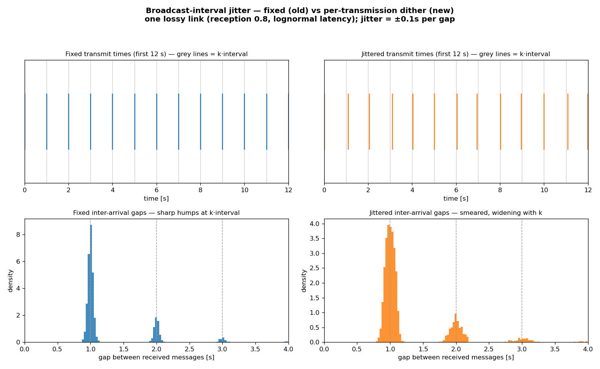

# Broadcast-interval jitter: dithering the transmit slot smears the k·interval comb

**Status: validated (implemented in `run_fleet`).** The companion to [[broadcast-phase-offset]]. A
*phase* offset shifts an aircraft's broadcast comb but keeps it perfectly regular; **jitter** dithers
*every* gap — the next broadcast lands `interval + U(-j, +j)` later — the per-transmission slot
randomisation real ADS-B uses to avoid the systematic co-channel collisions a fixed grid would
produce. This drives the real [[communication-reception-latency|Comm]] over one lossy link under two
transmit schedules and compares the **inter-arrival gap of received messages** (panel 5 of that
observation). Written 2026-07-25. Reproduce with

    PYTHONPATH=. python scripts/broadcast_jitter_demo.py

(one link, reception 0.8, lognormal latency median 0.1 s; interval 1 s; jitter ±0.1 s ⇒ per-gap std
`0.1/√3 ≈ 0.058 s`; 4000 ticks.)

## The finding: the comb softens, the mean is unchanged

| Transmit schedule | mean gap | gaps within ±0.1 s of k·interval |
|---|---|---|
| **Fixed** (old) | 1.262 s | **98.8 %** |
| **Jittered** (new, ±0.1 s) | 1.263 s | **82.2 %** |

- **Top row** — the transmit comb over the first 12 s. Fixed sits exactly on the grey `k·interval`
  grid; jittered drifts slightly off it, each gap dithered independently.
- **Bottom row** — the inter-arrival gap of *received* (not dropped) messages. Fixed shows razor-sharp
  humps at 1 / 2 / 3 s (a hump at `k` = a run of `k−1` drops on a rigid grid). At this modest ±0.1 s
  the jittered humps **soften and widen** — still centred on `k·interval` but spread ~±0.1 s at `k = 1`
  and **wider with `k`** (~√k·jitter, the Irwin–Hall spread of summing `k` uniform gaps). They stay
  *distinct* here; a larger dither (e.g. ±0.4 s) would widen them until they overlap and the comb
  dissolves entirely.

Crucially the **mean gap is unchanged** (1.26 s ≈ `interval / p`): jitter reshapes the *distribution*
of when information arrives without changing how *often* it does. It is a pure decorrelation of
timing, exactly the property that stops a fleet of transmitters from colliding in lockstep.

## Now implemented — `run_fleet(..., broadcast_jitter=…)`

Three independent transmit-timing knobs now exist, each defaulting to today's behaviour so the
n = 2 ⇒ `run_encounter` reduction gate is untouched:

| Knob | Models | Default |
|---|---|---|
| `broadcast_phase` | unsynchronised *start* (spawned at different times) | aligned at 0 |
| `broadcast_jitter` + `broadcast_rng` | per-transmission slot dither (this note) | 0 (fixed interval) |
| (both) | realistic ADS-B-like transmitter | off |

`broadcast_jitter` adds `U(-j, +j)` to each aircraft's next-broadcast time, drawn from its own
substream (ADR 0006 §6); the demo above mirrors that same draw driving `Comm` directly. Validated to
require `j < interval` (gaps stay positive) and `broadcast_rng` when `j > 0`. Note this only becomes
*observable in `run_fleet`* once 6f threads comm/surveillance (today's fleet is perfect-delivery) —
the mechanism is in place ahead of that, and the demo already shows its effect through the comm layer.

## What this is / isn't

- **Is:** a faithful fixed-vs-jittered comparison through the real `Comm`, and the visual proof of
  what jitter changes (the comb) versus what phase changes (the alignment, [[broadcast-phase-offset]]).
- **Isn't:** a claim that jitter improves safety — like phase, it changes the *structure* of the
  uncertainty (decorrelates timing), and whether that helps depends on the metric. It is the honest
  transmitter model, not a mitigation.

## Relations

- Completes the transmit-timing pair with [[broadcast-phase-offset]] (phase = shift the comb, jitter
  = dissolve it); both refine the fleet side of [[phase-6-plan]] (6f) and sit on decision
  [[0006-communication-model-design]]. Directly extends panel 5 of [[communication-reception-latency]].
