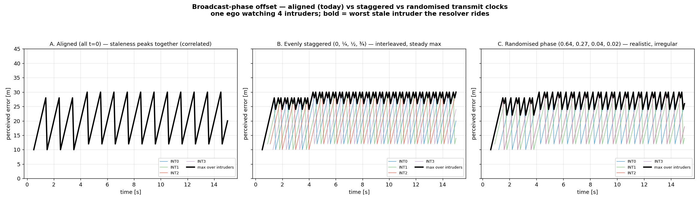

# ⚠️ Broadcast-phase offset: the fleet's transmit clocks are hardcoded aligned

**Status: IMPORTANT — model-fidelity gap (blocks a faithful Phase 6f).** Aircraft "spawned" at
different times run the *same* broadcast interval at *different phase*: A transmits at 0, 1, 2, …
while B (spawned 0.3 s later) transmits at 0.3, 1.3, 2.3, …. The reference loops
(`run_encounter`, `run_fleet`) hardcode a **single global** `next_broadcast` starting at 0
([fleet.py:129](../../opencdarr/fleet.py), [loop.py:236](../../opencdarr/loop.py)), so **every
aircraft is phase-aligned** and all spawn at `t = 0`. That is a real, unstated modelling assumption,
and it is the *pessimally correlated* one. Written 2026-07-25. Reproduce with

    PYTHONPATH=. python scripts/broadcast_phase_offset_demo.py

(one ego watching 4 straight intruders at 20 m/s through the real `Comm` + `LastKnown`; reception
1.0, latency 0.5 s — drops off, to isolate the *phase* effect; interval 1 s, dt 0.1 s.)



## The finding: alignment correlates every intruder's staleness

The bold line is the **max perceived error over all intruders** — the ego's *worst-informed*
target at each instant, which is exactly what a multi-intruder resolver
([[multi-intruder-vo-vs-mvp]]) rides. Same models, same intruders, same interval; only the phase
policy differs:

| Broadcast phase | max-staleness mean | **std** | all-fresh floor |
|---|---|---|---|
| **Aligned** (all 0 — today) | 20.8 m | **5.7 m** | **10 m** |
| **Evenly staggered** (0, ¼, ½, ¾) | 28.2 m | 1.6 m | 24 m |
| **Randomised** (0.64, 0.27, 0.04, 0.02) | 27.2 m | 2.3 m | 22 m |

- **Aligned** (left): all four sawteeth are *identical and superimposed* — every intruder goes
  fresh on the same tick and stale on the same tick. The ego cycles between an **all-fresh** trough
  (10 m) and an **all-stale** peak (30 m). Note the trap in the *low mean*: alignment looks good on
  average precisely because it periodically refreshes everyone at once — but it pays with the
  **highest variance** and a recurring tick where the ego holds its **oldest** picture of **every**
  intruder simultaneously, exactly when a superconflict would demand acting on all of them.
- **Staggered / randomised** (middle, right): the sawteeth interleave, so the max settles into a
  tight band near its ceiling (std 1.6–2.3 m). The ego is *never* fresh on everyone, but also
  *never* simultaneously stalest on everyone — a steadier, decorrelated uncertainty with **no
  fleet-wide blind tick**. Higher typical staleness, far lower variance, no correlated worst case.

Which is "safer" depends on the metric — aligned gives lower *average* staleness and recurring
all-fresh relief, but pays with high variance and a correlated worst-case spike; the offset policies
trade both away for constancy. The point is not that one wins: it is that **the choice is currently
made by accident**, baked into the loop as "everyone at phase 0," and a superconflict study that
leans on the correlated worst case ([[fleet-cooperative-ring]], [[fleet-ipr-sweep]]) is quietly
reading the aligned assumption.

## Randomised phase is the realistic model — and it lets first contact happen at t < 1 s

Real transmitters don't share a clock: each aircraft, spawned at its own time, draws a random
initial firing offset and then repeats every interval (ADS-B deliberately randomises its ~2 Hz slot
to avoid systematic co-channel collisions). Panel **C** draws each phase from `U(0, interval)`. A
consequence the aligned model *cannot* produce: with a small phase, first contact lands **before the
first full second** — here INT2/INT3 (phases 0.04 / 0.02) are first perceived at **t ≈ 0.6 s**
(phase + 0.5 s latency), while INT0 (phase 0.64) isn't heard until t ≈ 1.2 s. The aligned model gates
*all* first contact to a single `latency`-after-`t=0` instant; randomised phase spreads it, which is
both more realistic and changes who the ego can react to earliest. In an implementation the phase
would be one `U(0, interval)` draw per aircraft from its spawned RNG substream (ADR 0001) — clone-safe
and reproducible from the seed, exactly like every other stochastic input.

## Is it implemented anywhere? No — but the *models* already support it

The split is clean:

- **CNS models — already support offset.** `Comm.step` stamps each broadcast with its own `t_meas`
  and `LastKnown` keeps the freshest by `t_meas` ([communication.py:143](../../opencdarr/cns/communication.py));
  nothing there assumes a shared clock. This demo produces the staggered case using the **stock
  models unchanged** — proof the capability is already there.
- **The loop — does not.** Both runners advance one scalar `next_broadcast += broadcast_interval`
  for the whole fleet. That single line is the entire aligned-phase assumption.

Also note `run_fleet` does not yet thread `communication`/`surveillance` at all (perfect delivery,
Phase-6 plan decision 3) — so phase offset only becomes *observable* once 6f threads comm through.
Offset without comm is nearly a no-op (instant delivery), which is why this belongs **inside** 6f,
not bolted on before it.

## How to implement in `run_fleet` (a 6f sub-item)

Two independent knobs, both per-aircraft, both defaulting to today's behaviour so the
N = 2 ⇒ `run_encounter` reduction gate is untouched:

1. **Per-aircraft broadcast phase.** Replace the scalar with a vector and let each aircraft fire on
   its own schedule:
   ```python
   # phases: Sequence[float] | None  (None -> all 0.0, today's aligned default)
   next_bc = [0.0] * n if phases is None else [p % broadcast_interval for p in phases]
   ...
   for i in range(n):
       if t + eps >= next_bc[i]:
           # aircraft i measures self, transmits, and decides on *its* tick
           next_bc[i] += broadcast_interval
   ```
   This forces a distinction the fused single cadence hides: **transmit** (when i broadcasts) vs
   **decide** (when i reads surveillance + runs CDR). Spawned-at-offset means the *whole* avionics
   cycle is shifted, so keep them fused per aircraft — just per-aircraft, not global.
2. **Perception via a per-source latch.** Once decisions desynchronise, aircraft i can no longer
   read "everyone's state *this* tick"; it must read each source's **last transmitted** value. With
   comm that is exactly `surveillance.perceived(comm_state, i, j, t)`; without comm, a
   `last_tx: list[state|None]` latch updated at each transmit reproduces it.

**The one hazard — keep the aligned default byte-identical.** The N = 2 gate requires the aligned
path to call `communication.step` **once with all broadcasts, all receivers, in agent order** (the
RNG draw order `run_encounter` pins). So guard it: `phases is None` ⇒ the current code verbatim;
`phases` given ⇒ the per-aircraft path (its own reproducibility, no bit-for-bit claim vs the aligned
path). **Per-transmission jitter** — real ADS-B randomising the ~2 Hz slot to avoid the systematic
co-channel collisions the aligned model would produce — is the complementary knob, now implemented as
`broadcast_jitter` (phase shifts the comb, jitter dissolves it); see [[broadcast-jitter]].

## What this is / isn't

- **Is:** a faithful exercise of the real `Comm`/`LastKnown` proving (a) offset phase decorrelates
  fleet staleness and (b) the models already support it — the loop does not.
- **Isn't:** a `run_fleet` result (no CDR, no resolution; intruders fly straight so the sawtooth is
  legible), and not the only realistic axis — drop correlation is already independent per link here,
  so this isolates *phase*, not congestion.

## Relations

- A required sub-decision of the 6f rung in [[phase-6-plan]] (comm/surveillance at N); sits on
  decision [[0006-communication-model-design]] (per-message `t_meas`) and the directed design of
  [[0004-layered-directed-design-for-multiaircraft-and-ips]].
- Companion to [[surveillance-asymmetric-perception]] (staleness + self-noise stack) and the
  perfect-perception baseline [[fleet-ipr-sweep]]; the correlated worst case it exposes is the one
  the superconflict of [[fleet-cooperative-ring]] implicitly assumes.
