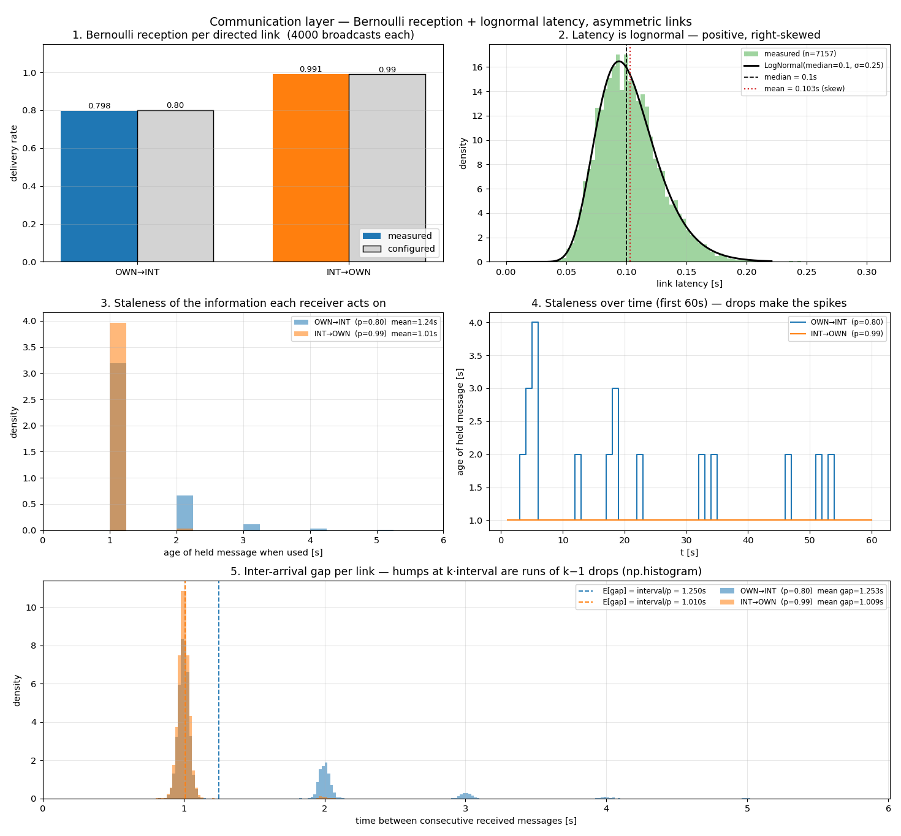

# Communication layer — Bernoulli reception + lognormal latency

**Status: validated.** The Phase 3b communication layer behaves as specified: per-link Bernoulli
reception matches its configured rate, latency matches the lognormal it is drawn from, and the two
combine to make each receiver act on *stale* information — asymmetrically, when the links differ.
Written 2026-07-20.

Implements [[0006-communication-model-design]]. Reproduce with
[`scripts/comm_layer_demo.py`](../../scripts/comm_layer_demo.py).

## Setup

One aircraft pair, broadcasting once per second for 4000 ticks, with **deliberately asymmetric
links** — the case the directed design exists for (ADR 0004):

| link (source → receiver) | reception probability |
|---|---|
| `OWN → INT` | **0.80** (lossy) |
| `INT → OWN` | **0.99** (near-perfect) |

Latency on both links: `LogNormal(median = 0.1 s, σ = 0.25)`. Lognormal is the natural first-order
datalink model — strictly positive, concentrated near a typical value, with a thin tail of much
later arrivals. It is parameterised by the **median** because `exp(μ)` *is* the median, so the
typical delay is directly readable. `σ = 0.25` gives a visibly skewed shape without the tail
reaching the 1 s broadcast interval — realistic jitter for a fast link, and it keeps
§"the non-obvious bit" below a clean read.

## What the four panels show

**1 — Bernoulli reception is calibrated.** Measured delivery rates are **0.798** and **0.991**
against configured 0.80 and 0.99. The two links are drawn independently per message, so a
broadcast can land one way and be dropped the other in the same tick.

**2 — Latency matches its distribution.** The measured histogram (n = 7157 delivered messages)
sits on the analytic lognormal PDF. Median **0.101 s** ≈ the configured 0.1 s; mean **0.103 s** is
visibly *higher* — the signature right skew, where a thin tail of slower deliveries pulls the mean
above the median. Observed p99 = 0.177 s, max = **0.304 s** — clearly skewed, still comfortably
inside a third of the broadcast interval.

**3 & 4 — the two effects combine into staleness.** This is the point of the whole layer: what a
receiver acts on is not the intruder's current state but the last message it managed to receive.

| link | mean age of held info | p95 | max |
|---|---|---|---|
| `OWN → INT` (p = 0.80) | **1.245 s** | 2.0 s | 5.0 s |
| `INT → OWN` (p = 0.99) | **1.009 s** | 1.0 s | 2.0 s |

The lossy link leaves `INT` acting on information that is on average ~25% older, and occasionally
**5 seconds** old — five consecutive drops. At 10 m/s that is a 50 m position error on a 50 m
protected zone, from communication alone, before any GPS noise. The reliable link sits almost
flat at exactly one broadcast interval.

## Panel 5 — inter-arrival gap (the reception-loss signature, directly)

Panel 5 histograms the time between one *received* message and the next on each link (bin counts
computed explicitly with `np.histogram` at a 0.02 s bin width, then drawn as bars — not
`ax.hist`). This isolates
reception loss from latency more cleanly than the staleness panels: for a Bernoulli(p) reception
process broadcasting every `interval` seconds, the number of ticks between successes is geometric,
so the gap lands on `k · interval` with probability `(1-p)^(k-1) p` — a comb of humps decaying
geometrically, not a single peak.

That is exactly what comes out: **OWN→INT** (p = 0.80) shows clear humps at 1 s, 2 s, 3 s, 4 s —
runs of 0, 1, 2, 3 consecutive drops — while **INT→OWN** (p = 0.99) is a single sharp spike at 1 s
with almost nothing beyond it. Measured mean gaps land on the closed-form expectation
`E[gap] = interval / p` to three significant figures:

| link | measured mean gap | `interval / p` |
|---|---|---|
| `OWN → INT` (p = 0.80) | 1.253 s | 1.250 s |
| `INT → OWN` (p = 0.99) | 1.009 s | 1.010 s |

## The non-obvious bit: drops dominate staleness, not latency

Ages in panels 3–4 are near-integer multiples of the 1 s broadcast interval, and the reliable link
is *pinned* at exactly 1.0 s. That is not a bug — it falls out of the timing:

- Messages are sent on the 1 Hz tick and consumed on the 1 Hz tick.
- Median latency (0.1 s) is far below the broadcast interval, so a message sent at `t` virtually
  always arrives before the decision at `t + 1`. It changes *nothing* about the age at decision
  time: still exactly one interval old.
- So **each extra second of staleness is a dropped message**, not a slow one. The `p = 0.80` link's
  spikes to 2 s, 3 s, 5 s are runs of consecutive drops.

Latency only bites when it exceeds the broadcast interval — with these params (max observed
0.304 s) it never does, so every delivered message here arrives well within its own tick and
staleness is *entirely* explained by drops. [[0006-communication-model-design]] §4's freshest-by-
`t_meas` guard against out-of-order arrival still matters in general (a slower or jitterier link,
or latency approaching the broadcast interval, reaches that regime — see an earlier run of this
demo with `σ = 0.5`, whose tail reached 1.38 s), it just isn't exercised at this parameterisation.

**Implication for tuning experiments:** at a 1 Hz broadcast rate, reception probability is the
dominant staleness lever and latency is nearly invisible. To make latency itself matter, either
raise it toward/past the broadcast interval or raise the broadcast rate.
