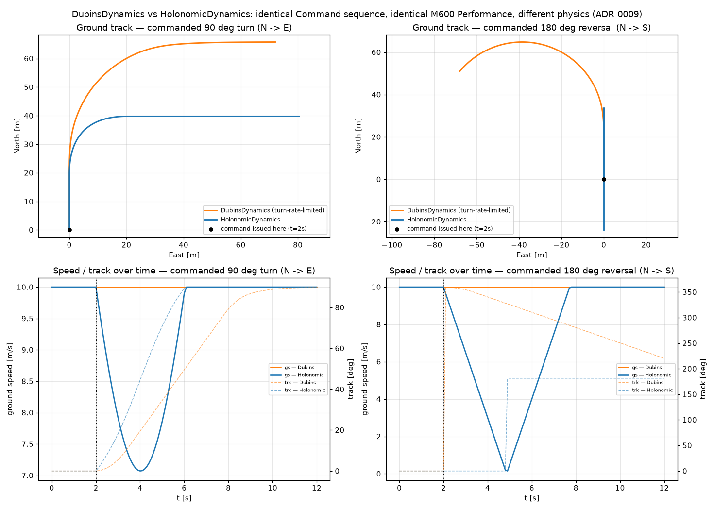

# Controlling DubinsDynamics vs HolonomicDynamics

**Status: validated.** Both `Dynamics` implementations (ADR 0007) are driven by the exact same
control code — the difference in trajectory is physics, not API. Written 2026-07-21.

Implements [[0007-dynamics-as-pluggable-interface]] and [[0008-velocity-vector-command]];
introduces [[0009-holonomic-dynamics]]. Reproduce with [`scripts/dynamics_comparison_demo.py`](../../scripts/dynamics_comparison_demo.py).

## How to control either model

There is exactly one control surface: build a `Command` (a target ground-velocity vector, ADR 0008) and call `.step(state, command, perf, dt)` in a loop. Nothing else changes between the two models:

```python
from opencdarr.dynamics import Command, DubinsDynamics, HolonomicDynamics
from opencdarr.performance import M600
from opencdarr.state import AircraftState

state = AircraftState(id="D0", lat=52.0, lon=4.0, trk=0.0, gs=10.0)   # flying north
cmd = Command.from_track_speed(90.0, 10.0)                            # fly east at 10 m/s

dubins = DubinsDynamics()         # turn-rate-limited, heading coupled to travel
holonomic = HolonomicDynamics()   # no coupled heading — chases the vector directly

for _ in range(n_steps):
    state = dubins.step(state, cmd, M600, dt)       # or: holonomic.step(state, cmd, M600, dt)
```

`Command.from_track_speed(hdg, spd)` is the aviation-legible constructor; `Command(v_east=..., v_north=...)` is the underlying vector form and is exactly what `MVP`/`VO` already return — swap `dynamics=` in `run_encounter` (or call `.step` directly, as here) and no other code changes, whichever model is in use. That's the whole point of the boundary these two ADRs built.

The only thing that differs between the two calls above is *how each model interprets the same
`cmd`*: `DubinsDynamics` reconstructs a target heading and turn-rate-limits toward it; `HolonomicDynamics` reads the vector directly and isotropically accelerates toward it. Same
`Performance`, same envelope (`v_max`), same acceleration budget (`ax`) — different physics.

## Setup

Both models start identically: flying north at 10 m/s (M600 `Performance`). At `t = 2 s` (after a
short settled cruise), the command changes and is held for the rest of the run (`t_max = 12 s`,
`dt = 0.1 s`):

- **turn** — command changes to due east (a 90 deg direction change).
- **reverse** — command changes to due south (a 180 deg reversal).



## What it shows

**Top-left (turn, ground track).** Dubins (orange) sweeps a wide, continuously-curving arc out to
the commanded heading — a turn radius is unavoidable when heading and travel direction are
coupled. Holonomic (blue) cuts a visibly tighter, more direct corner toward the same eventual
east-bound track.

**Top-right (reverse, ground track).** This is the sharpest contrast. Dubins loops out to the west
before curving back to point south — turning 180 deg while coupled to a heading has no shortcut,
it's still a turn. Holonomic goes **exactly straight up the same vertical line and straight back
down it** — `max |east offset| = 0.000000000 m` for the whole run (confirmed to floating-point
precision; also pinned by `test_reversal_travels_a_straight_line_not_a_loop` in
`tests/test_holonomic_dynamics.py`). It slows to a stop, reverses, and retraces its own path —
there is no arc to trace, because nothing coupled heading to direction of travel in the first
place.

**Bottom row (speed/track over time).** Two things worth calling out precisely:

- **Dubins holds `gs = 10.0000` m/s exactly throughout both maneuvers** — turning costs it time,
  never speed (`max_tr`/`max_dtr2` bound the heading change; `ax` never even engages once cruise
  speed is reached). **Holonomic's speed dips during the turn** — to `7.0714 m/s` at `t = 4.00 s`
  in the turn scenario (2 s after the command, i.e. exactly the temporal midpoint of its
  convergence — expected: chasing a fixed target vector along a straight line in velocity-space,
  the magnitude is smallest at the geometric midpoint of that line, and `10·sin(45°) = 7.071`
  matches to 4 decimal places), and all the way to `0.15 m/s` in the reverse scenario (discretised
  floor near true zero, `dt = 0.1 s`). **This is the real trade-off the plot makes visible**: the
  holonomic model spends part of its acceleration budget *redirecting* rather than *maintaining
  speed*, because there's only one isotropic budget instead of two independent ones (turn-rate vs.
  ax). Neither is "better" — they're different physical machines.
- **Holonomic reaches the commanded track faster**: `6.00 s` after the command vs. `10.20 s` for
  Dubins in the turn scenario (both to within 1 deg of the target). Total path length over the
  full 12 s run is shorter for holonomic in both scenarios (turn: `112.6 m` vs `120.3 m`; reverse:
  `91.6 m` vs `120.3 m` — Dubins travels the *same* 120.3 m regardless of scenario because its
  speed never changes, only its direction).

**One honest artifact, not a bug.** Around the moment holonomic's speed crosses near-zero in the
reverse scenario, the dashed track line jumps rather than sweeping smoothly — `atan2` of a
vector that's momentarily almost `(0, 0)` is numerically ill-conditioned, so which side of ~180°
it reports can wobble step to step. This doesn't affect position (the vector's *magnitude* is
also near-zero right then, so the direction barely matters to where the aircraft actually goes)
and it's the same territory the `_SPD_EPS` "hold heading on a truly zero command" rule exists
for — here the vector never quite reaches exactly zero, so that guard isn't the one firing, but
the underlying cause (direction is ill-defined near a zero vector) is identical.

## Why this is the right comparison to make

The two things this needed to prove, both checkable independently of the plot:

- **The control interface is genuinely shared** — no `if isinstance(dynamics, ...)` anywhere in
  the demo script; the same `Command` object drives both `.step()` calls. This is
  [[0008-velocity-vector-command]]'s neutrality claim, exercised for real rather than argued.
- **The models actually diverge in the way theory predicts** — a coupled-heading vehicle pays for
  a direction change in *time* (turn radius, but constant speed); a holonomic one pays in
  *instantaneous speed* (dips while redirecting, but converges to the target direction faster).
  Both the unit tests (analytical, exact) and this plot (visual, for the same scenarios) agree.

## What this doesn't cover yet

Both trajectories above are driven directly (`.step()` in a loop), not through a real CD/CR/CRR
encounter between the two aircraft. That mixed-fleet case — one Dubins aircraft, one holonomic,
actually resolving a conflict against each other — is covered separately in
[[mixed-fleet-dubins-holonomic]]: it confirms CD/CR/CRR don't need to change (they only ever read
`trk`/`gs`, which both models produce with the same meaning), threaded manually since
`run_encounter` itself still takes one shared `dynamics=`/`perf=` for both sides. Wiring
`run_encounter` for per-aircraft dynamics is the remaining follow-up, tracked in
[[0009-holonomic-dynamics]]'s Consequences.
