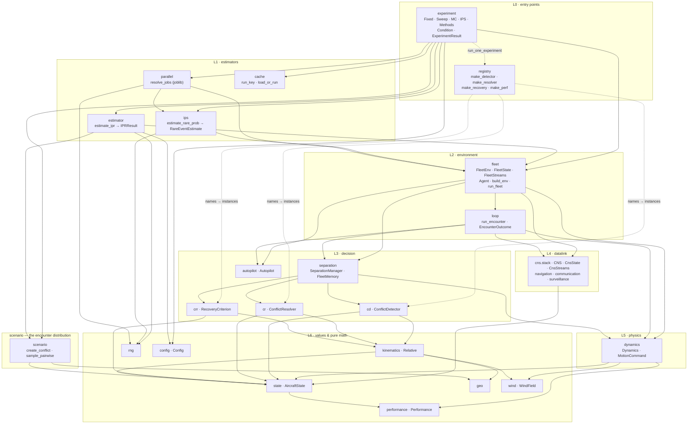

# Architecture: from `run_experiment` down to the smallest value

Where `opencdarr/experiment.py` sits, and how one call descends through every layer to the leaf values.
Written 2026-07-30, after [[run-experiment-todo]] items 1–6b landed.

[[architecture-dataflow]] already maps the run layer in detail — one tick of the loop, the pluggable
interfaces, the module-by-module I/O. This note is the layer **above** it (declaration → conditions →
estimates) plus the full descent, so the two compose: read this for *where things are*, that one for
*what happens inside a tick*. Every edge below was extracted from the actual imports, not recalled.

---

## 1. The seven layers

`experiment.py` is the widest composition root in the package: **14** intra-package modules, and the only
one importing **both** estimators plus the cache plus the parallel scheduler. Everything below it is
unaware of it — the layering is strictly one-way.

Two modules sit outside the stack. `scenario` is orthogonal to it — it *builds initial conditions*
rather than advancing them, which is why both L1 estimators reach it directly. And `viz` (`Tracks`,
`extract_tracks`, `plot_pairwise`) hangs off L2, reading a recorded `FleetState` log: an output tool,
not part of a run.

## 2. What each layer owns

| L | module | classes | owns |
|---|---|---|---|
| 0 | `experiment` | `Fixed` `Sweep` `MC` `IPS` `Methods` `Condition` `ExperimentResult` `CacheConfig` `CacheIdentityError` | *what varies*, and the table |
| 0 | `registry` | — | name → component, the config file's half of the surface (§4) |
| 1 | `estimator` | `IPRResult` | P(LoS) over encounters, Wilson interval |
| 1 | `ips` | `Particle` `IPSResult` `RareEventEstimate` | multilevel splitting, replication CI |
| 1 | `parallel` | — | joblib scheduling, no statistics |
| 1 | `cache` | — | `config + seed + code-hash → result` |
| 2 | `fleet` | `FleetEnv` `FleetState` `FleetStreams` `Agent` `FleetOutcome` `StatesLog` | the N-aircraft environment: `advance` / `level` / `is_terminal` |
| 2 | `loop` | `EncounterOutcome` | the pairwise runner (the n=2 reference) |
| 3 | `separation` | `SeparationManager` `FleetMemory` | detect → resolve → recover control flow, `resopairs` |
| 3 | `cd` `cr` `crr` | `ConflictDetector` `ConflictResolver` `RecoveryCriterion` (+ `StateBased` `MVP` `VO` `PastCPA` `FTR` `ProbabilisticFTR`) | the CDR algorithms |
| 3 | `autopilot` | `Autopilot` `GuidanceMemory` (+ `CruiseAutopilot` `WaypointAutopilot`) | the nominal command |
| 4 | `cns.stack` | `CNS` `CnsState` `CnsStreams` `Perception` | fix → transmit → hear, as one call |
| 4 | `cns.base` | `NavigationModel` `CommunicationModel` `SurveillanceModel` `NoiseDistribution` `LatencyDistribution` `Message` `CommState` `InFlight` | the datalink interfaces |
| 5 | `dynamics` | `Dynamics` `MotionCommand` (+ `Multirotor` `FixedWing`) | how a command becomes motion |
| 6 | `state` | `AircraftState` `DesiredVelocity` | the spine — everything future-affecting |
| 6 | `performance` `wind` `kinematics` `config` | `Performance` `WindField` `Relative` `Config` (+3) | limits, environment, CPA math, typed config |
| 6 | `geo` `rng` `cache` | — | geodesy, seeded streams, content hashing |

## 3. `experiment.py` internals

Nine classes, three roles:

**Declaration** — `Fixed(value)` holds a parameter; `Sweep(values, name, build)` fans it out.
`build` is the load-bearing part: it maps a level onto the value the run needs, so a *component* can
be swept over a readable scalar axis (`Sweep([1.05, 1.4], build=lambda m: MVP(margin=m),
name="margin")` puts numbers in the table and objects in the run). `Methods` bundles the CDR stack.
`MC` / `IPS` each carry **exactly** their own estimator's parameters, so an illegal pairing is
unrepresentable rather than validated.

**Expansion** — `expand()` cross-products the swept axes into `Condition`s, each holding the levels
that *label* it and the values the run *receives*. An unknown key raises with the **23** declarable
names (5 scenario + 2 detection + 4 numerics + 4 geometry + 8 components). An all-`Fixed` declaration
is one condition, not a separate path.

**Execution and results** — `_run_one` (module-level, so a joblib worker can pickle it) wraps
`_run_mc` / `_run_ips` in the cache. `ExperimentResult` holds the conditions and the **raw** estimator
results, reducing to `records()` / `frame()` / `plot()` / `cell()` on demand.

The cache-identity machinery (`identity`, `CacheIdentityError`) lives here rather than in `cache`
because it is about *live component objects*, which `cache.py` deliberately refuses to know about —
it takes a caller-supplied plain description precisely because a `StateBased()` instance has no
stable identity to hash. `identity` is the thing that supplies one.

## 4. Two ways in, one implementation — and why `registry` is its own module

`experiment.py` has **two** entry points, and the second is a thin wrapper over the first:

| | `run_experiment` | `run_one_experiment` |
|---|---|---|
| specified by | a **declaration** — components as instances | a **YAML `Config`** — components as strings |
| cardinality | N conditions | one (all-`Fixed`) |
| backend | `MC` or `IPS` | `MC` |
| resolves components | not needed, you passed them | through `registry` |
| for | a contributor in a notebook | a committable, diffable config |

`run_one_experiment` builds a `Methods` from the registry, declares **nothing** as an axis, and calls
`run_experiment`. So there is one estimator path, one cache, one card writer — pinned by a test that
asserts the wrapper's rows equal the hand-written all-`Fixed` declaration. This is what
[[run-experiment-design]] §1 predicted: "that becomes the all-`Fixed`, single-cell special case".

**Why the registry is a separate module rather than private helpers.** It is the one thing a Python
caller never touches: a config *file* can hold a name, not an instance, so something must map
`resolution: mvp` onto `MVP(margin=1.05)`. Naming that module after its job makes its **limit**
visible instead of buried — because the limit is real. The ladders know exactly six names, so
anything else is unreachable from a file:

- `ProbabilisticFTR` **exists**, with `prob_threshold` and `ktheta`, but `MethodsConfig` has no
  fields for them — so naming it would only half-work, and with it the published γ experiment stays
  Python-only;
- a contributor's own resolver is unreachable *by construction* — no string can name a class the
  registry has never heard of.

That asymmetry is why "add a file, not a fork" holds through `run_experiment` and not through a
config file, and why a full registry (config-selectable plugins) is deferred to the first outside
contribution. `tests/test_registry.py` pins the exclusion, so it reads as a decision rather than an
oversight; that test is the one to delete when parameterised names arrive.

## 5. One condition, end to end

**MC.** `run_experiment` → `expand` → `_run_one` → `cache.run_key` / `load_or_run` → `_run_mc` →
`_config_for` + `_resolved_methods` → `estimator.estimate_ipr` → `rng.spawn(seq, 3)` →
`scenario.sample_pairwise` → `fleet.run_fleet` → `build_env` → `FleetEnv.initial_state` → then per
`dt`: `FleetEnv.advance` → `CNS.sense` → `SeparationManager.step` → detector / resolver / recovery →
`Dynamics.step` → `FleetOutcome` → `IPRResult`.

**IPS.** Same head, then `_run_ips` builds a `build_initial` closure (`sample_pairwise` + `build_env`
→ `Particle`) and hands it to `ips.estimate_rare_prob` → `replication_seeds` → `ips_once` →
`evolve_shard` → `_evolve_to_shell` → **the same `env.advance`** → `resample_level` → `IPSResult` →
`combine_replications` → `RareEventEstimate`.

The two chains diverge at L1 and re-converge at `FleetEnv.advance`. That convergence is the point: it
is why the same contributed resolver or airframe cannot behave differently under the two backends,
and it only became true when plain MC moved off `loop.run_encounter` ([[run-experiment-todo]] item 2).

## 6. Structural facts worth knowing

- **`AircraftState` is the most depended-on thing in the package** — **25** modules import `state`
  (excluding the `__init__` re-export hub). That is the "you own the state" spine working as intended:
  it is a value, so nothing needs a runtime to read it.
- **`ips` depends on exactly two modules** (`fleet`, `rng`). The rare-event estimator rides the
  environment interface and nothing else — no CDR import, no scenario import. That thinness is why a
  new algorithm is "add a file, not a fork".
- **Nine leaf modules** carry no intra-package dependency at all: `cache`, `cns.broadcast`,
  `cns.noise_distributions`, `config`, `geo`, `mission`, `performance`, `rng`, `wind`. They are the
  foundation, and each is independently testable.
- **The graph is acyclic** — checked, not assumed: a depth-first cycle search over the 48 module files
  (excluding the `__init__` re-export hubs, which are cycles by design) finds none. So a contributor
  can read upward from any leaf without circularity.
- **`estimator` no longer imports `loop`.** It reaches `fleet` instead. `loop` survives as the
  pairwise reference the n=2 reduction is validated against.

## 7. One odd edge, recorded

`fleet` imports `loop` — specifically `_DEFAULT_DYNAMICS` and `_setpoint_adapter`. The N-aircraft
runner borrowing two private names from the pairwise one is backwards relative to the layering
(`loop` is the special case of `fleet`, not its base), and it is why `loop` cannot simply be deleted
now that `estimator` bypasses it. Harmless today — both are module-level constants/pure helpers —
but the natural home for them is `fleet` or `dynamics`, with `loop` importing them instead. Not worth
a change on its own; worth folding into whatever next touches either file.

## Related

- [[architecture-dataflow]] — the run layer in detail: one tick, the interfaces, module I/O. Predates
  `experiment.py`; this note is the layer above it.
- [[run-experiment-todo]] — how this layer was built, and what each item cost
- [[run-experiment-design]] — the proposal it came from
- [[todo-might-be-a-bug]] — suspected defects found while building it
- [[0004-layered-directed-design-for-multiaircraft-and-ips]] — why L2 is split into
  env / state / streams
- [[0017-ips-level-and-splitting]] — what L1's `ips` does with that split
