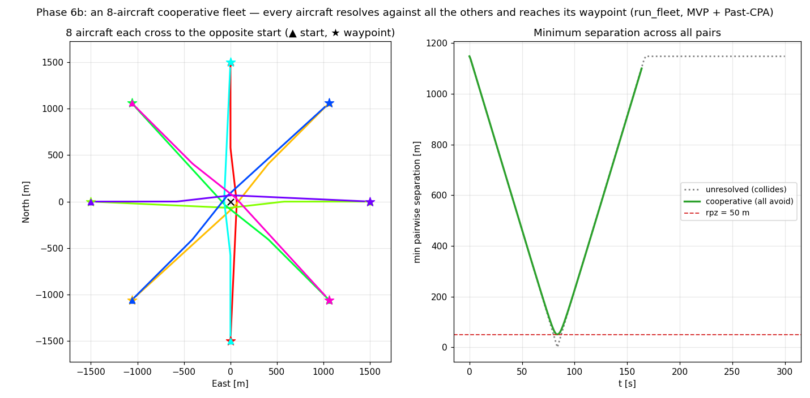

# The cooperative fleet: every aircraft avoids (run_fleet)

**Status: validated (Phase 6b).** The N-aircraft environment — `run_fleet` — where *every* aircraft
runs its own detect → resolve → recover against all the others, so in a conflict the whole fleet
manoeuvres, not just one side. This is the answer to "can the intruders also avoid?" — in a one-shot
`resolve()` call nothing moves; avoidance is a *loop* property, and `run_fleet` is that loop at N.
Written 2026-07-25. Reproduce with
[`scripts/fleet_cooperative_demo.py`](../../scripts/fleet_cooperative_demo.py).

## The setup and the result

Eight aircraft sit uniformly on a ring, each flying to the **diametrically-opposite** start — so all
eight converge through the centre (Phase-6 scenario 2). Unresolved, they collide (min pairwise
separation → **0 m**). With every aircraft cooperating (StateBased + MVP + Past-CPA), the fleet bows
around the centre and clears — **min pairwise separation 73.7 m ≥ rpz = 50 m**.

Each aircraft's `SeparationManager` sees the other seven (perfect perception this pass), detects the
subset in conflict, resolves against that **set** (MVP summing the pairwise avoidance vectors, Phase
6a), and recovers once clear of **all** of them. No central controller — the fleet behaviour is the
emergent composition of eight independent, cooperating decisions.

## Reduces to the pairwise runner — the free regression

`run_fleet` with two agents reproduces `run_encounter` **bit-for-bit** — same `conflict` / `los` /
`min_sep`, noiseless and seeded-noisy, for MVP and VO (`test_fleet.py`). The self-fix RNG draws in
agent order, the perceived-traffic list is every *other* aircraft, and the metrics are measured on
the true states every step — all identical to the pairwise loop at N = 2. So the whole multi-aircraft
generalisation is gated against every Phase-4/5 anchor for free (ADR 0004: "at N = 2 the environment
must reduce to the pairwise result").

## A finding: cooperative-symmetric MVP breaks the symmetry

The resolution is **not** a clean symmetric rosette. Some aircraft barely deviate (near-straight
through the centre) while others bow far out. This is a real property of the *potential-field* model:
each aircraft sums its pairwise avoidance vectors against the other seven, and for the aircraft near a
symmetry axis those vectors largely **cancel**, leaving a small net correction — the same
superposition under-clearing seen in [[multi-intruder-vo-vs-mvp]], now across the fleet. The
staggering still opens every pair past `rpz` (73.7 m), but the burden is shared unevenly. This is
exactly the behaviour that motivates a **priority / give-way coordination model** (6f) and, before
that, making the coordination an explicit, swappable choice (6c) rather than the implicit "everyone
cooperates symmetrically" the loop hard-codes today.

## The per-aircraft bundle and the fleet memory

`run_fleet` takes a list of `Agent`s (state + perf + optional dynamics/autopilot) — the per-aircraft
grouping ADR 0011 §7 deferred "until a real grouping need appears"; N parallel lists is that need.
Each aircraft threads its own `FleetMemory` (the clonable set of active pairs, Phase 6a) and
`GuidanceMemory`, so nothing that differs between aircraft lives outside the clonable state — the
no-hidden-state invariant, now across a fleet, ready for the IPS particle in Phase 8.

## Why this is the right thing to check

- **It resolves what would collide** — unresolved min-sep 0 m, cooperative 73.7 m, both measured on
  the true states over all pairs (`test_fleet.py` pins the superconflict clears where the baseline
  loses).
- **N = 2 is bit-for-bit** — the environment change did not disturb any pairwise result.
- **It is deterministic and reproducible** — same inputs → same outcome; the seeded path matches the
  pairwise seeded path exactly, so the multi-aircraft IPR sweep (6e) rests on the same reproducibility
  the pairwise sweeps do.

## What this still doesn't cover

The coordination is the **implicit** cooperative-symmetric one hard-coded in the loop; making it an
explicit, swappable model (and adding a priority model for the uneven-burden case) is 6c / 6f.
Perception is perfect — asymmetric perception under a lossy comm/surveillance model is 6g. The
quantitative multi-aircraft IPR (how clearance degrades with fleet density) is 6e. And MVP's symmetric
under-clearing is a resolver property, not a fleet-runner one — VO's union clears the same rings by a
slightly larger margin (`test_fleet.py` covers both).
