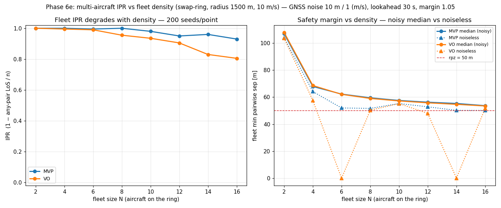

# The multi-aircraft IPR: how detect-and-avoid degrades with fleet density

**Status: validated (Phase 6e).** The quantitative payoff of the N-aircraft environment — a seeded
IPR sweep over **fleet size**, the N-aircraft analogue of the pairwise angle/wind sweeps. A ring of
`N` aircraft each cross to the diametrically-opposite start (the swap-ring superconflict of
[[fleet-cooperative-ring]]), run over 200 GNSS-noise realisations per point; the fleet IPR is
`1 − (realisations with any-pair LoS)/n`. It answers the headline question of the whole fleet build:
**does DAA hold as traffic thickens?** Written 2026-07-25. Reproduce with

    PYTHONPATH=. python scripts/ipr_fleet_sweep.py --n 200 --jobs 8 --seed 0

(swap-ring radius 1500 m, 10 m/s, `rpz` 50 m, GNSS noise 10 m / 1 (m/s), lookahead 30 s, margin
1.05, dt 0.5 s).

## The result: IPR erodes with density, and VO erodes faster than MVP

| N | 2 | 4 | 6 | 8 | 10 | 12 | 14 | 16 |
|---|---|---|---|---|---|---|---|---|
| **MVP IPR** | 1.000 | 1.000 | 0.995 | 1.000 | 0.980 | 0.950 | 0.960 | 0.930 |
| **VO IPR**  | 1.000 | 0.995 | 0.990 | 0.955 | 0.935 | 0.905 | 0.830 | 0.805 |
| median min-sep [m] | ~107 | ~68 | ~62 | ~59 | ~57 | ~56 | ~55 | ~54 |

The safety margin (median min pairwise sep) falls monotonically with density — **107 m at N = 2 down
to ~54 m at N = 16** — as more aircraft cross the same centre with less room to manoeuvre. Both
resolvers hold IPR ≈ 1 through low density and then erode: **MVP stays robust (0.93 at N = 16)**;
**VO falls further and faster (0.955 by N = 8, 0.805 by N = 16)**. So the answer is *yes, but it
degrades gracefully* — cooperative DAA absorbs a surprising amount of density before separation
starts to fail, and how gracefully depends on the resolver.

## Why it degrades: the margin is pinned to rpz, so noise-robustness is what thins

The revealing column is **noiseless min-sep**: for MVP it sits right around `rpz` (50–55 m) for every
N ≥ 6. The resolver *clears by design* — it targets `margin·rpz` and gets there — so the deterministic
clearance is roughly **density-independent**, always just above the boundary. What actually degrades
with N is therefore not the mean margin but the **noise robustness**: with more aircraft, more pairs
ride that near-`rpz` boundary at once, so the probability that GNSS noise tips *at least one* pair into
LoS grows with N. The fleet IPR is an any-pair-LoS union, and the union over a growing set of
boundary-riding pairs is exactly what erodes. This is the fleet-scale face of MVP's symmetric
under-clearing ([[multi-intruder-vo-vs-mvp]], [[fleet-cooperative-ring]]).

## VO is more brittle at density — the reverse of the pairwise picture

Pairwise, VO's union-of-cones clears by a *larger* margin than MVP's vector sum. Under fleet density
that inverts: VO erodes faster (0.805 vs MVP's 0.930 at N = 16). The union-feasibility search that is
crisp against one or two cones becomes fragile when a dozen cones tile the velocity space — the
nearest exterior velocity sits on a knife-edge that noise easily violates. A resolver being *better
pairwise but worse in the crowd* is the density analogue of the [[near-parallel-ipr-inversion]]
lesson: pairwise ranking does not survive to the fleet.

> **Caveat — the VO results may be wrong.** I am not a VO expert, and the union-of-cones
> candidate search here is my own implementation (decision 4 of [[phase-6-plan]]). VO's faster
> erosion and its symmetry-collapse nugget below could reflect a limitation or bug in *this*
> resolver rather than a property of velocity-obstacle avoidance in general. Treat the VO
> numbers as provisional until reviewed against a reference implementation.

## The nugget: noise *breaks the symmetry* that traps VO

VO's **noiseless** baseline collapses to a collision at exactly-symmetric sizes — **0.1 m at N = 6,
0.2 m at N = 14** (visible as the two spikes to zero in the right panel) — while its **noisy** median
at those same points stays 55–62 m and its IPR is 0.83–0.99. A perfectly symmetric ring is a
degenerate tie for VO's greedy nearest-exterior search: every aircraft picks the mirror-image
velocity, they stay locked on the collision course, and the deterministic run pancakes at the centre.
**GNSS noise breaks the tie** — infinitesimal asymmetry lets each aircraft commit to a side — so here
noise is not a hazard but the thing that *rescues* the resolver. MVP, summing avoidance vectors rather
than choosing among feasible candidates, has no such tie and its noiseless ring never collapses. The
lesson for the deferred **priority / give-way** coordination ([[priority-coordination]]): an explicit
asymmetry is what the symmetric superconflict needs — noise is just supplying it by accident.

## Reduces to the pairwise IPR at N = 2 — the free regression

`--verify-n2` re-runs the two-aircraft ring (a head-on pair) through **both** `run_fleet` and
`run_encounter` on the same 200 substreams: the LoS / min-sep vectors are **IDENTICAL**. So the whole
sweep rests on the same bit-for-bit reduction the environment was gated on ([[fleet-cooperative-ring]],
`test_fleet.py`) — at N = 2 the fleet IPR *is* the pairwise IPR, and everything above N = 2 is the
genuine multi-aircraft signal, reproducible from `--seed`.

## Why this is the right thing to measure

- **It is the fleet analogue of the pairwise sweeps** — same seeded-MC method, same reproducibility,
  same IPR definition lifted to any-pair LoS; the pairwise result falls out at N = 2.
- **It separates two failure modes** — the density-driven margin squeeze (median min-sep) from the
  resolver-specific brittleness (MVP vs VO, and VO's symmetry collapse) — rather than reporting a
  single scalar.
- **It is honest about the limit** — DAA does not hold perfectly as traffic thickens; it degrades,
  measurably and reproducibly, and the sweep says by how much and why.

## What this still doesn't cover

One geometry (the swap-ring) and perfect, symmetric perception. Wind is off (the sweep threads no
`WindField`; combining density with the [[ipr-under-wind]] axis is a later cross-sweep). Asymmetric
perception under a lossy comm/surveillance model over the n(n−1) links — where different aircraft act
on different, stale pictures — is 6f, and is where the any-pair union is likely to erode faster still.
