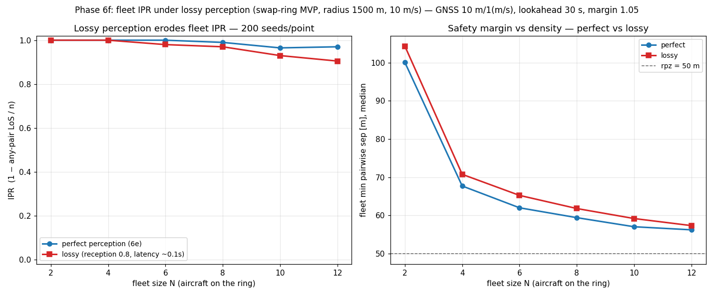

# Fleet IPR under lossy perception: the cost of dropped, stale, asymmetric pictures

**Status: validated (Phase 6f — the quantitative payoff).** The 6e sweep [[fleet-ipr-sweep]] measured
the fleet IPR under **perfect** perception — every aircraft handed every other's true state instantly.
6f threads the lossy comm/surveillance model through `run_fleet`, so aircraft act on **dropped, stale,
asymmetric** pictures over the *n(n−1)* directed links. This sweep runs the swap-ring superconflict
**twice on the same GNSS noise** — once perfect, once lossy — so the gap between the two IPR curves is
*purely* the cost of imperfect perception, the erosion 6e's perfect baseline was hiding. Written
2026-07-25. Reproduce with

    PYTHONPATH=. python scripts/ipr_fleet_comm_sweep.py --n 200 --jobs 8

(swap-ring MVP, radius 1500 m, 10 m/s, `rpz` 50 m, GNSS 10 m / 1 (m/s); lossy link = reception 0.8 +
lognormal latency median 0.1 s; lookahead 30 s, margin 1.05, dt 0.5 s, 200 seeds/point.)

## The result: lossy IPR erodes below perfect, and the gap widens with density

| N | 2 | 4 | 6 | 8 | 10 | 12 |
|---|---|---|---|---|---|---|
| **IPR perfect** (6e) | 1.000 | 1.000 | 1.000 | 0.990 | 0.965 | 0.970 |
| **IPR lossy** | 1.000 | 1.000 | 0.980 | 0.970 | 0.930 | 0.905 |
| **Δ (cost of lossy)** | 0.000 | 0.000 | 0.020 | 0.020 | 0.035 | **0.065** |

At low density the two are indistinguishable — a sparse ring has slack enough to absorb a dropped or
stale message. As the ring thickens the lossy curve peels away: by **N = 12 lossy IPR is 0.905 vs
perfect's 0.970**, a 6.5-point gap. Losing information and thinning the room to manoeuvre compound —
each aircraft is acting on an older, gappier picture of a *denser* sky, exactly where a missed or late
message is most likely to matter.

## The nugget: the median margin *rises* under lossy, yet the IPR *falls*

The right panel is the counter-intuitive part. The **median** min-sep is **higher** under lossy at
*every* density (e.g. 104 m vs 100 m at N = 2, 57.3 m vs 56.2 m at N = 12) — the opposite of what
"degraded perception" suggests. Staleness makes an aircraft act on a *lagged* neighbour position, so
it tends to **over-react** — manoeuvring against where the intruder *was*, over-separating on the
typical encounter. So the middle of the distribution actually moves *away* from `rpz`.

But IPR is not a median — it is an **any-pair-LoS union over the tail**. What lossy perception does is
**fatten that tail**: occasionally a drop or a long latency means an aircraft never sees a closing
neighbour in time, misses the avoidance entirely, and that *one* pair breaches `rpz`. The median
gets safer while the worst case gets worse. **The margin is not the safety story — the tail is**, and
lossy perception trades a little median over-separation for a heavier failure tail. A study that
reported only mean/median separation would conclude lossy comm is *harmless or even helpful*; the IPR
says the opposite.

## Reduces to perfect at low density — consistent with the bit-for-bit lossy gate

At N = 2 the lossy and perfect IPRs are both 1.000 (Δ = 0): the two-aircraft ring is too sparse for
drops/latency to produce a LoS at this geometry. This is the IPR-level shadow of the exact reduction
`test_fleet.py` pins — `run_fleet(2)` with a comm model reproduces `run_encounter`'s lossy result
**bit-for-bit** (the N = 2 lossy gate). Everything above N = 2 is the genuine multi-aircraft
asymmetric-perception signal, reproducible from `--seed`.

## Why this is the right thing to measure

- **It isolates perception.** Both arms share the *same* GNSS-noise substream per realisation, so the
  only difference between the curves is lossy-vs-perfect delivery — not a different random draw.
- **It completes the 6e story.** [[fleet-ipr-sweep]] explicitly flagged that its perfect-perception
  baseline hid an erosion; this measures that erosion (Δ up to 0.065) and shows it grows with density.
- **It separates margin from safety.** The median-rises-yet-IPR-falls split is the honest, non-obvious
  finding — the reason the fleet needs a tail metric (IPR), not a margin summary.

## What this still doesn't cover

- **MVP only.** VO's density brittleness and the [[fleet-ipr-sweep|VO-implementation caveat]] mean a
  lossy VO sweep deserves its own run; MVP is the robust resolver to establish the lossy baseline on.
- **Symmetric-except-drops perception.** Reception is an i.i.d. per-link Bernoulli (0.8 everywhere), so
  asymmetry here is *statistical*, not structural — a persistently down link, or the correlated
  broadcast-timing effects of [[broadcast-phase-offset]] / [[broadcast-jitter]], would bite harder.
- **One geometry** (the swap-ring) and one lossy operating point (0.8 / 0.1 s); a reception×density or
  latency×density surface is the natural follow-on.

## Relations

- Realises the observation deliverable of 6f in [[phase-6-plan]]; the lossy counterpart of
  [[fleet-ipr-sweep]] (6e perfect baseline) and sits on decision [[0006-communication-model-design]].
- Companion to the transmit-timing pair [[broadcast-phase-offset]] / [[broadcast-jitter]] and the
  perception illustration [[surveillance-asymmetric-perception]] — this is where their qualitative
  mechanisms show up in the fleet safety metric.
