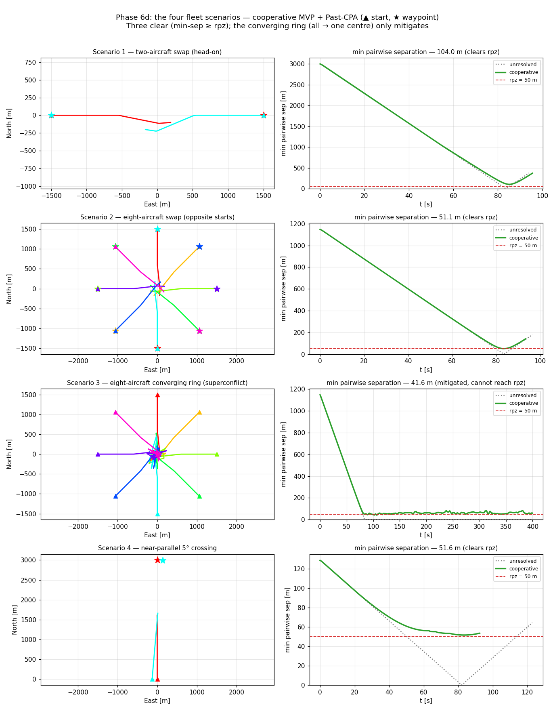

# The four fleet scenarios: three clear, one is only mitigated

**Status: validated (Phase 6d).** The qualitative payoff of the N-aircraft environment
([[fleet-cooperative-ring]]): four hand-built fleet geometries, each a genuine conflict, run through
the cooperative loop (`run_fleet`'s detect → resolve → recover, every aircraft against all the
others — MVP + Past-CPA). Three resolve cleanly; the fourth, the symmetric converging superconflict,
exposes a real limit of *any* separation-assured DAA — you cannot hold a required minimum spacing
while eight aircraft all steer for one point. Written 2026-07-25. Reproduce with
[`scripts/fleet_scenarios_demo.py`](../../scripts/fleet_scenarios_demo.py).

## The four scenarios and their outcomes

The builders live in [`opencdarr/scenario.py`](../../opencdarr/scenario.py) (Phase 6d); each returns
a fleet that, flown straight, collides. Cooperative MVP (margin 1.1) + Past-CPA over `rpz = 50 m`,
`t_lookahead = 30 s`, 10 m/s multirotors:

| # | Scenario | unresolved min-sep | cooperative min-sep | verdict |
|---|---|---|---|---|
| 1 | Two-aircraft swap (head-on) | 3.0 m | **104.0 m** | clears |
| 2 | Eight-aircraft swap (opposite starts) | 1.1 m | **51.1 m** | clears |
| 3 | Eight-aircraft converging ring (→ one centre) | 0.0 m | **41.6 m** | *mitigated, < rpz* |
| 4 | Near-parallel 5° crossing | 0.1 m | **51.6 m** | clears |

Every aircraft flies a `WaypointAutopilot` goto mission, so it doesn't just avoid — it **avoids and
then resumes** to its destination (the left panels: manoeuvre out, recover, continue to ★). Scenarios
1, 2 and 4 all open every pair past `rpz` and the fleet reaches its waypoints.

## The headline: the converging ring is a superconflict the DAA can only mitigate

Scenario 3 is the honest one. Eight aircraft on a ring, **all aimed at the same centre point** — the
goal itself is incompatible with separation: eight bodies cannot occupy one point and stay `rpz`
apart. So the cooperative loop does the only thing it can — it holds them in a tight, jostling cluster
around the centre (right panel: min-sep collapses from ~1150 m, then **stably hovers around 41.6 m**,
just below `rpz`, for the rest of the run rather than continuing to 0). That is a **mitigation, not a
resolution** — a lift from a certain 0 m collision to a sustained ~42 m near-miss, but never a clean
clear. The limit is the *scenario*, not the resolver: no separation-assured algorithm can satisfy
"stay 50 m apart" and "all reach this one point" simultaneously. This is why the test that pins it
([`tests/test_fleet_scenarios.py`](../../tests/test_fleet_scenarios.py)) asserts *mitigated*
(`resolved.min_sep` well above the baseline **and** below `rpz`), not *cleared* — the documented
superconflict finding, the same symmetric over-reaction seen pairwise in [[multi-intruder-vo-vs-mvp]]
and across the ring in [[fleet-cooperative-ring]], now at its logical extreme.

The contrast with scenario 2 is the point: the opposite-start swap sends the same eight aircraft
through the same crowded centre, but each has a **distinct** destination on the far side, so the fleet
can bow apart and stream through — 51.1 m, cleared. Same congestion, resolvable goal ⇒ resolved;
same congestion, one shared goal ⇒ only mitigated.

## Why this is the right thing to check

- **It exercises the environment at N, not the primitive.** These are `run_fleet` runs (reimplemented
  in the demo only to capture per-tick tracks — `run_fleet` returns just the scalar outcome); the
  numbers match `test_fleet_scenarios.py` to the digit (104.0 / 51.1 / 41.6 / 51.6 m).
- **It distinguishes "resolved" from "mitigated".** A demo that only showed the three clean cases
  would over-claim; the converging ring keeps the story honest and names a real limit of cooperative
  separation assurance — the case a **priority / give-way** coordination model would help but not fully
  fix ([[priority-coordination]]).
- **Every aircraft resumes to a waypoint**, so the tracks show the full avoid-then-continue behaviour
  a route-flying fleet has, not just the deflection — the [[mixed-fleet-dubins-holonomic]] lineage.

## What this still doesn't cover

Qualitative, seed-free, perfect perception. The quantitative multi-aircraft IPR — how clearance
degrades with fleet density over seeded GNSS-noise realisations — is 6e. Asymmetric perception under
a lossy comm/surveillance model over the n(n−1) links is 6f. And the near-parallel panel (scenario 4)
is a thin sliver under equal-aspect because the geometry is ~3 km along-track and metres across — the
separation panel, not the ground track, carries that case.
