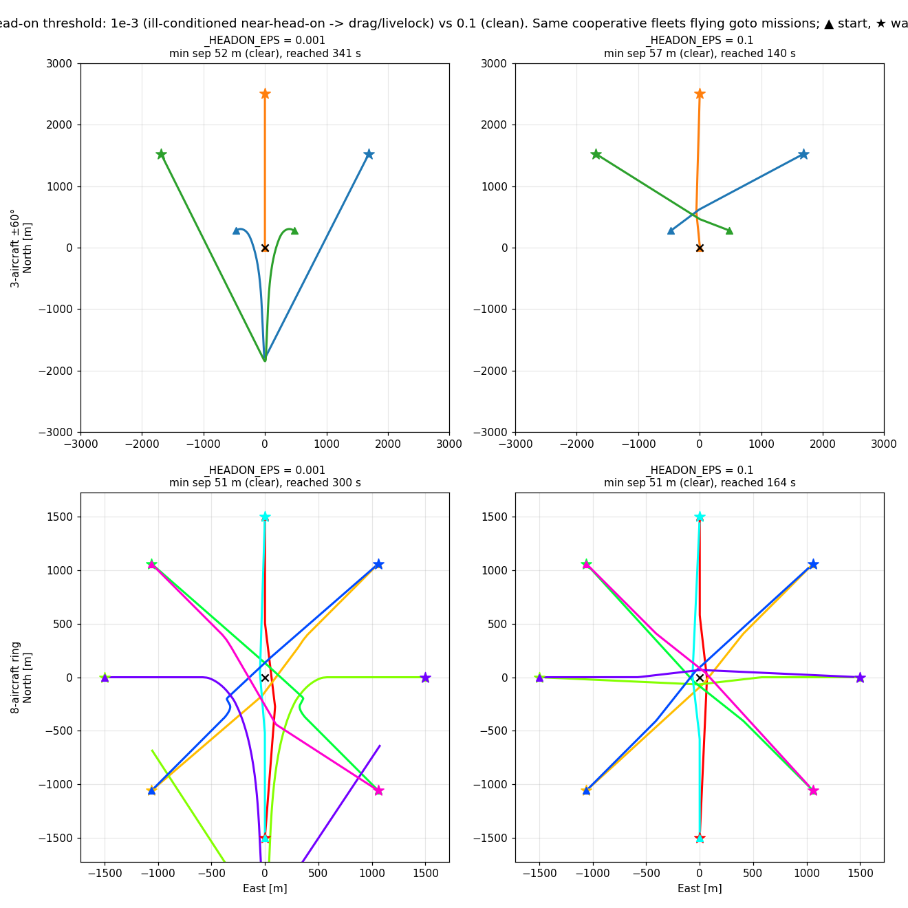

# The MVP resolution-bias floor (`_BIAS_EPS`) — a near-head-on fidelity bug found against BlueSky

**Status: validated (Phase 6b diagnostic).** Multi-aircraft cooperative scenarios exposed a
livelock: two aircraft in a near-head-on conflict would drag each other far off course instead of
making a small avoidance. Checking BlueSky's MVP pinned the cause to one constant — the floor that
biases the resolution direction when the predicted miss is tiny (`_BIAS_EPS`, ex-`_HEADON_EPS`).
Written 2026-07-25. Reproduce with
[`scripts/headon_threshold_demo.py`](../../scripts/headon_threshold_demo.py).

## The handler, and the one difference from BlueSky

MVP's resolution divides by the predicted miss distance (`scale = gain / (tcpa · d_miss)`), so a
head-on (miss → 0) needs an exception: floor the miss and pick a clean perpendicular side. We have
that handler, **identical in form** to BlueSky's (`bluesky/traffic/asas/mvp.py:299`):

```python
# ours (opencdarr/cr/mvp.py)              # BlueSky (mvp.py)
if d_miss <= _BIAS_EPS:    # 1e-3         if dabsH <= 10.:            # 10 metres
    d_miss = _BIAS_EPS                        dabsH = 10.
    cx, cy = ry/dist*d_miss, -rx/dist*d_miss   dcpa[0] = drel[1]/dist*dabsH
                                               dcpa[1] = -drel[0]/dist*dabsH
```

Same direction formula (perpendicular to the relative-position vector). **The one difference: the
threshold — BlueSky `10 m`, our re-derivation `1e-3 m`.** Below ~0.1 m of predicted miss the *actual*
CPA-offset vector is tiny and **noise-dominated**, so the resolution *direction* is ill-conditioned:
a near-head-on pair gets a weak, wandering correction and drags each other off course — a livelock.

## Before / after, on the two cooperative fleets

Two cooperative fleets flying goto missions — the 3-aircraft ±60° conflict and the 8-aircraft ring
(each crossing to the diametrically-opposite start, scenario 2) — at `_BIAS_EPS = 1e-3` and `0.1`:



| | `1e-3` (broken) | `0.1` (fixed) |
|---|---|---|
| **3-aircraft ±60°** | ~1800 m southward drag before recovering; 341 s | one small deviation, straight to waypoints; 140 s |
| **8-aircraft ring** | tangled, aircraft over-detour; never settles in 300 s | clean rosette, all reach waypoints; 164 s |

At `1e-3` (left column) the fleets still *clear* rpz (51–52 m — recovery eventually catches them),
but the paths are grossly inefficient: the ±60° intruders swing ~2 km off track, and the 8-aircraft
ring never converges within the horizon. At `0.1` (right column) both resolve with a single small
avoidance and every aircraft continues to its waypoint.

## The threshold is a cliff between 0.01 and 0.1

Sweeping the 3-aircraft case (`margin 1.05`):

| `_BIAS_EPS` | min sep | time | southward drag |
|---|---|---|---|
| `1e-3` | 51.6 m | 341 s | ~1800 m |
| `1e-2` | 56.9 m | 232 s | 798 m |
| `1e-1` | 57.3 m | 140 s | 0 m |
| `1` | 56.4 m | 140 s | 0 m |

The breakdown is between `0.01` (drag returns) and `0.1` (clean). Anything from **~0.1 m up to
BlueSky's 10 m** gives a stable resolution; `1e-3` sat well inside the ill-conditioned regime.

## The fix — and a caveat

`_BIAS_EPS = 0.1` (renamed from the misleading `_HEADON_EPS` — it is a *conditioning floor on the
resolution-bias direction*, not only a head-on guard) — comfortably above the ~0.01 m cliff, and far
below `rpz = 50 m` so it barely perturbs well-separated conflicts (only near-head-ons, where it
*should* engage). This is the same mechanism as BlueSky's 10 m floor, at a tighter value.

**Caveat (before this is treated as settled): the value is likely separation-minima dependent.**
BlueSky's `10 m` and our `0.1 m` are both bare constants, but the regime where the CPA-offset
direction becomes ill-conditioned scales with the protected-zone radius `rpz` (and with the closing
speed and decision cadence). `0.1` works for `rpz = 50 m`; it should be **generalised to a fraction
of `rpz`** (or derived from the geometry) rather than left a hard-coded metre value — deferred, but
flagged here so it is not forgotten when `rpz` changes.

**Consequence:** this changes the resolution for near-head-on geometries, so four **noiseless MVP
anchors re-anchor** (a deliberate physics correction, re-verified like ADR 0013's fixed-wing
re-anchor). The `test_cr` head-on functional checks still hold (they are approximate); the shifted
pinned values are:

| anchor | old | new |
|---|---|---|
| `test_loop._ANCHOR_NOISELESS_MVP` | 109.5894691711749 | 109.49370533404944 |
| `test_loop_mixed_fleet._ANCHOR_MIXED_MVP` | 95.95820946411477 | 95.88552098523046 |
| `test_loop_mixed_fleet._ANCHOR_FW_MVP` | 53.338481757697984 | 53.5791250988019 |
| `test_loop_wind._ANCHOR_WIND_MVP` | 54.85144470789156 | 54.898044526517275 |

The seeded-noisy MVP anchors and all VO anchors are unchanged (the noisy geometries rarely hit the
exact near-head-on regime, and VO does not use this constant). These supersede the Phase-4/5 MVP
values cited in ADR 0011/0015 and the phase-4 plans (left as dated records of what held then).

## Why this is the right thing to check

- **Diagnosed against the reference, not guessed** — the BlueSky handler is byte-for-byte ours except
  the constant; the fix restores its intent.
- **The effect is measured** — the drag distance, the min-sep, and the time-to-waypoint all improve,
  and the 0.01↔0.1 cliff is pinned by a sweep, not eyeballed.

## What this still doesn't cover

The analogous fix for **VO**: VO has its own head-on handling (the cone becomes ill-defined as the
miss vanishes), and at a tight `margin = 1.05` it under-resolves a fast head-on re-crossing (loses
separation) because — unlike MVP — its shortest-way-out has **no near-CPA urgency scaling**. That is
a separate resolver issue ([[multi-intruder-vo-vs-mvp]] lineage), to be addressed with an analogous
floor and/or an ORCA-style formulation. The livelock also motivates the explicit, swappable
**coordination model** (6c) and a **priority** model (6f) for dense symmetric conflicts.
