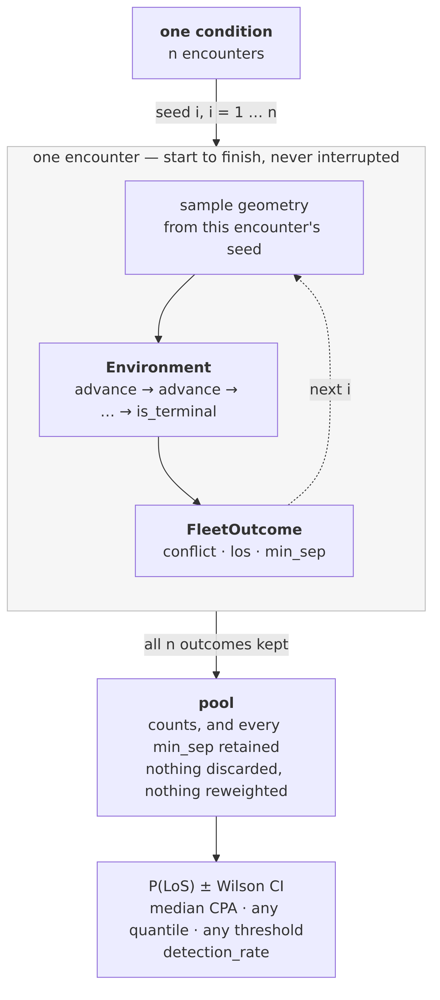
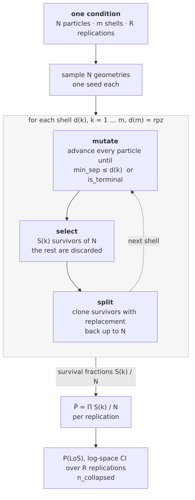
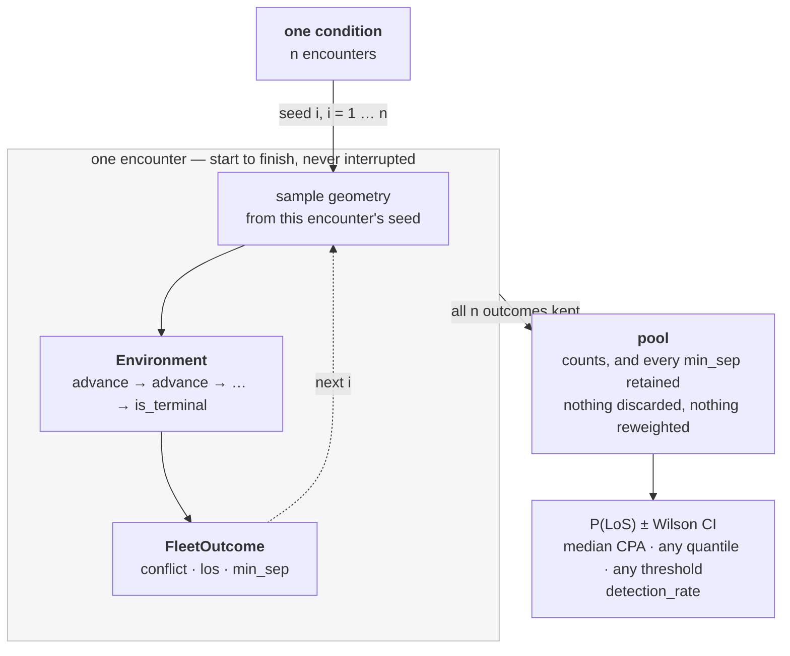
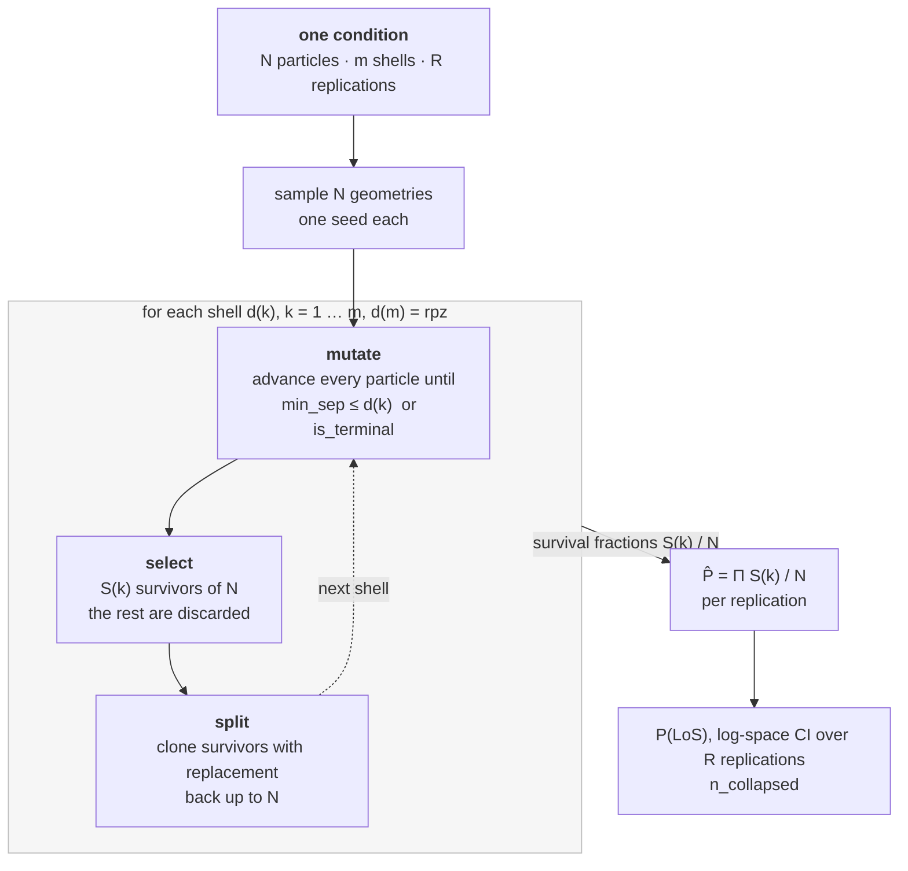

# ⚠️ IMPORTANT: the environment owns advancing; the estimator owns which states continue

**Status: reference — the seam is correct and validated, and one documentation defect was found
against it ([[todo-might-be-a-bug]] entry 9).** Written 2026-07-31, while drawing the handbook's
architecture figures. This is the fact the whole *Estimators* section of the site rests on, and the
reason `median_min_sep` is a Monte-Carlo-only column rather than a reporting preference.

Companion to [[experiment-layer-architecture]], which maps the **static** layering — who imports
whom, `experiment.py` down to leaf values. This note is the **runtime** seam: what an estimator
actually does to a run while it is happening. Read that one for *where things are*, this one for
*what each estimator does to an environment*.

## The one-sentence version

> The environment decides **how a state advances**. The estimator decides **which states exist and
> which get to keep going**.

`FleetEnv` is "the fixed rules of a fleet encounter — everything a particle's future depends on that
is *not* the particle" (`fleet.py:250`). It exposes three things, and `advance` is bit-identical
whichever estimator is driving:

| | |
|---|---|
| `initial_state(agents)` | build the world at `t = 0` |
| `advance(state, streams)` | one `dt` step — perception, detection, resolution, kinematics, wind |
| `is_terminal(state)` | has this run finished |

The estimator never reaches inside `advance`. What it chooses is how many runs, from what initial
conditions, **whether a run in progress is cut short or duplicated**, and how outcomes become a
number. Only the third differs between the two estimators, and it is the whole difference.

## Monte Carlo never intervenes



`estimate_ipr` loops `advance` until `is_terminal`, once per encounter, `n_encounters` times. Every
run it starts, it finishes, untouched. Nothing is discarded and nothing is reweighted, so the batch
**is** a sample of the encounter population — which is what licenses reading a median, a quantile or
any threshold off it (`min_seps`, [[run-experiment-todo]] item 4d).

## IPS cuts, discards and clones



`_evolve_to_shell` advances only until the particle crosses the next shell (`ips.py:101`):

```python
while state.min_sep > target and not env.is_terminal(state):
    state = env.advance(state, streams)
```

then `resample_level` **discards** the particles that did not reach the shell and **clones** the
survivors with replacement back up to `N`. So IPS runs the environment in *legs*, and between legs
it deletes and duplicates states.

**What comes back to IPS is a `FleetState`, not an outcome.** No `FleetOutcome` is ever built on the
IPS path. From that state it reads exactly two things — `state.min_sep <= target` (survivor or
dropped) and `env.is_terminal(state)` (dead, so it never will this leg). Nothing about what happened
during the leg.

It needs the *whole* state because a survivor has to be **resumable**: clones are advanced onward to
the next shell, so what is handed back must carry everything the future depends on — true states,
guidance and recovery memories, held commands, the datalink value state, the broadcast clock, the
accumulators. That is why `FleetState` is a deeply immutable, self-contained value (ADR 0004), and
why cloning is free: a clone shares the immutable value and only gets fresh RNG streams.

## The consequence that keeps being re-derived

Because IPS deletes non-survivors and duplicates survivors, **its final cloud is not a sample of the
encounter population** — it is concentrated on the rare set by construction. So there is no unbiased
population median in it to report. `median_min_sep` being MC-only is not a policy choice or an
unimplemented feature; there is no honest number to print. This is [[run-experiment-todo]] item 8's
rule (*IPS gives the rare-event probability and anything conditional on the rare set; it cannot give
unconditional population expectations*) meeting its first concrete metric.

The same fact cuts the other way for validation: both estimators drive the **same**
`build_env` / `advance` / `is_terminal` seam, so a contributed resolver or airframe behaves
identically under both. That equivalence was false once — plain MC bypassed `build_env` and silently
ignored a custom `Kinematics` while IPS honoured it — which is what forced the two onto one seam
([[run-experiment-todo]] item 2).

## Regenerating the figures

Rendered with `docker run --rm -v "$PWD:/data" minlag/mermaid-cli -i x.mmd -o x.png -b white -s 3`.

<details>
<summary>Monte Carlo source</summary>



</details>

<details>
<summary>IPS source</summary>



</details>

## Related

- [[experiment-layer-architecture]] — the static layering these two run on top of
- [[architecture-dataflow]] — what happens inside one `advance`
- [[todo-might-be-a-bug]] entry 9 — three docstrings name `level` as the importance function, and
  IPS never calls it; `level` is the *instantaneous* minimum, IPS splits on the *running* minimum
- [[0017-ips-level-and-splitting]] — why the running minimum, and the fixed-shell obligation
- [[run-experiment-todo]] — item 2 (one seam, both backends), item 4d (the record), item 8 (what
  IPS can and cannot report)
- [[important-ips-gap]] — where this seam is not enough, and the importance function has to change
