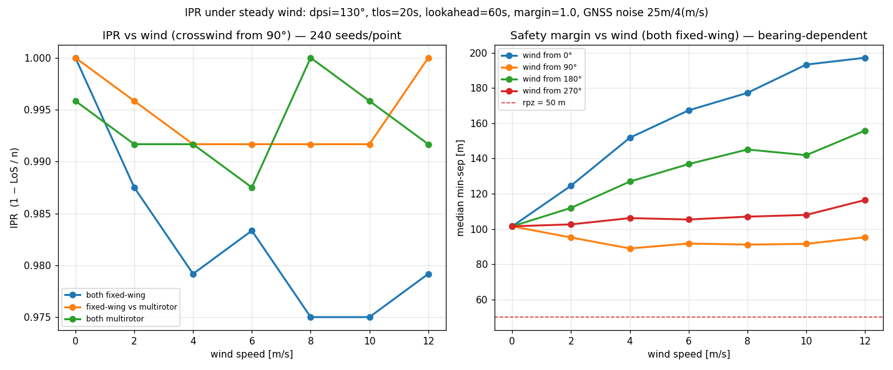
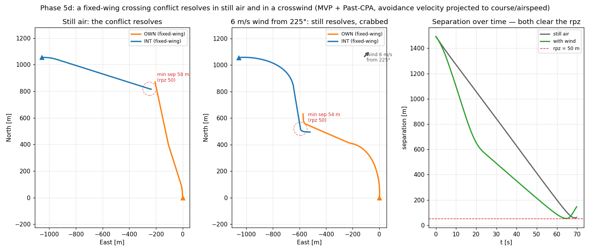

# IPR under steady wind

**Status: validated (Phase 5d).** The quantitative payoff of the wind model: does a steady uniform
wind degrade detect-and-avoid, and for which airframe? Run through the same `run_encounter` entry
point the still-air IPR sweeps use, with `wind=` threaded (Phase 5a). Written 2026-07-24. Reproduce
with [`scripts/ipr_wind_sweep.py`](../../scripts/ipr_wind_sweep.py) and
[`scripts/wind_conflict_demo.py`](../../scripts/wind_conflict_demo.py).

## The headline: the DAA stack is largely wind-robust, and the fixed-wing pays the small residual

A **uniform** wind adds the *same* drift to both aircraft, and the CD/CR/CRR stack decides on the
wind-blown **ground** frame (`velocity_enu`) — which is exactly the threat geometry it should see
(Phase-5 plan decision 5). So to first order the wind cancels in the relative motion and the IPR is
preserved. The residual is the airframe's *wind-relative maneuverability*:

On a demanding conflict (near-head-on `dpsi = 130°`, short warning `tlos = 20 s`, `lookahead = 60 s`,
`margin = 1.0`, heavy GNSS noise `25 m / 4 m/s`, 240 seeds/point) so the baseline has headroom to
move:

- **Both fixed-wing** (left, blue): IPR falls from `1.000` to `≈ 0.975–0.988` in wind — a couple of
  points — and the median safety margin drops from `101 m` to `≈ 90 m`. A fixed-wing's turn rate and
  stall floor limit how much of its *airspeed*-frame maneuver survives into the ground frame, so
  under wind some resolutions land a little later and a little tighter.
- **Fixed-wing vs multirotor** and **both multirotor** (left, orange/green): stay `≈ 0.99+` — the
  multirotor's slack, isotropic envelope crabs freely and absorbs the wind, so the pair is robust.

## The bearing dependence is the cleaner signal

The right panel (median min-sep vs wind, both fixed-wing, by wind bearing) is unambiguous: the wind's
effect on the safety margin depends on *where it comes from*. A wind from **0° / 180°** (along the
ownship's track) **widens** the miss (margin climbs to `150–200 m`); a **crosswind from 90°**
**tightens** it (margin falls to `≈ 90 m`, the worst case); **270°** is roughly neutral. Every case
stays well clear of `rpz = 50 m` — the degradation is a *margin* effect, not a wholesale failure.

The mechanism is the airspeed/ground-speed split: a fixed-wing commanded a cruise/avoidance *course*
holds that ground course under wind (it crabs) but its **ground speed varies with heading** (Eq 4),
so the closure timing shifts — helpfully for some bearings, harmfully for others.

## The picture, on a single encounter

The same 90° fixed-wing crossing, flown in still air and in a `6 m/s` wind that tightens this
geometry, both **resolving** (min-sep `58 m` → `54 m`, both ≥ `rpz`):

Still air (left): the two fixed-wings turn out of the conflict cleanly. With wind (middle): the
ground tracks are visibly **crabbed and bent**, the closure is faster (right panel), yet MVP +
Past-CPA still opens the miss past `rpz`. The avoidance velocity is projected to a course/airspeed
setpoint (`project_to_fixedwing`, Phase 4e) and the airframe crabs it into the wind (Phase 5c).

## Why this is the right thing to check

- **It runs through `run_encounter`** — the mixed-fleet + wind encounter is one `wind=` argument on
  the same entry point the still-air sweeps use (ADR 0011 §7 + Phase 5a), so the comparison is
  apples-to-apples and the anchors are pinned (`test_loop_wind.py`).
- **The result is honest about magnitude.** Steady uniform wind is *not* a large DAA hazard here —
  the interesting, defensible finding is exactly that robustness, plus the small, bearing-dependent
  fixed-wing residual. The large hazards (gusts, shear, spatially varying wind) are deferred by
  construction (the `WindField` seam, ADR 0016).

## What this still doesn't cover

Steady, uniform wind only. A spatially/temporally varying field (gusts, shear, turbulence) would
break the "translates both equally" cancellation and is where a real IPR hazard would live — the
`WindField` type is the seam it slots behind ([[phase-5-plan]] decision 2 / ADR 0016), matching the
paper's own §3.1 future-work boundary. The sweep uses a single crossing angle and a fixed demanding
configuration; a full `dpsi × wind` grid is a longer run, not a different mechanism.
