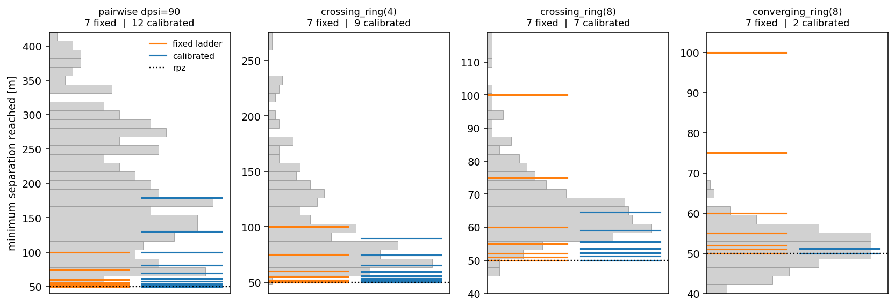
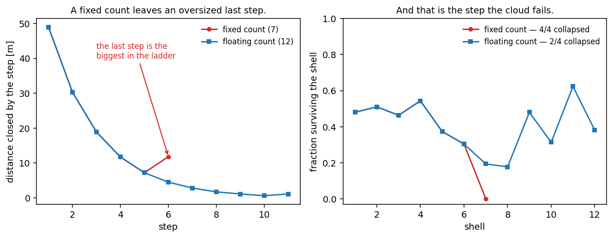
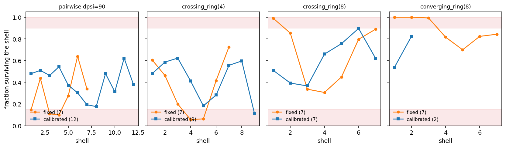

# Calibrating a splitting ladder: what it gives, and what it does not

**Status: measured, 2026-08-06.** The validation campaign (`scripts/validation/`) runs the same CDR
stack over three geometries and compares plain Monte Carlo with splitting on each. Splitting needs
a **ladder**: a decreasing list of separations, from where encounters usually end up down to `rpz`.
This note measures what a calibrated ladder gives you and what it does not. It also records a trap
in how a ladder is built. Text is in ASD-STE100 Simplified Technical English.

**A correction first.** An earlier draft of this note said that one hand-picked ladder collapsed
every ring condition, and that calibration corrected it. That is **wrong**. The collapse had a
different cause: the ring and traffic scenarios put their aircraft into the air with an accuracy of
zero, thus the navigation model added no noise. Those runs were fully deterministic. Each encounter
gave the same minimum separation, thus no particle could cross a shell below that value and every
ladder collapsed. The bug is corrected in `opencdarr/scenario/base.py`, and a test now makes sure
each scenario carries the declared accuracies. When you correct the noise, the hand-picked ladder
works. The measurements below use the corrected code.

**Setup.** `rpz 50 m`, `lookahead 120 s`, `StateBased` + `MVP(1.05)` + `PastCPA`, `GnssNavigation`,
`dt 0.5 s`, `pos_ci95 10 m` (the rare rung of [[rare-event-validation-ladder]]). Pilots are 300
encounters. Each splitting run is 300 particles and 4 replications — small, thus a weak ladder shows
itself as a collapse and does not hide in the noise. The hand-picked ladder is
`[100, 75, 60, 55, 52, 51, 50]`, from [[ips-gate1-correctness]].

## A ladder must span the distance, not the probability

The value a ladder must cover is the distance from the usual result down to `rpz`. That distance is
very different for each geometry:

| geometry | median `min_sep` | span above `rpz` |
|---|---|---|
| pairwise `dpsi=90` | 178.9 m | 128.9 m |
| `crossing_ring(4)` | 89.7 m | 39.7 m |
| `crossing_ring(8)` | 64.6 m | 14.6 m |
| `converging_ring(8)` | 51.2 m | **1.2 m** |

That is a range of two orders of magnitude, from one CDR stack. A converging ring is the extreme
case: its usual result is almost at `rpz`, thus loss of separation is the normal outcome and not the
rare one.

*Grey shows where 300 encounters ended. Orange shows the hand-picked shells, blue the calibrated
ones. For the pairwise encounter the hand-picked ladder stops at 100 m, but the encounters go up to
400 m — thus the ladder has no shells in the range where most particles start. For the converging
ring the opposite occurs: two shells are above the full distribution and do no work.*

## How to calibrate a ladder

Fly a short pilot of the same geometry, then put the shells between the median and `rpz`:

    d_0 = median(pilot min_sep)                     # about half the cloud crosses shell 1
    d_k = rpz + (d_0 - rpz) · r^k,  k = 0 … m-1     # each shell closes the same fraction
    ladder = [d_0 … d_{m-1}, rpz]

with `r = 0.62`. The pilot is 200 to 300 encounters, which is sufficient. The pilot must only find
the **upper** range, because the rare tail below it is the work that splitting does.

Two rules make it operate:

- **Start at the median.** Then about half of the cloud crosses the first shell. Measured first-shell
  survival is 0.48 to 0.54 for the four geometries.
- **Space the shells by a constant ratio.** Then each level closes the same fraction of the distance
  that is left, thus the survival of each level is approximately equal. ADR 0017 §2 records that
  equal survival is what adaptive multilevel splitting ([[ips-adaptive-levels]]) does automatically.

If the median is already below `rpz`, there is no range to start from. The ladder then starts above
`rpz`, at the 90th percentile of the pilot.

## The trap: do not fix the number of shells

The first version used seven shells for every geometry: six from the formula, then `rpz`. It passed
at the common rung, thus it looked correct. It failed at the rare rung, and only on the geometries
with a wide span.

*Left: the distance that each step closes. The two ladders are the same for five steps. Then the
fixed-count ladder (red) makes a step of 11.6 m, although the step before it was 7 m. Right: the
survival of each shell. The two are again the same, and then the red ladder goes to exactly zero at
that step. All four replications collapsed.*

The cause is arithmetic and not physics. Six terms of the formula over a span of 129 m put the sixth
shell at 61.6 m. The ladder then goes from 61.6 m to 50 m in one step. That step is the largest in
the ladder, and it is at the end, where the cloud is most thin.

**The correction is to fix the ratio and let the number float.** Select the number of shells such
that the last one is a short distance above `rpz`:

    m = ⌈ 1 + ln(final_gap / span) / ln(r) ⌉        # final_gap = 1.5 m

The number of shells then tells you about the geometry: a pairwise encounter needs 12, a converging
ring needs 2.

## What calibration gives: no shell is wasted

This is the result that holds. The hand-picked ladder wastes levels on some geometries and makes
other levels too thin. A calibrated ladder keeps the survival of each level near the middle.

*The red bands show the two conditions to avoid. Above 0.9 a level does no work. Below 0.15 a level
is thin, which is where variance comes from and where a collapse starts. The hand-picked ladder
(orange) touches both bands. The calibrated ladder (blue) stays between them.*

| geometry | hand-picked ladder | calibrated ladder |
|---|---|---|
| `converging_ring(8)` | 7 shells; **three** of them survive at 1.00, 1.00, 0.99 | **2 shells**, `P = 4.26×10⁻¹` |
| `crossing_ring(8)` | 7 shells; the first survives at 0.99 | 7 shells, all between 0.37 and 0.90 |
| `crossing_ring(4)` | two levels survive at **0.06** | 9 shells, minimum 0.11 |
| pairwise `dpsi=90` | levels at 0.15, 0.11, 0.10 | 12 shells, minimum 0.18 |

The converging ring is the clearest case. The hand-picked ladder uses seven shells and three of them
do nothing. The calibrated ladder uses **two** and gives the same answer (`4.26×10⁻¹` against
`4.05×10⁻¹`). That is 3.5 times less work for the same result.

## What calibration does not give: it is not more reliable

This must be said clearly, because it was the claim of the first draft and it is not correct.

| geometry | hand-picked | fixed count | calibrated |
|---|---|---|---|
| pairwise `dpsi=90` | **1 / 4** | 4 / 4 | 2 / 4 |
| `crossing_ring(4)` | **0 / 4** | 1 / 4 | 0 / 4 |
| `crossing_ring(8)` | **0 / 4** | 0 / 4 | 0 / 4 |
| `converging_ring(8)` | **0 / 4** | 0 / 4 | 0 / 4 |

The hand-picked ladder collapses least often. The calibrated ladder does not improve it. The
fixed-count version was worse than both, and the floating count only repairs that error.

The reason is that these four geometries all give results between 46 m and 290 m, and the ladder
`[100 … 50]` goes through that band. It was selected by hand for a pairwise encounter and it also
operates for these rings by chance. A geometry outside that band — a larger ring, or a smaller
`rpz` — would need a new ladder, and somebody would have to select it.

**Therefore the correct reason to calibrate is automation and efficiency, and not accuracy.** You do
not tune a ladder by hand for each new geometry, and no level is wasted. That is worth the 300
encounters that the pilot costs.

## What this does not cover (and the honest limits)

- **`r = 0.62` and `final_gap = 1.5 m` are selected, not derived.** They give a first-shell survival
  near 0.5 and a last step of the same size as the others, for the four geometries measured here.
  Adaptive multilevel splitting ([[ips-adaptive-levels]]) removes the need to select them.
- **300 particles is too few for the pairwise encounter at this rung.** It collapses 1 to 2 times in
  4 with every ladder. That is the number of particles and not the shape of the ladder. The campaign
  uses 2000. The count of collapses is in each row of the results, thus it is never hidden.
- **A ladder is a property of a row.** Each condition calibrates its own, thus two conditions are not
  compared on the same shells. This is correct, because the result is an estimate of `P(LoS)` and not
  of the ladder. But you must record the ladder with the row, and the campaign does.
- **The pilot cost is recorded in each row but is not in the campaign totals**, which are Monte Carlo
  plus splitting only. Against an anchor of up to 5×10⁶ encounters it is very small.
- **Calibration cannot make a dangerous geometry rare.** An eight-aircraft converging ring stays near
  `P = 0.4` with any ladder. Rarity is a property of the airspace and not of the estimator.
- **The figures come from a scratch script and not from a script in the repository.** Every number in
  them is in the tables above, thus this note does not need the script to be read.
