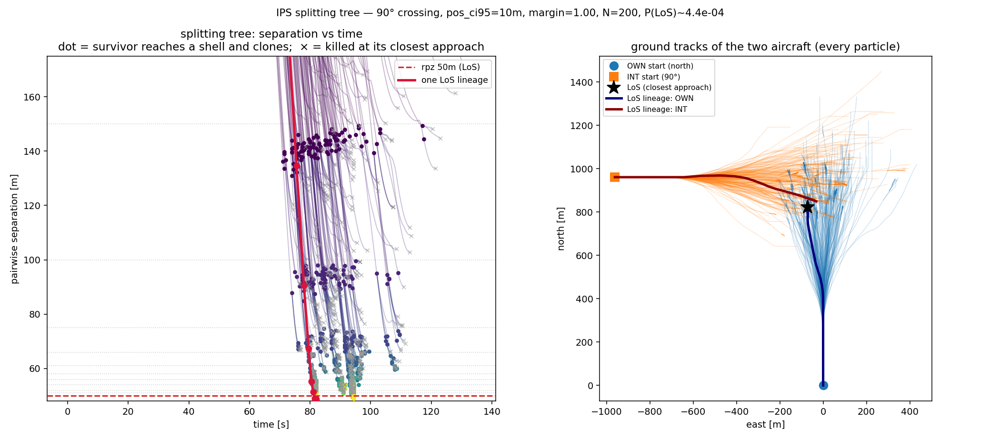

# The IPS splitting tree: seeing the estimator work, and finding the noise floor

**Status: diagnostic (Phase 8).** A visualisation of the rare-event estimator (ADR 0017) that
doubles as a sanity check and an explainer. `scripts/ips_tree.py` re-runs the fixed-effort
multilevel splitting of `ips_once` for one geometry — mirroring its seed spawning exactly, so it
*is* the real IPS run — but records each particle's separation-vs-time path, the two aircraft ground
tracks, and the resample parentage (which the estimator itself discards). It then traces one particle
that reached a loss of separation back through its parent-clones to `t = 0` and draws that lineage
bold over the faint full tree. Written 2026-07-26. Reproduce:

    python scripts/ips_tree.py                                  # 90 deg, pos 10, margin 1.0, N=200
    python scripts/ips_tree.py --pos 20 --lookahead 30 -N 100   # a less-safe variant

(fixed 90° crossing, 20 kts, `dcpa=0`, `tlos 90`, `rpz 50`, `lookahead 60`, `margin 1.00`, GNSS
`pos_ci95 10 m`, seed 0.)

## What the tree shows (and confirms)

**Left — separation vs time.** Every particle enters at the top (~150 m apart), descends as the pair
approaches, and dips toward its closest approach. A **dot** marks a survivor that reached a shell and
was cloned (with fresh noise); an **×** marks a killed particle at its closest approach, above the
next shell. The tree **marches rightward in time** in waves — each clone continues from its parent's
*crossing state*, which sits later in the encounter, so each resampling generation probes deeper.
That temporal progression *is* the interaction in the interacting-particle system.

**Right — ground tracks.** OWN flies north from the origin; INT crosses at 90°; the bundle fans out,
and that spread is the GNSS noise (each aircraft avoiding on its own slightly-wrong picture).

**The bold lineage** is one particle traced from `t=0` into LoS (closest approach 48.8 m < rpz). It is
a *physically continuous, valid* trajectory — each clone starts exactly at its parent's crossing
state — but IPS never simulated it end-to-end 10⁴ times. It **reused the shared promising ancestor**
(the trunk) and only re-rolled the hard descent through the shells across a handful of survivors. That
reuse — many descendants sharing one ancestor's approach — is exactly why IPS reaches a `P ≈ 4×10⁻⁴`
event with N=200 instead of the ~10⁵–10⁶ brute force would need. **The tree is the efficiency.**

## N must scale with rarity — visible

At `margin 1.00` the tree reaches, per particle budget (the collapse point is where a level runs out
of survivors, [[ips-gate2-efficiency]]):

| N | deepest shell reached |
|---|---|
| 60 | ~56 m |
| 100 | ~51 m (one shell short of rpz) |
| **200** | **50 m (LoS)** — the figure above |

Fixed-effort refills to N at every level, so once N is large enough that no level hits zero
survivors, the tree completes to the rare boundary.

## Stress test: P(CPA < 10 m) at pos=10 — the noise floor

Pushing the rare boundary from rpz=50 m down to **10 m** (a deep near-collision) with **N=1000** and
shells from 150 m to 10 m, the run **collapses at ~48 m**:

    survival:  60:0.21  55:0.20  52:0.14  50:0.056  48:0.000   -> COLLAPSED at d=48

So even N=1000 finds **no probability mass below ~48 m**. The reading is physical, not a tuning
artifact (finer shells near 50 did not help): **10 m of GNSS noise cannot overcome a working resolver
enough to drive a 90° crossing into a deep near-collision.** The CPA distribution has a left tail
below rpz (`P(CPA<50) ≈ 4×10⁻⁴`) that then falls to zero within ~2 m — a **floor set by the noise
level**. `P(CPA<10)` at pos=10 is therefore effectively zero, and *not a number IPS should report*.

The valuable part: **IPS collapse is information.** Brute-force MC would return `0` events with no way
to distinguish "too rare to sample" from "no mass at all". IPS's collapse point pins *where* the mass
runs out (~48 m), which is a statement about the dynamics, not a failure of the estimator. To make
`CPA<10` estimable you must raise the noise (`pos_ci95` up) so the resolver fails deeply enough for
near-collisions to carry probability — a separate sweep.

## Caveats

- **One seed, no CI** — the tree and the `P` on it are a single replication for illustration; real
  estimates run replications ([[ips-gate1-correctness]], `scripts/ips_validate.py`).
- **A clean 90° crossing is *safe*** (median clearance ~153 m); the sharp survival cliff at ~50 m is
  the resolver's clearance boundary, and the noise floor sits just below it. Harder geometries
  (near-head-on, shallow) or shorter lookahead would move both.
- **N=1000 stress run: ~30 s** on this machine — cheap, because deep-tail segments are short.

Companions: [[0017-ips-level-and-splitting]] (design), [[rare-event-validation-ladder]] (the ladder),
[[ips-gate1-correctness]] / [[ips-gate2-efficiency]] (the gates), [[ips-adaptive-levels]] (AMS).
