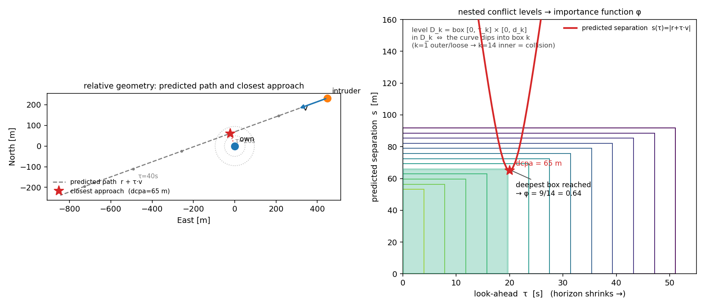

# The look-ahead conflict coordinate (Blom eq. 10.7, made light)

**Status: prototype, promising (Phase 8).** The importance function that finally ladders the
comms-blackout rare event where `min_sep`, staleness, and CPA-weighted staleness all collapsed
(5/6 → **0/6** at `rx=0.10`). Borrowed from Blom, Krystul & Bakker, *Free Flight Collision Risk
Estimation by Sequential Monte Carlo* (NLR-TP-2006-288), §10.2.2, eq. 10.7. Written 2026-07-27.
Prototyped in `scratchpad/probe_lookahead.py`; to be wired into `scripts/ips_unified_validate.py`.
See [[important-unified-coordinate]] and [[important-ips-gap]] for the road here.

Everything below is **horizontal** (co-altitude), so it is 2-D — that is the whole reason it is
lighter than Blom's: his second clause is the vertical one, which drops out for us.

## 1. The two ingredients

$$\mathbf{r} = \mathbf{p}_{\text{intr}} - \mathbf{p}_{\text{own}} \in \mathbb{R}^2 \quad\text{(relative position, } \mathbf{r}=(r_x,r_y)\text{)}$$

$$\mathbf{v} = \mathbf{v}_{\text{intr}} - \mathbf{v}_{\text{own}} \in \mathbb{R}^2 \quad\text{(relative velocity, } \mathbf{v}=(v_x,v_y)\text{)}$$

## 2. Straight-line extrapolation — where they will be $\tau$ seconds ahead

$$\mathbf{r}(\tau) = \mathbf{r} + \tau\,\mathbf{v}, \qquad s(\tau) = \lVert \mathbf{r} + \tau\,\mathbf{v}\rVert = \sqrt{(r_x+\tau v_x)^2 + (r_y+\tau v_y)^2}$$

$s(\tau)$ is the predicted separation at look-ahead $\tau$.

## 3. Closest predicted approach within a horizon $\tau_k$

$$\hat{s}_k = \min_{0 \le \tau \le \tau_k} \lVert \mathbf{r} + \tau\,\mathbf{v}\rVert$$

Since $s(\tau)$ is a parabola under the norm, there is a closed form:

$$\tau^\star = -\frac{\mathbf{r}\cdot\mathbf{v}}{\lVert\mathbf{v}\rVert^2}, \qquad \hat\tau = \operatorname{clip}(\tau^\star, 0, \tau_k), \qquad \hat{s}_k = \lVert \mathbf{r} + \hat\tau\,\mathbf{v}\rVert$$

So $\hat{s}_k$ is: the **dcpa** if the closest approach falls inside the window; the separation **at
the horizon** if it is beyond; the **current** separation if the pair is already diverging.

## 4. Nested conflict levels — shrink miss *and* horizon together

$$D_k = \{\, x : \hat{s}_k(x) \le d_k \,\}, \qquad k = 1,\dots,m$$

$$d_1 \ge d_2 \ge \dots \ge d_m = r_{\text{pz}} \quad\text{(miss threshold} \to \text{protected zone)}$$

$$\tau_1 \ge \tau_2 \ge \dots \ge \tau_m = 0 \quad\text{(look-ahead} \to \text{now)}$$

At the deepest level $k=m$: $\tau_m=0 \Rightarrow \hat{s}_m = \lVert\mathbf{r}\rVert$ (current
separation) and $d_m = r_{\text{pz}}$, hence

$$D_m = \{\, \lVert\mathbf{r}\rVert \le r_{\text{pz}} \,\} = \text{actual loss of separation.}$$

The nesting $D_1 \supset D_2 \supset \dots \supset D_m$ holds because a smaller window *and* a tighter
threshold give a subset.

## 5. The importance function the splitter climbs

$$\boxed{\ \varphi(x) = \frac{1}{m}\,\max\{\, k : \hat{s}_k(x) \le d_k \,\}\ } \qquad \varphi \in [0,1], \quad \varphi = 1 \iff \text{LoS}$$

($\varphi = 0$ if the pair is in no level.) IPS places shells at $\tfrac1m, \tfrac2m, \dots, 1$ and,
for each $k$, evolves a particle until $\varphi \ge \tfrac{k}{m}$ (first entry into $D_k$), keeps the
survivors, and resamples — the fixed-effort splitting of [[ips-splitting-tree]].

**Schedule used** (linear), for $k=1,\dots,m$:

$$\tau_k = \tau_{\max}\!\left(1 - \tfrac{k}{m}\right), \qquad d_k = d_{\max} - (d_{\max}-r_{\text{pz}})\,\tfrac{k}{m}$$

with $\tau_{\max}=55\,\text{s},\ d_{\max}=95\,\text{m},\ r_{\text{pz}}=50\,\text{m},\ m=14$.

**One-line reading.** $\varphi$ is **dcpa, counted only within a look-ahead window that shrinks level
by level** — loose miss / long horizon at the top, "collision right now" at the bottom.

## Illustration

*Left — the relative geometry.* Own at the origin, the intruder approaching along the dashed predicted
path $\mathbf{r}+\tau\mathbf{v}$; the red star is the closest predicted approach (here $\text{dcpa}=65$
m, reached $\tau^\star=20$ s ahead). *Right — the nested levels as nested boxes.* Each level $D_k$ is
the box $[0,\tau_k]\times[0,d_k]$ with its corner at the origin; because both the horizon $\tau_k$ and
the miss $d_k$ shrink with $k$, the boxes nest (loose / long-horizon outer $\to$ collision at the
inner corner). The pair is in level $D_k$ **exactly when the predicted-separation curve
$s(\tau)=\lVert\mathbf{r}+\tau\mathbf{v}\rVert$ (red) dips into box $k$**. The deepest box the curve
reaches is $\varphi\cdot m$ — here $\varphi = 9/14 = 0.64$ (shaded green). As the encounter runs and
the pair closes, the curve slides down-and-left into deeper boxes, so $\varphi$ climbs toward 1
(collision); if instead the resolver builds miss distance, the curve lifts out of the deep boxes and
$\varphi$ stalls. That "escape costs a resolved message" is why the same geometric ladder prices in
the drop probability. Generated by `blom-comparison/opus4p8_lookahead_illustration.py`.

## Correspondence to Blom eq. 10.7

$$\underbrace{\lvert y^{ij} + \tau\,v^{ij}\rvert \le d_k}_{\text{our } \hat{s}_k \le d_k\ \text{(horizontal)}} \ \text{AND}\ \underbrace{\lvert z^{ij} + \tau\,r^{ij}\rvert \le h_k}_{\text{vertical clause — dropped, co-altitude}} \quad\text{for some } \tau \in [0,\tau_k]$$

His $y, v$ are our $\mathbf{r}, \mathbf{v}$ (horizontal); the "for some $\tau \in [0,\tau_k]$" is
exactly our $\min_{0\le\tau\le\tau_k}$; the $z, r$ clause is the vertical one we do not need.

## Why it ladders the comms blackout (where `min_sep` collapsed)

The shrinking look-ahead $\tau_k$ **spreads the discrimination over the whole approach**: a blind pair
on a collision course lights up the predicted-conflict set *early* (while still far apart), because
$\hat{s}_k$ uses the closing **velocity**, not just the current position. Escaping a level requires
the resolver to *grow* the predicted miss — which needs a received message — so each shell's survival
fraction silently prices in $(1-r_x)$. `min_sep` (position only) is flat until the final approach, so
it cannot ladder the blackout and collapses; $\varphi$ ladders both nav drift and the blackout with
one coordinate — no cap, no staleness, no factoring.

## Empirical status (2026-07-27) — validated 3/3 against MC on the real sim

Benchmark settings (`pos=20`, `rx=0.06`), 1500 particles, 10 reps, vs the one MC ground-truth run:

| regime | look-ahead IPS | MC | verdict |
|---|---|---|---|
| nav   | $3.12\times10^{-4}$ | $2.66\times10^{-4}$ | PASS, 0/10 collapsed |
| comms | $1.232\times10^{-3}$ | $1.212\times10^{-3}$ | PASS, 0/10 collapsed |
| both  | $2.644\times10^{-2}$ | $2.676\times10^{-2}$ | PASS, 0/10 collapsed |

Every IPS CI overlaps MC, no collapses — robust *and* accurate. And it clears the comms cell that
collapsed 5/6 with `min_sep` / staleness / CPA-weighted staleness: at the rarer `rx=0.10` (MC out of
reach), $\hat{P}=3.76\times10^{-5}$ with **0/6 collapsed**, tight CI $[2.7,4.8]\times10^{-5}$.

**Done (2026-07-27):** `LookaheadCoord` is now the coordinate in `scripts/ips_unified_validate.py`
(the default rare-event simulator for our case) — `max(nav, cap·comm)`, staleness and the cap are
retired. The per-step scan is reduced to a single `in_level(k)` test (~3× faster IPS). Re-run
confirms it: nav $3.33\times10^{-4}$, comms $1.255\times10^{-3}$, both $2.589\times10^{-2}$, all 0/6.

**Next:** push to $10^{-5}$–$10^{-6}$ on the 100-core box now that the coordinate no longer collapses
(`--preset rare --jobs -1 --reps 120 --pos 14 --rx 0.10 --particles 4000 --mc-n 3e7`), and re-tune
`d_max`/`tau_max`/`m` if a different geometry is used.

## Related

- [[important-unified-coordinate]] — the `max(nav, cap·comm)` attempt this supersedes
- [[important-ips-gap]] — the coordinate matrix; "dcpa as a leading indicator" is vindicated here,
  but in the right form (nested on look-ahead), not raw dcpa
- [[ips-splitting-tree]] — the fixed-effort splitting $\varphi$ plugs into
