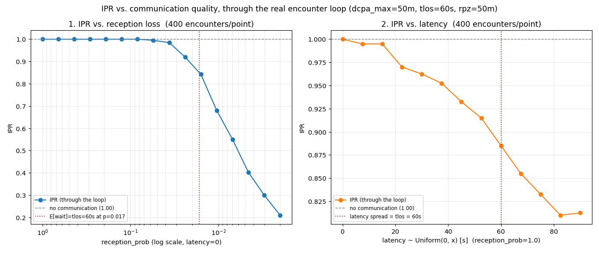

# Loop integration (3b) — IPR responds to reception loss and latency

**Status: validated end to end.** `run_encounter` now actually uses the communication layer for
its CDR decisions, not just in isolated layer tests — `detect(A, B_as_A_holds) ≠ detect(B,
A_as_B_holds)` (`vault/phase-3-plan.md`'s opening line) is driven by reception/latency, not only
independent GPS noise. Written 2026-07-20, closing the last open item on the Phase 3 checklist.

Implements the loop-integration item of [[0006-communication-model-design]]. Reproduce with
[`scripts/comm_ipr_sweep.py`](../../scripts/comm_ipr_sweep.py).

## Where this sits relative to the earlier CNS observations

- [[communication-reception-latency]] validated `Comm` in isolation (reception rate, latency
  distribution) — no encounter, no CDR.
- [[surveillance-hold-as-is]] validated `LastKnown.perceived` in isolation — one source, one
  receiver, no resolution logic.
- **This note is the first one where a dropped or late message can actually change whether an
  encounter loses separation.** Everything upstream was necessary but not sufficient; this is
  what makes it matter.

## Setup

Same scenario as `configs/pairwise.yaml`: random-angle pairwise encounters (`dcpa_max = 50 m`,
`tlos = 60 s`, `rpz = 50 m`, `lookahead = 120 s`), MVP + PastCPA, no GPS noise (so communication
is the only stochastic driver of the outcome, isolating its effect the same way the GPS-noise
monotonicity test isolates CI95). 400 encounters per point, seed fixed, swept via `estimate_ipr`
→ `run_encounter` — the real production path, not a standalone simulation.

## Panel 1 — reception loss

IPR is **flat at 1.0 down to `reception_prob ≈ 0.08`**, then drops in a clean, steep curve to
**0.21** at `p = 0.002`. The knee lines up almost exactly with the marked threshold
`p* = 1/tlos ≈ 0.017` — the reception rate at which the *expected* wait for a first successful
delivery (`E[wait] = broadcast_interval / p`, the same closed-form used in
[[communication-reception-latency]]) equals the entire time-to-loss-of-separation window. Below
that rate, a meaningful fraction of encounters don't get a single message through in time to
resolve at all.

**This confirms the calibration finding from building the loop-integration tests**: reception has
to be quite bad — worse than "occasional drops" — before it shows up in IPR at all, because a
60-second encounter window absorbs a lot of lost 1 Hz broadcasts. It is not that communication
loss doesn't matter; it's that *this* scenario's time budget is long enough to make ordinary loss
recoverable. A tighter `tlos` or a faster required reaction would move the knee accordingly.

## Panel 2 — latency

A steadier, shallower decline: IPR falls from 1.0 to **~0.81** as latency spread grows from 0 to
90 s (`Uniform(0, x)`, reception perfect). No sharp knee here — staleness accumulates gradually
rather than flipping a pair between "has data" and "has none". The point at `x = 90` (0.2125)
sits fractionally *above* `x = 82.5` (0.2100) — not a real reversal, just single-seed Monte Carlo
noise at `n = 400`; the trend across the whole sweep is unambiguous.

## What changed to make this possible

`opencdarr/loop.py`: `run_encounter` gained `communication` / `surveillance` / `comm_rng`.
`communication=None` (the default) is **byte-identical** to Phase 3a — verified by every
pre-existing test passing unmodified, not just asserted. When set, each broadcast is offered to
`communication.step(...)` (its own RNG substream — `estimator.py` now spawns `geom_seq, nav_seq,
comm_seq` unconditionally, ADR 0006 §6) before a decision reads `surveillance.perceived(...)`;
`_decide` accepts `other: AircraftState | None` and flies nominal when nothing has ever been
received (ADR 0006 §5).

7 new tests in `tests/test_loop_cns.py`: `p=1,latency=0` bit-identical to no-communication;
monotonic degradation with reception loss and with latency; reproducibility; and — the one
specifically protecting against a subtle correlation bug — adding a communication layer does
**not** change navigation's random draws (independent substreams, verified by running the same
`nav_seq` with and without communication attached and checking the outcome is identical).
