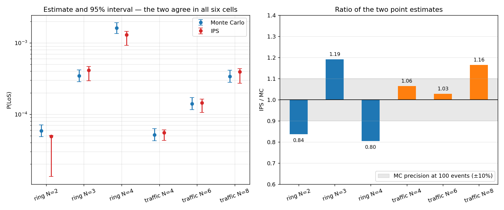
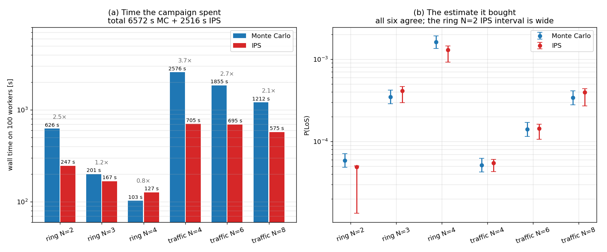
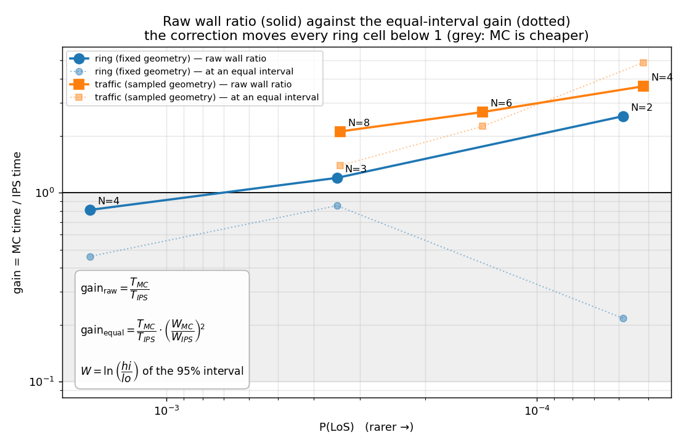
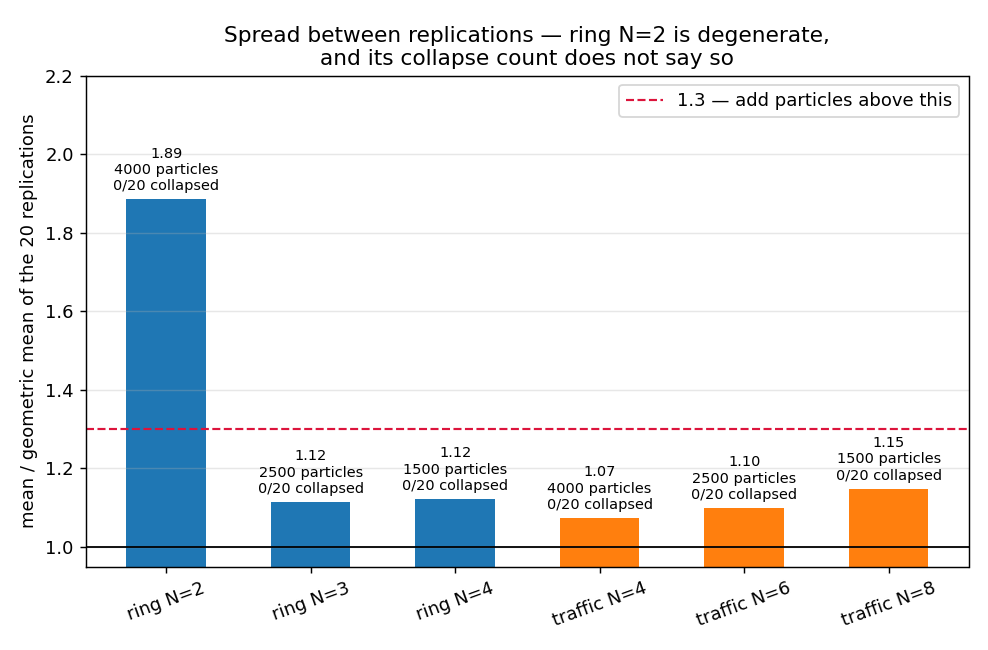
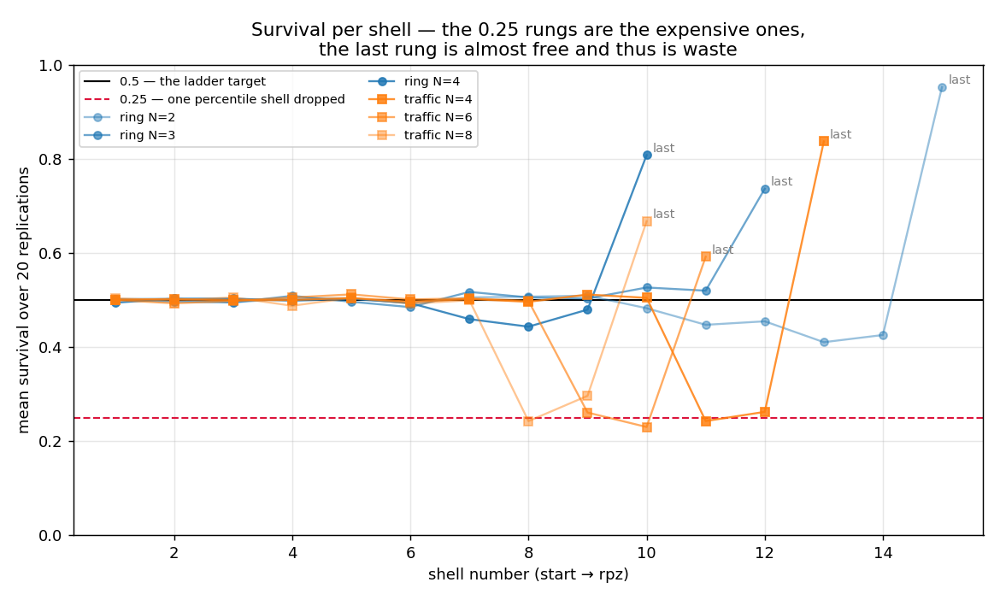

# Campaign: Monte Carlo against IPS, six cells

**Status: done. The two estimators agree in all six cells. But at an equal interval width, IPS is
cheaper only in the three traffic cells.** This is the full-size run of the two
handbook campaigns. [[ips-gate1-correctness]] and [[ips-gate2-efficiency]] showed correctness and
efficiency on small test cases. This run shows the same two properties on the shipped environment,
at production size, with 100 workers. Written 2026-08-05.

The text of this note is in ASD-STE100 Simplified Technical English.

## The run

    PYTHONPATH=. python scripts/mc_vs_ips_campaign.py --target-events 100 --reps 20 \
        --particles 4000 2500 1500 --jobs 100 --out campaign.json

The run was on a different machine. The result file is `campaign.json`, in the repository root and
in `scripts/`. The two copies are the same file. The four figures in this note come from that file
through [`scripts/plot_mc_vs_ips_campaign.py`](../../scripts/plot_mc_vs_ips_campaign.py):

    PYTHONPATH=. python scripts/plot_mc_vs_ips_campaign.py

The run used commit `0295f6b` of [`scripts/mc_vs_ips_campaign.py`](../../scripts/mc_vs_ips_campaign.py).
That version has the geometry in module constants. The local working copy has the same geometry in
an `Arena` dataclass, but this change is not committed. Thus `campaign.json` has no `arena` block,
and its `settings` block has no radius fields. The geometry is the same in both versions: ring
radius 500 m, measured disc 1000 m, release circle 1200 m, rpz 50 m, lookahead 30 s, speed 10 m/s,
GNSS `pos_ci95` 10 m, `dt` 0.5 s.

Part 1 is the ring: `N` aircraft on a circle, each one flies to the opposite point. The start state
is fixed, thus only the CNS noise is random. Part 2 is random traffic by the Groot–Ellerbroek–
Hoekstra entry rule (see [[random-spawn-conflict-probability]]). Each encounter draws a new
geometry and new noise.

Monte Carlo (MC) runs to 100 events, not to a number of encounters. IPS uses 20 replications. The
shell ladder for each cell comes from the MC min-separation record.

## The result

| cell | MC `P(LoS)` | MC 95 % CI | events / encounters | IPS `P(LoS)` | IPS 95 % CI | MC time | IPS time | gain |
|---|---|---|---|---|---|---|---|---|
| ring N=2 | 5.86e-5 | [4.83e-5, 7.12e-5] | 102 / 1 740 000 | 4.90e-5 | [1.34e-5, 5.04e-5] | 626 s | 247 s | 2.5× |
| ring N=3 | 3.47e-4 | [2.86e-4, 4.20e-4] | 104 / 300 000 | 4.13e-4 | [2.95e-4, 4.65e-4] | 201 s | 167 s | 1.2× |
| ring N=4 | 1.61e-3 | [1.36e-3, 1.92e-3] | 129 / 80 000 | 1.30e-3 | [9.19e-4, 1.45e-3] | 103 s | 127 s | 0.8× |
| traffic N=4 | 5.15e-5 | [4.24e-5, 6.27e-5] | 100 / 1 940 000 | 5.49e-5 | [4.31e-5, 6.05e-5] | 2576 s | 705 s | 3.7× |
| traffic N=6 | 1.40e-4 | [1.15e-4, 1.70e-4] | 101 / 720 000 | 1.44e-4 | [1.06e-4, 1.62e-4] | 1855 s | 695 s | 2.7× |
| traffic N=8 | 3.40e-4 | [2.80e-4, 4.13e-4] | 102 / 300 000 | 3.96e-4 | [2.71e-4, 4.37e-4] | 1212 s | 575 s | 2.1× |

`gain` is the MC time divided by the IPS time, as the campaign ran. This is the raw gain. The two
methods did not reach the same precision, thus §2 corrects it. The full campaign took 2.53 h on 100
workers. That
is about 253 worker-hours. MC used 6572 s of that time, and IPS used 2516 s. MC flew 5 080 000
encounters. No replication collapsed: the collapse count is 0 of 20 in all six cells.

## 1. The two estimators agree

The IPS value divided by the MC value is between 0.80 and 1.19. The largest difference is thus
20 %. The MC interval and the IPS interval overlap in all six cells. The MC intervals are Wilson
intervals at 100 events, thus their relative half-width is about ±10 %. A difference of 20 % is
inside the sum of the two errors.

This is [[ips-gate1-correctness]] again, but on the shipped environment and at production size. The
agreement holds for a fixed start state (the ring) and for a random start state (the traffic). Thus
the estimator is correct across the seam that [[important-estimator-environment-seam]] describes.

## 2. Time: IPS is cheaper in the traffic cells only

**The raw times are not times for the same answer.** `--target-events 100` sets the MC precision to
almost the same value in every cell: the MC interval width `ln(hi/lo)` is between 0.344 and 0.391.
`--reps 20` sets no target for the IPS precision, thus the IPS width is between 0.339 and 1.325.
Panel (a) shows the time that the campaign spent. Panel (b) shows the estimate that this time
bought. The two panels together show the fault: at ring N=2, IPS used 2.5 times less time than MC,
but its interval is 3.4 times wider.

Both intervals become narrow as `1/sqrt(effort)`. The MC interval narrows with the number of
events, and the IPS interval narrows with the number of replications. The cost of each method is
linear in that effort. Thus, to make an interval `k` times more narrow, you must pay `k²` times
more time. **This is the equation:**

    W       = ln(hi / lo)                  the width of a 95% interval, scale free
    gain_raw   = T_mc / T_ips                                     what the campaign measured
    gain_equal = T_mc / T_ips  ×  (W_mc / W_ips)²                 the same, at an equal interval

`ln(hi/lo)` is used because `P(LoS)` is positive and covers decades, and because the IPS interval
is not symmetric. The last column gives `gain_equal`, and it is the one to use:

| `P(LoS)` | cell | raw time gain | IPS width / MC width | **gain at an equal interval** |
|---|---|---|---|---|
| 1.6e-3 | ring N=4 | 0.8× | 1.33 | **0.46×** |
| 3.5e-4 | ring N=3 | 1.2× | 1.18 | **0.85×** |
| 5.9e-5 | ring N=2 | 2.5× | 3.42 | **0.22×** |
| 3.4e-4 | traffic N=8 | 2.1× | 1.23 | **1.39×** |
| 1.4e-4 | traffic N=6 | 2.7× | 1.09 | **2.24×** |
| 5.2e-5 | traffic N=4 | 3.7× | 0.87 | **4.88×** |

The figure gives the two lines together, and repeats the equation. The solid line is the measured
wall ratio. The dotted line is the corrected one. Read the dotted line.

**IPS wins only in the traffic cells.** There the gain increases as the event becomes more rare:
1.39×, then 2.24×, then 4.88×, as `P(LoS)` decreases from 3.4e-4 to 5.2e-5. That is a factor of
about 4 for each decade of rarity. The cross-over for the traffic cells is near `P = 5e-4`. MC cost
is proportional to `1/P` for a constant number of events. IPS cost is proportional to the number of
shells, and the number of shells is proportional to `log(1/P)`. Thus the increase must continue
below the range of this campaign, to the collision radius near `P = 1e-7` that MC cannot reach.

**IPS loses in all three ring cells**, and ring N=2 is the worst (0.22×). §3 gives the cause: the
ring start state is fixed, thus the particle cloud becomes degenerate. The ring is the cell type
that IPS must be good at, because it is the worst case that a study looks at. Thus this is the
result to correct first.

**The cost of one encounter is not the cause.** MC throughput decreases from 2781 encounters/s at
ring N=2 to 247 encounters/s at traffic N=8. But the throughput tracks `N`, not the part: ring N=4
gives 780 encounters/s and traffic N=4 gives 753 encounters/s, which is almost the same. Thus the
traffic cells are not easier to fly. They are easier for IPS.

**The gain here is small because the campaign is not deep.** A gain of 1.4 to 4.9 is much less than
the gain that [[ips-gate2-efficiency]] found, because that gate used a case where MC read exactly
zero. At `P(LoS) = 5e-5` MC still sees events, thus MC is still a fair competitor.

## 3. The ring N=2 cell is the least converged

The IPS interval for ring N=2 is [1.34e-5, 5.04e-5]. The point estimate 4.90e-5 is almost at the
top limit of that interval. This is not an error. The point estimate is the arithmetic mean of the
20 replications. The interval is a log-space interval, thus it is centred on the geometric mean
(2.60e-5). A large difference between the two means shows a large spread between replications.

| cell | mean / geometric mean | log spread between replications |
|---|---|---|
| **ring N=2** | **1.89** | **1.51** |
| ring N=3 | 1.12 | 0.52 |
| ring N=4 | 1.12 | 0.52 |
| traffic N=4 | 1.07 | 0.39 |
| traffic N=6 | 1.10 | 0.49 |
| traffic N=8 | 1.15 | 0.55 |

The ring N=2 spread is three times the spread of all other cells. The replications thus give values
across a range of about 4.5×. The collapse count for this cell is 0. **Thus a collapse count of
zero is not sufficient to show that the particle count is sufficient.** [[ips-gate2-efficiency]]
gives the collapse count as the primary indication of too few particles. This run adds a second
indication: the ratio of the mean to the geometric mean. A ratio above about 1.3 shows that the
cloud is degenerate, and the run needs more particles.

**The probable cause is the fixed start state.** All 4000 ring particles start from the same world.
Only the noise makes them different. After 14 resample steps, the survivors come from few ancestors,
thus they are correlated. The traffic cells draw a new geometry for each particle, thus the initial
cloud is diverse, and the same number of shells gives a much smaller spread. Compare ring N=2 and
traffic N=4: the two cells have almost the same `P(LoS)`, the same 4000 particles and almost the
same number of shells (15 and 13), but the ring spread is 3.9 times the traffic spread.

**Actions:** report the geometric mean and the interval together, or use more replications. Give
the fixed-geometry cells more particles than a sampled-geometry cell at the same `P(LoS)`.

## 4. The ladder loses a factor of 2 at some shells

`build_ladder()` puts the shells at the percentiles 2⁻¹, 2⁻², 2⁻³ … of the MC min-separation
record. If the estimator is correct, the survival at each shell must be 0.5. A guard in the
function refuses a shell that is nearer than `step` metres to the shell before it. `step` is 0.5 m
for the ring and 1.0 m for the traffic. When the guard refuses a shell, the next shell is two
percentile steps below the last one. Its survival is thus 0.25, not 0.5.

The recorded survivals show this effect:

    traffic N=4:  0.50 ×10,  0.243,  0.262,  0.837
    traffic N=6:  0.50 × 8,  0.261,  0.230,  0.592
    traffic N=8:  0.50 × 7,  0.242,  0.296,  0.667
    ring N=2:     0.50 × 9,  0.482, 0.447, 0.455, 0.410, 0.425,  0.952

The arithmetic agrees. For traffic N=4 the product of the first 12 survivals is 6.22e-5, and the
12th shell is the 2⁻¹⁴ percentile (6.10e-5). **A shell with a survival of 0.25 is the expensive
shell**, because the variance of a splitting stage increases as the survival decreases. The traffic
cells lose two shells each, because their `step` is twice the ring `step`.

**The last shell is almost free, and thus it is waste.** The percentile loop stops at a shell very
near to the rpz (50.19 m, 50.51 m, 50.03 m). The function then always appends the rpz itself. The
survival of that last step is 0.59 to 0.95. The run pays a full resample stage for almost no
decrease in probability.

**Actions:** decrease `step` for the traffic cells to 0.25 m, or remove the guard and let the
ladder builder merge equal shells. Do not append the rpz when the last shell is already within
`step` of the rpz. The correct solution is adaptive shells (AMS), which hold the survival at a
constant value and thus make both faults impossible. See [[ips-splitting-tree]] and
[[0017-ips-level-and-splitting]].

## 5. The notebook values are too low in two cells

The script holds the notebook IPS values in `cfg.assume_p`, and uses them only to price a
calibration run. The notebook used 600 to 2500 particles and 6 replications. The campaign used 1500
to 4000 particles and 20 replications.

| cell | notebook IPS | campaign MC | inside the MC interval? |
|---|---|---|---|
| ring N=2 | 4.65e-5 | 5.86e-5 | no — too low |
| ring N=3 | 3.37e-4 | 3.47e-4 | yes |
| ring N=4 | 1.81e-3 | 1.61e-3 | yes |
| traffic N=4 | 3.90e-5 | 5.15e-5 | no — too low |
| traffic N=6 | 1.17e-4 | 1.40e-4 | yes, but at the lower limit |
| traffic N=8 | 3.59e-4 | 3.40e-4 | yes |

The two errors are both low, and both are in the most rare cell of their part. This agrees with the
rule in [[ips-gate2-efficiency]]: too few particles give a value that is too low. The error is
between 20 % and 25 %, thus it is not large, but its sign is always the same.

**Action:** correct `cfg.assume_p` with the campaign MC values, and correct the notebook text.

## 6. The separation stack decreases the risk by a factor of about 5000

[[random-spawn-conflict-probability]] gives the conflict demand, which is the probability that a
drawn fleet contains a conflict before the separation logic acts. The campaign MC gives what is
left after the logic acts:

| cell | demand `P(conflict)` | campaign MC `P(LoS)` | factor |
|---|---|---|---|
| traffic N=4 | 0.3155 | 5.15e-5 | 6120 |
| traffic N=6 | 0.6022 | 1.40e-4 | 4290 |

The derivation note gives the factor as "about 5000" from the notebook IPS value at N=6. The
campaign MC value gives 4290. Thus the statement in that note is correct, and it now has a Monte
Carlo source. The demand for N=8 is not derived, thus that row is empty.

## Limits

- **The comparison of times is a comparison of one machine, not of operation counts.** The MC time
  and the IPS time come from the same run on the same 100 workers, thus the ratio is fair. But the
  absolute values do not transfer to a different machine. Run `--calibrate` first on a new machine.
- **The equal-interval gain in §2 assumes that you add replications.** The IPS interval narrows as
  `1/sqrt(reps)`, and the cost increases with `reps`, thus the correction is exact for that method.
  But the correct repair for ring N=2 is more particles, not more replications, because §3 shows a
  degenerate cloud. More particles can narrow the interval more quickly than `1/sqrt(reps)`. Thus
  0.22× is a lower limit for that cell, not a measurement. A run at 16 000 particles would give the
  measurement.
- **The MC min-separation record is lost.** `run_mc()` builds the record, gives it to the ladder
  builder, and then removes it from the cell before the write (`campaign.json` has no `min_sep`
  field). Thus the ladder cannot be rebuilt from the result file, and the record cannot be used
  again. The shells are kept, thus the run is repeatable, but the distribution is not. Write the
  record to a separate file. See [[segment-min-separation]].
- **Ring N=4 shows 129 events, not 100.** MC runs in chunks of 20 000 encounters, thus it
  overshoots the target in a cell where events are frequent. This makes the interval better than
  the target, not worse.
- **One seed.** All six cells used seed 0. The agreement in §1 is thus one sample of the agreement,
  not a distribution of it.

Companions: [[ips-gate1-correctness]] (correctness gate), [[ips-gate2-efficiency]] (efficiency
gate), [[rare-event-validation-ladder]] (the ladder), [[ips-parallel-scaling]] (the worker scaling
this run depends on), [[ips-splitting-tree]] (the shells), [[important-ips-gap]] and
[[important-estimator-environment-seam]] (the seam the two parts test),
[[random-spawn-conflict-probability]] (the demand in §6),
[[0017-ips-level-and-splitting]] and [[0018-parallel-ips-scheduling]] (design).
