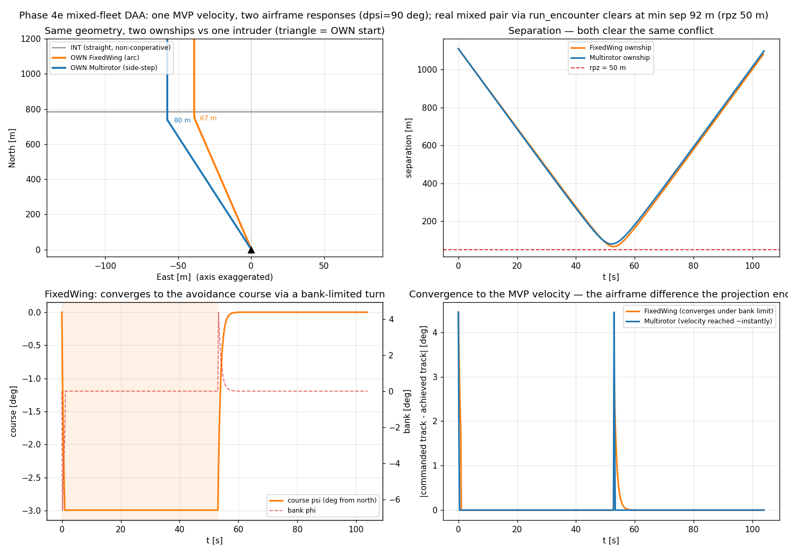

# Mixed-fleet DAA: FixedWing vs Multirotor through `run_encounter`

**Status: validated (Phase 4e gate green).** A real multirotor-vs-fixed-wing conflict — detect,
resolve, recover (`StateBased` + `MVP` + `PastCPA`, unmodified) — run through **`run_encounter`
itself**, each aircraft advanced by its own `dynamics`/`perf` bundle (ADR 0011 §7). Closes the
remaining follow-up from [[mixed-fleet-dubins-holonomic]] ("wiring `run_encounter` for per-aircraft
`Dynamics`/`Performance`") and confronts the honest gap ADR 0013 §4 named: **a fixed-wing cannot
fly the resolver's raw velocity.** Written 2026-07-24. Reproduce with
[`scripts/mixed_fleet_daa_demo.py`](../../scripts/mixed_fleet_daa_demo.py).

## The problem this rung solves

`MVP`/`VO` emit a vehicle-neutral avoidance **velocity** (ADR 0008/0011 §2). For a `Multirotor`
that is a native `TrajectorySetpoint.velocity` — flown directly. For a `FixedWing` it is *not* a
setpoint at all: the airframe takes a lateral **course** + a longitudinal **airspeed**, and
`FixedWing.step` **fails fast** on a raw velocity (ADR 0013 §4). So a velocity avoidance has to be
**projected** onto the fixed-wing channels before it can fly. The projection lives at the
separation layer, `separation.project_to_fixedwing`:

```
target_course   = track of the avoidance velocity   (atan2(v_east, v_north))
target_airspeed = |avoidance velocity|, clamped to  [v_min, v_max]   (stall .. max airspeed)
```

It is deliberately an **approximation**, and the approximation *is* the physics: a multirotor
reaches the commanded velocity essentially instantly; a fixed-wing can only **converge** to that
course under its bank/roll limit and ramp to that airspeed under `ax`. `MVP`/`VO` stay
vehicle-neutral (they still emit a velocity); the projection is wired per-airframe by the loop
(`loop._setpoint_adapter`), applied to **every** command the manager returns — nominal, override,
or coast — so a fixed-wing never leaves the separation layer holding a velocity it cannot fly. The
override (not just the mission nominal) is exactly what carries that velocity, which is why the
adapter sits at the separation layer and not in a fixed-wing autopilot.

## Setup

`run_encounter` now threads `(dynamics, perf)` per aircraft: `own_dynamics`/`own_perf` and
`intr_dynamics`/`intr_perf` each default to the shared bundle, so every single-airframe caller (and
the bit-for-bit multirotor anchors in `test_loop.py`) is unchanged, and a mixed pair is one call:

```python
run_encounter(
    own, intr, perf=M600, rpz=50.0, t_lookahead=120.0, dt=0.2,
    detector=StateBased(), resolver=MVP(margin=1.1), recovery=PastCPA(bouncing_guard=True),
    own_dynamics=FixedWing(), own_perf=SMALL_FIXEDWING,   # a small fixed-wing UAV
    intr_dynamics=Multirotor(), intr_perf=M600,           # a DJI M600 multirotor
)
```

A 90 deg crossing at 15 m/s (`create_conflict`, `dcpa = 0`, `tlos = 60 s`). Nothing here is a
mixed-fleet code path: the CD/CR/CRR layers and the `SeparationManager` are the unmodified ones the
IPR sweeps use; the only additions are the per-aircraft bundle and the airframe-derived setpoint
adapter.



## What it shows

**It resolves through the normal entry point.** The real mixed pair (both running DAA) clears at
**min sep 91.7 m**, well clear of `rpz = 50 m`, and recovers cleanly (the pair terminates on the
`done_timeout`, not the perpetual MVP "dance" a tighter symmetric geometry can induce). The gate
pins this deterministically (`test_loop_mixed_fleet.py`), plus a seeded GPS-noisy `min_sep` and a
small seeded IPR = 1.0 from seed 0 — reproducible from seed, the property the rare-event method
will rest on.

The four panels use two ownships of each airframe resolving the **same** geometry against the same
non-cooperative intruder, to isolate the airframe response:

- **Ground tracks (east axis exaggerated).** Both drift west to open the miss distance; the
  fixed-wing (orange) clears by less (**66.5 m** vs the multirotor's **79.9 m**) — it needs a
  little more room because it converges to the avoidance velocity rather than snapping to it.
- **Separation.** Both clear the same conflict; the fixed-wing's trough is slightly deeper and
  slightly later — the signature of a bank-limited turn-in.
- **FixedWing course + bank.** The fixed-wing turns onto the avoidance course through a *feasible,
  bank-limited* arc: `bank` ramps up (finite roll rate), holds a modest angle, and the course
  converges — it never snaps. At cruise the required bank is small (a few degrees); the stall/bank
  envelope is a hard bound that would bind harder in a more aggressive encounter.
- **Convergence to the MVP velocity.** The gap between the commanded track and the achieved track:
  the **multirotor closes it near-instantly** (a vertical step), the **fixed-wing converges over
  several seconds** under its turn limit — most visible at recovery (~t = 53 s), when the command
  snaps back to the nominal and the two airframes track it at very different rates. This is the
  projection's documented approximation, drawn.

## The fixed-wing MVP/VO IPR, re-anchored

ADR 0013's Consequences deferred "the MVP/VO IPR on the *fixed-wing* airframe" to this rung (it
needed the projection). It is now pinned in `test_loop_mixed_fleet.py` as the both-fixed-wing pair
on the same 90 deg crossing — the analogue, on the fixed-wing airframe, of the multirotor `min_sep`
anchors in `test_loop.py`: **MVP 53.58 m, VO 53.41 m** (the MVP value re-anchored slightly with the
Phase-6 `_BIAS_EPS` fix, [[headon-threshold]]). Two slow-turning fixed-wings clear the same
geometry by a **tighter margin** than the mixed/multirotor case (91.7 m) — the non-holonomic turn
limit costs miss distance, exactly as expected.

## Why this is the right thing to check

- **CD/CR/CRR and MVP/VO stay vehicle-neutral.** No layer branches on the airframe. MVP emits the
  same velocity for either side; the *only* airframe-specific step is the projection, and it lives
  in one named function wired by the loop, not inside the resolvers.
- **The fail-fast contract is preserved, not bypassed.** `FixedWing.step` still refuses a raw
  velocity (`test_fixedwing_dynamics`); the projection is what supplies a valid setpoint, tested in
  isolation (`test_setpoint_adapter`: the projected `(course, airspeed)` is feasible and the
  fixed-wing converges to it without violating stall/bank).
- **It runs through `run_encounter`**, so the mixed pair is sweepable for an IPR the same way every
  other encounter is — the follow-up [[mixed-fleet-dubins-holonomic]] left open is closed.

## What this still doesn't cover

The projection is a pure velocity→course/airspeed map with no wind (`ψ = χ`); the wind crab angle
and the NPFG form land with [[phase-5-plan|Phase 5]]. The airspeed clamp assumes the avoidance
speed is achievable within `[v_min, v_max]`; a resolver demanding a speed *outside* the envelope is
silently clamped (the fixed-wing then resolves more by heading) — an acceptable approximation this
pass, not a modelled infeasibility signal. And the four-panel contrast uses a non-cooperative
straight intruder to isolate each airframe; the both-cooperative mixed pair (the gate) is the
headline number, but its per-airframe manoeuvre split is geometry-dependent and not dissected here.
