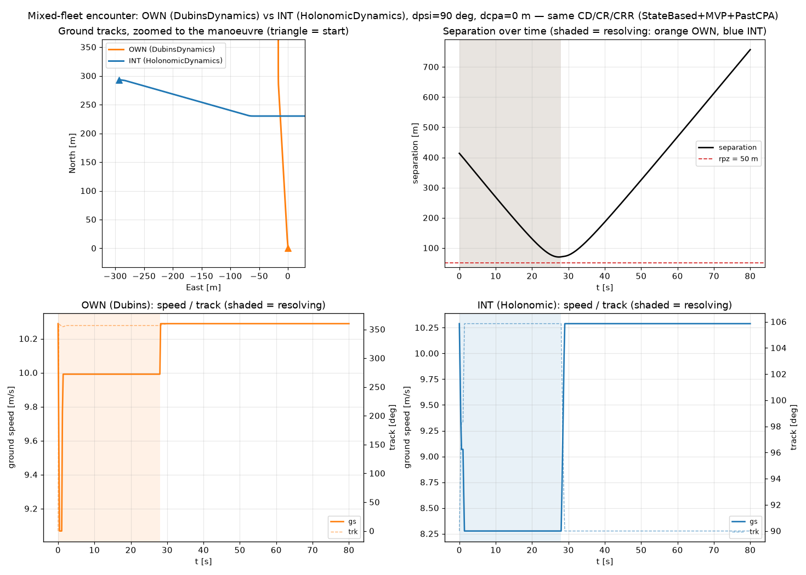

# Mixed-fleet encounter: DubinsDynamics vs HolonomicDynamics

**Status: validated.** A real two-aircraft conflict — detect, resolve, recover
(`StateBased` + `MVP` + `PastCPA`, unmodified) — where each aircraft is advanced by a *different*
`Dynamics` model. Written 2026-07-21.

Extends [[controlling-dubins-vs-holonomic]] (which drove each model directly with synthetic
commands) to the case flagged as untried in its "What this doesn't cover yet" section and in
[[0009-holonomic-dynamics]]'s Consequences: a genuine encounter where the two sides don't share a
physics model. Reproduce with
[`scripts/mixed_fleet_demo.py`](../../scripts/mixed_fleet_demo.py).

## Setup

`OWN` (`DubinsDynamics`) and `INT` (`HolonomicDynamics`) start in a 90 deg crossing conflict
(`create_conflict`, `dcpa = 0`, `tlos = 25 s`, both M600 `Performance`, `10.29` m/s). No noise: CD decides on the true states directly (same "no noise" pattern as `scripts/trajectory_comparison/run_ours.py`, but using `_INACTIVE`/`PairMemory` correctly — that script's `ro = ri = False` initial memory is a stale pre-`PairMemory` leftover that actually raises `AttributeError` against today's `_decide`; not something to copy, flagged separately).

```python
own = AircraftState(id="OWN", lat=52.0, lon=4.0, trk=0.0, gs=SPEED)
intr = create_conflict(own, intr_id="INT", dpsi=90.0, dcpa=0.0, tlos=25.0, rpz=RPZ, side=1)
own_dyn, intr_dyn = DubinsDynamics(), HolonomicDynamics()
...
cmd_own, mem_own = _decide(own, intr, nom_own, mem_own, RPZ, LOOKAHEAD, det, res, rec)
cmd_intr, mem_intr = _decide(intr, own, nom_intr, mem_intr, RPZ, LOOKAHEAD, det, res, rec)
own = own_dyn.step(own, cmd_own, M600, DT)      # OWN advances as a Dubins car
intr = intr_dyn.step(intr, cmd_intr, M600, DT)  # INT advances as a holonomic vehicle
```

`_decide` (detect/resolve/recover) and `MVP`/`StateBased`/`PastCPA` are called exactly as
`run_encounter` calls them — nothing here is a special mixed-fleet code path. The only thing that
differs from a same-fleet encounter is which `Dynamics.step` each aircraft's `Command` goes
through.



## What it shows

**It resolves.** Minimum separation `70.22 m`, clear of `rpz = 50 m` — the encounter that, left
unresolved, would collide (`dcpa = 0`) is avoided, with each aircraft flying its own physics the
whole time.

**Top-left (ground track, zoomed to the manoeuvre).** OWN's path (orange) is a sharp, brief
turn-rate-limited hook right at the start, then a straight line — once `DubinsDynamics` reaches its
target heading it holds it, same as every single-model case. INT's path (blue) is a continuous
diagonal curve that gradually flattens — `HolonomicDynamics` is always moving its velocity vector
directly toward whatever MVP currently resolves to, so the curvature tracks the *resolution*
changing smoothly, not a heading catching up to a fixed target.

**Top-right (separation) and bottom row (speed/track).** Both aircraft are shaded "resolving" for
exactly the same window, `28.0 s` — **and this is not a coincidence, it's provable from the code.**
`PastCPA.should_resume` and `StateBased.detect` both reduce to the sign of
`rel.rx*rel.vx + rel.ry*rel.vy` (`relative_enu`'s dot product) plus a symmetric distance check.
`relative_enu(own, intr)` and `relative_enu(intr, own)` produce exactly negated `(rx, ry, vx, vy)`
— and a dot product is invariant under negating both vectors — so `detect`/`should_resume` give
the *same boolean* regardless of which aircraft is "own" and which is "other," for any geometry,
as long as both directed calls see the same true states (true here — no noise). Only `MVP.resolve`
is genuinely directional (each aircraft's own avoidance vector); detection and recovery timing
never can differ between the two sides in a noise-free encounter like this one.

**Bottom row (speed/track), the same trade-off from the synthetic comparison, now inside a real
resolution.** OWN holds close to its resolved speed (min `9.069` m/s, barely below the `10.29` m/s
cruise) — Dubins pays for a heading change in time, not speed. INT dips further (min `8.277` m/s)
— Holonomic's isotropic accel budget is split between redirecting and maintaining magnitude, as
[[controlling-dubins-vs-holonomic]] found synthetically. The same physics, now producing an actual
avoidance manoeuvre instead of a scripted command.

## Why this is the right thing to check

The two claims this needed to prove, and how each is checked here rather than just asserted:

- **CD/CR/CRR are genuinely dynamics-agnostic.** No code path here branches on which `Dynamics`
  either aircraft uses — `_decide`, `StateBased`, `MVP`, `PastCPA` are the unmodified functions
  `run_encounter` itself calls. If any of them silently assumed a coupled heading, this encounter
  would either error or resolve incorrectly; it does neither.
- **The resolution actually clears**, not just "runs without crashing" — `70.22 m > 50 m` is a
  real, checked outcome, not an assumption.

## What this still doesn't cover

This threads `_decide` manually rather than through `run_encounter`, which still takes one shared
`dynamics=`/`perf=` for both sides (ADR 0009's Consequences, unchanged). Wiring `run_encounter`
itself for per-aircraft `Dynamics`/`Performance` — so this scenario could run through the same
entry point `estimate_ipr`/`scripts/ipr_angle_sweep.py` use, and be swept for an IPR — is the
remaining follow-up, not designed here.
