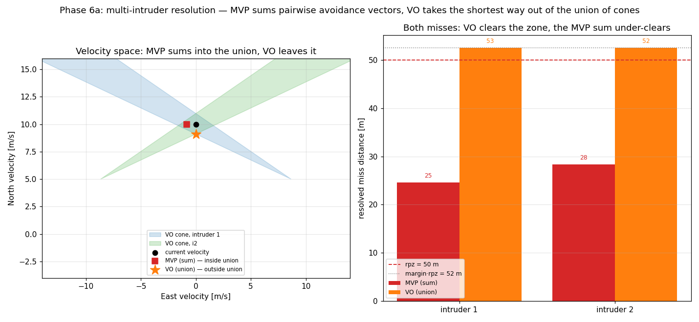

# Multi-intruder resolution: MVP sums, VO takes the union

**Status: validated (Phase 6a).** The separation algorithm made genuinely multi-agent: `resolve`
takes the intruder **set**, and — the load-bearing point — **the two resolvers compose over the set
differently** (ADR 0004 / Phase-6 plan decision 4). Written 2026-07-25. Reproduce with
[`scripts/multi_intruder_demo.py`](../../scripts/multi_intruder_demo.py).

## The two composition rules

An ownship heading north is in simultaneous conflict with two intruders crossing from ±60° (both
`dcpa = 0`). Each intruder forbids a **cone** of ownship velocities (its velocity obstacle).

- **MVP is a potential field → it sums.** `resolve(own, intruders)` = `v_own − Σ dv_i`, each `dv_i`
  the pairwise avoidance vector. In the velocity-space panel (left) the summed velocity (red square)
  is still **inside the union** of the two cones: the two pairwise corrections partly cancel, so the
  ownship under-corrects. In the ground frame (right) it opens the misses only to **25 / 28 m** —
  short of `rpz = 50 m`. This is a real, known limitation of potential-field superposition on a
  symmetric double conflict, not a bug.
- **VO is a feasibility problem → it takes the union.** The resolution is the velocity **outside the
  union of the cones** nearest the current velocity — the VO velocity (orange star) sits just
  **outside both cones** on the union's boundary. It clears **both** misses to **52 / 53 m**
  (`= margin·rpz`). A *summed* VO would have landed inside a cone (the exact failure mode this
  avoids).

This is precisely why the interface takes the set and lets each algorithm compose its own way, rather
than prescribing a generic "sum" — the flaw the Phase-6 plan originally had, caught in review.

## How VO handles the union — analytic candidate search

The nearest exterior point of a union of convex cones lies on the union's boundary, so the candidates
are: the projection of the preferred velocity onto **each cone edge**, plus the **pairwise
intersections of edges from different cones** (the union's vertices). Keep those outside *all* cones;
the nearest to the preferred velocity wins. An over-constrained fleet (a ring of intruders, no
reachable exterior velocity) falls back to the least-penetration candidate — a decision, not a crash
(`test_multi_intruder.py`). At one intruder this reduces to the single-cone shortest way out
**bit-for-bit** — every Phase-4/5 pairwise VO anchor is unchanged.

## A resolver decision found in review: VO's preferred velocity is the *current* velocity

The plan first chose VO's preferred (bias) velocity to be the **nominal** — "return toward the
intended track." Building it surfaced that this **destabilises the resolver**: greedy
nearest-to-nominal cone projection snaps back to the nominal the moment it momentarily looks feasible,
re-enters the conflict, oscillates, and in the two-sided crossing loop **lost separation (min_sep 4 m
vs rpz 50)**. Switching the preferred velocity back to the **current** velocity (the classic shortest
way out) restored a clean resolution (`min_sep 110.031 m`, byte-identical to the pre-Phase-6 anchor).

The lesson is architectural: **returning to the nominal is the recovery layer's job (CRR), not the
resolver's.** The `SeparationManager` therefore calls `resolve` with `preferred=None` (stay closest
to the current velocity); the `preferred` channel stays in the interface for a future stable
(ORCA-style, reciprocal half-plane) resolver that could carry a goal bias without oscillating.

## The manager over a fleet

`SeparationManager.step` now consumes the **whole** perceived-traffic list: it detects each pair,
resolves against the currently-detected **set** (the resolver composing it MVP-sum / VO-union), and
recovers **per pair** — a cleared pair leaves the `resopairs` set, and the aircraft reverts to nominal
only when it is clear of *all* its conflicts (the aggregate "resume when clear of all" emerges from
the per-pair removals, so the recovery criterion stays a directed pairwise primitive, unchanged). The
per-aircraft memory is now a `FleetMemory` — a clonable set of active directed pairs, the same
no-hidden-state discipline as the single-pair memory, one level up (more load-bearing at scale, ADR
0004).

## Why this is the right thing to check

- **The composition is verified, not assumed** — the VO velocity is checked *outside every cone*, and
  the MVP/VO miss distances are the real geometric outcome (`test_multi_intruder.py`).
- **N = 2 reduces bit-for-bit** — every Phase-4/5 MVP *and* VO anchor is unchanged (the union VO at
  one intruder is the old single-cone VO; MVP at one intruder is the old sum-of-one).
- **It respects the layer boundaries** — CR avoids (from the current velocity), CRR returns to
  nominal; the `preferred`-velocity finding kept those from bleeding together.

## What this still doesn't cover

MVP's superposition under-clears dense symmetric conflicts — whether that matters for the fleet IPR is
a Phase-6d/6e question (the converging-ring superconflict is the stress test). The N-aircraft
*environment* that runs many of these simultaneously (`run_fleet`) is [[phase-6-plan|6b]]; the
coordination model that composes the fleet's independent resolutions is 6c. VO's over-constrained
fallback is least-penetration, not a guaranteed-feasible relaxation (that is the ORCA formulation,
deferred).
