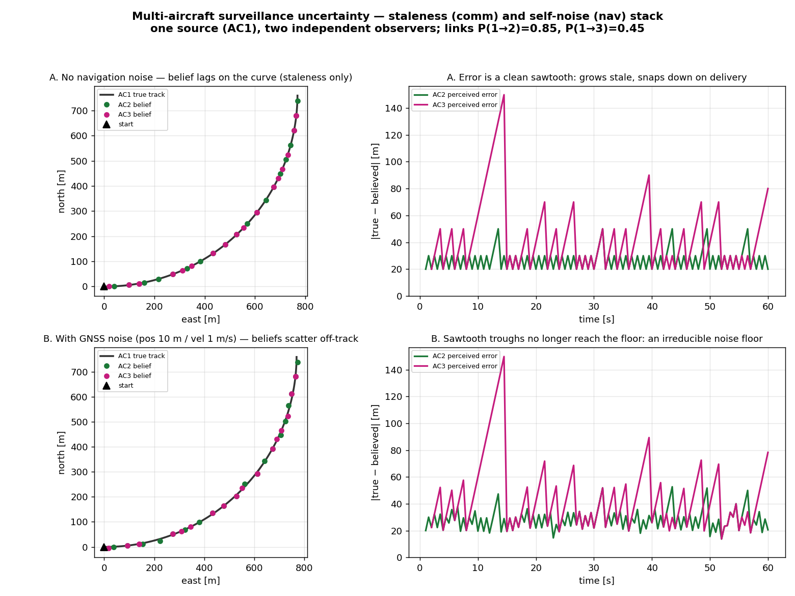

# Asymmetric perception at N: two observers of one aircraft hold different pictures

**Status: illustrative (motivates Phase 6f).** Everything through 6e gives every aircraft a
*perfect, shared* view of the fleet — `run_fleet` hands each decision the others' true states
directly. Phase 6f breaks that: perception runs over the *n(n−1)* directed comm links, so each
aircraft acts on its **own, stale, noisy** picture and no two aircraft agree. This note shows what
that uncertainty looks like *before* wiring it into `run_fleet`, by driving the real
[[surveillance-hold-as-is|LastKnown]] surveillance + `Comm` models (and optional GNSS navigation)
directly. One source **AC1** on a curving track is watched by two observers **AC2, AC3** over
independent links. Written 2026-07-25. Reproduce with

    PYTHONPATH=. python scripts/surveillance_asymmetric_demo.py

(AC1 at 20 m/s, heading sweeping 090→000 over 60 s; broadcast 1 s; constant link latency 0.8 s;
links P(1→2)=0.85, P(1→3)=0.45; GNSS pos 10 m / vel 1 m/s CI95 in the noisy row; `--seed` 7.)

## Two stacked, independent uncertainty sources

The perceived error `|true − believed|` decomposes into two effects that arrive from different
layers and behave differently:

- **Staleness (communication + surveillance).** Hold-as-is means an observer's belief is frozen at
  its last delivered message. Between deliveries the real aircraft flies on, so the error *grows* —
  the sawtooth's rising edge — then *snaps down* when a fresh message lands. The rising slope is the
  source's ground speed; the fall is a delivery. Dropped messages and the 0.8 s latency set how far
  the error climbs before the next reset.
- **Self-noise (navigation).** With GNSS noise every broadcast is itself a jittered self-measurement
  (`pos_ci95` / `vel_ci95`), so even a *just-delivered* message is already wrong by the sensor error.

Row **A** (top, no nav noise) is staleness alone: the error is a clean sawtooth whose troughs sit on
a flat floor (~20 m — the distance AC1 moves during one latency, plus turn curvature). Row **B**
(bottom, GNSS on) adds the second source: the **troughs no longer reach that floor** — they scatter,
dipping as low as ~14 m and jittering run-to-run, because each fresh fix carries an independent
position error. The tall stale spikes are barely changed (max ~150 m in both rows): during the turn,
staleness dominates and the 10 m self-noise is a small correction on top.

## The asymmetry: worse-informed vs disagreeing

Two distinct asymmetries, both of which the shared-perception `run_fleet` cannot produce:

- **Different reception → one observer is simply worse-informed.** AC3's link (P=0.45) drops more
  than half its messages, so its belief goes staler between updates: mean perceived error **~43 m vs
  AC2's ~27 m**, with spikes to ~150 m where AC2 peaks near ~50 m. Same aircraft, same sky, two
  very different qualities of picture.
- **Even equal reception → they still disagree.** At identical link probability the two observers
  *still* diverge, because each directed link is an independent draw and drops on different ticks —
  equal statistics, different realised picture (shown in the earlier 3-aircraft scratch run: mean
  ~32 m vs ~37 m at P=0.60 both). Perception is per-link, not per-fleet.

## Why this is the hard part of the multi-aircraft problem

Through 6e a symmetric ring is symmetric *because everyone sees the same thing* — that is exactly
the tie that traps the noiseless VO resolver ([[fleet-ipr-sweep]]). Under 6f that assumption is gone:
AC2 may be resolving against a 3-second-old AC1 while AC3 has lost the link entirely and is flying
nominal against it, all in the same instant. The [[multi-intruder-vo-vs-mvp|set-resolution]] and the
per-aircraft `FleetMemory` have to stay correct when each aircraft's *intruder set* is a different,
stale subset of the true fleet — no shared ground truth to lean on. This is where the any-pair-LoS
union of [[fleet-ipr-sweep]] is expected to erode faster still, and it is the reason 6f is the tail
of the phase rather than a quick wiring job.

## What this is and isn't

- **Is:** a faithful exercise of the *real* `Comm` / `LastKnown` / `GnssNavigation` models over
  three aircraft and their directed links — the same layers `run_encounter` already threads
  pairwise, shown at N with an explicit second observer.
- **Isn't:** a `run_fleet` result. No CDR, no resolution, no dynamics feedback — AC1 flies a scripted
  curve so the staleness is legible. The point is to *see the perception*, not to resolve a conflict.
  Wiring these links into `run_fleet` (and the N=2-reduces-to-`run_encounter` gate) is 6f itself.

## Relations

- Motivates the 6f rung of [[phase-6-plan]] (comm/surveillance at N); consumes the directed-link
  design of decision [[0006-communication-model-design]] and the directed perception of
  [[0004-layered-directed-design-for-multiaircraft-and-ips]].
- Sits on the perfect-perception baseline of [[fleet-ipr-sweep]] — the degradation this uncertainty
  adds is the observation 6f still owes; extends [[surveillance-hold-as-is]] from the pair to the fleet.
