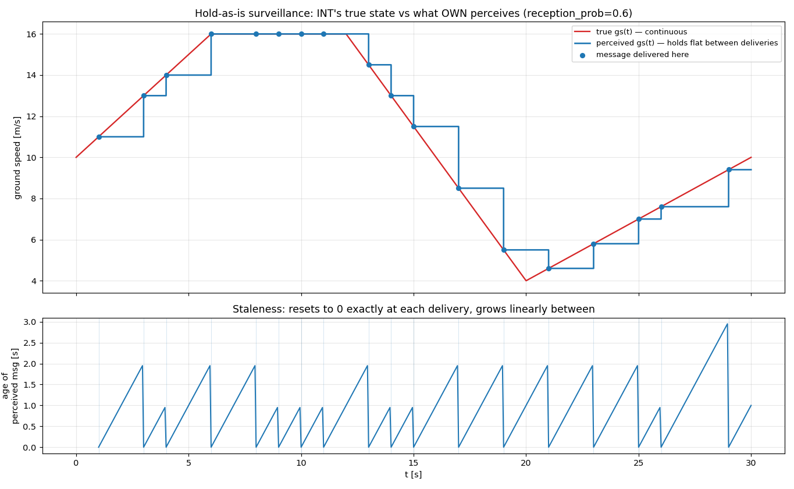

# Surveillance — hold-as-is, visually validated

**Status: validated.** `LastKnown.perceived` returns exactly the last delivered message,
unchanged, for as long as nothing new arrives — no dead-reckoning, no drift. Written 2026-07-20.

Implements [[0006-communication-model-design]] §2. Reproduce with
[`scripts/surveillance_demo.py`](../../scripts/surveillance_demo.py).

## Setup

One directed link, `INT → OWN`, `reception_prob = 0.6` (deliberately lossy — frequent, visible
drops) and **zero latency**, so the only effect on screen is reception, not delay. `INT`'s true
ground speed follows a hand-shaped profile (ramp up 10→16 m/s, hold, ramp down to 4 m/s, ramp back
up) sampled every 0.05 s — continuous and always moving, so a drop is unmistakable: perceived
simply fails to follow it.

## What it shows

**Top panel — truth vs perceived.** The red line (`true gs(t)`) is smooth and never flat. The blue
line (`perceived gs(t)`, a step function) sits on top of it only at the dots (actual deliveries);
everywhere else it is dead flat while truth keeps moving — e.g. `t = 6→8 s` and `t = 9→11 s`, both
multi-second runs where `OWN` believes `INT` is still doing 16 m/s while it has already started
decelerating. This is the property under test: **a drop leaves the perceived value exactly where
it was**, not interpolated, not decayed toward truth, not nudged at all.

**Bottom panel — staleness.** `age(state, "OWN", "INT", t)` is a sawtooth: it resets to **exactly
0.0000 s** at every delivery (confirmed numerically — `max age at delivery instants = 0.0000s`
over 18 deliveries) and grows linearly at `age = t − t_meas` until the next one. Taller teeth are
longer drop runs; the tallest here (~2.95 s, near `t = 29`) is a run of ~3 consecutive drops, and
it lines up exactly with the widest flat stretch in the top panel.

## Why this is the right thing to check

Two failure modes hold-as-is could plausibly have had, both ruled out here:

- **Drift or decay toward truth between deliveries** — would show as the blue step slowly bending
  toward red during a flat stretch. It doesn't: every flat segment is a perfectly horizontal line.
- **Age not resetting cleanly, or resetting early/late** — would show as a sawtooth that doesn't
  hit zero at the delivery dots. It hits `0.0000 s` at all 18, to floating-point precision.

18 deliveries out of 30 broadcasts (60%) also matches `reception_prob = 0.6` on a completely
separate run/seed from [[communication-reception-latency]] — an independent sanity check that the
comm layer and the surveillance layer built on top of it agree with each other.
