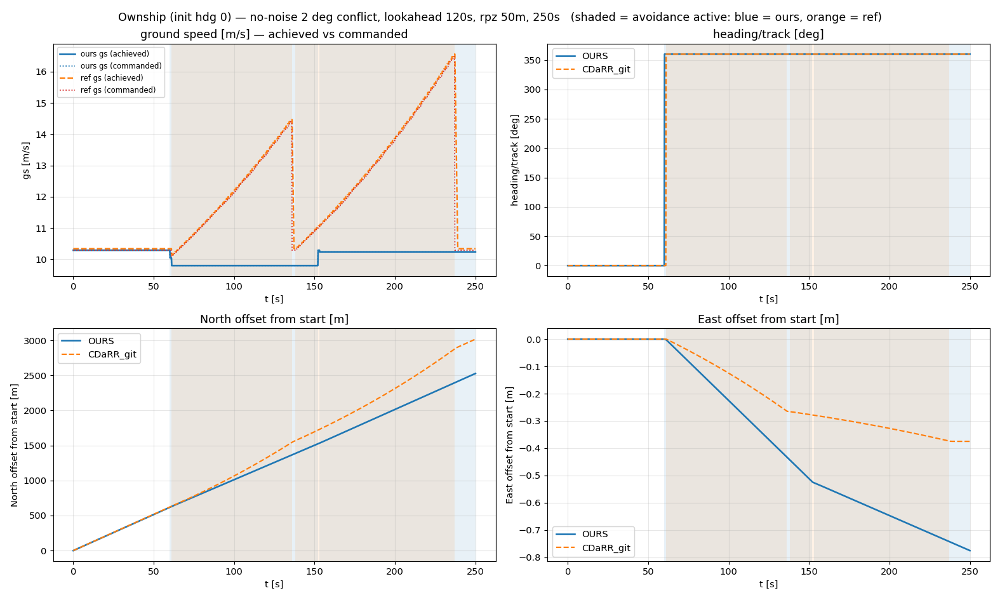
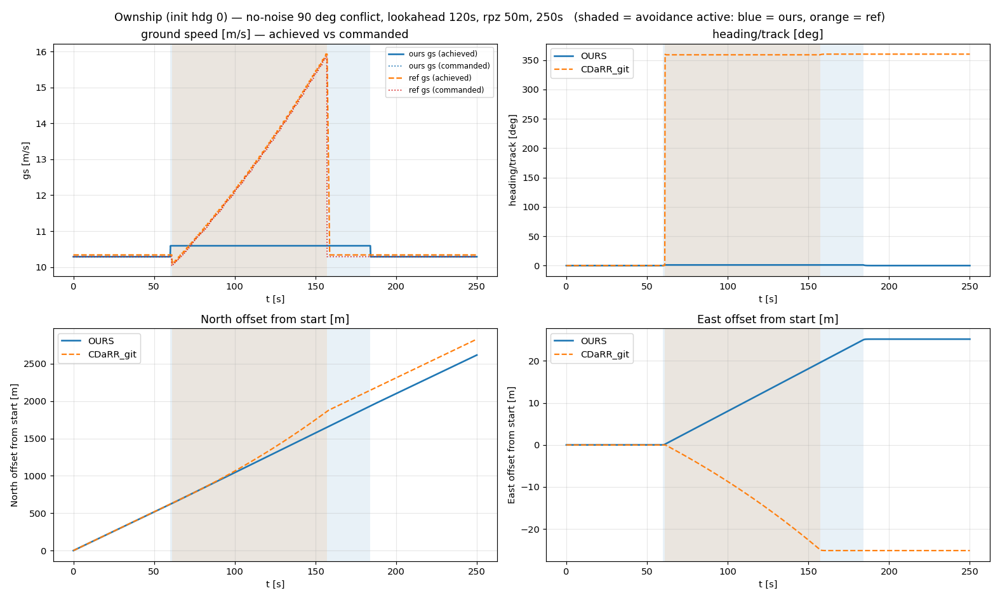

# Trajectory-level comparison — OpenCDaRR vs BlueSky (CDaRR_git)

**Status: reference cross-check. OpenCDaRR reproduces the reference's deterministic maneuver; the only divergence is in the ground-speed channel (a BlueSky ground-speed drift), flagged for later inspection.** Written 2026-07-20, closing the near-parallel-IPR investigation ([[near-parallel-ipr-inversion]]).

My honest saying, maybe the previous version of CDaRR was wrong. I don't see why the ground speed has to drift that much in a deterministic setup.

## What this is

A single **no-noise** conflict pair run in *both* stacks, recording the **ownship** (init hdg 0)
over 250 s, for two crossing angles. Because there is no measurement noise, the two simulators
should produce the *same* trajectory if their detection, resolution, recovery, and flight dynamics
agree — so any divergence is a pure implementation difference, not a noise artifact.

Scenario: ownship north at 10.2889 m/s, `dcpa = 0`, `rpz = 50 m`, `lookahead = 120 s`,
`tlos = 180 s`, `margin = 1.05`. Shaded spans = avoidance active (blue = ours, orange = reference).

Generated by [`scripts/trajectory_comparison/`](../../scripts/trajectory_comparison/) — see its
README to reproduce (`run_ours.py`, `run_reference.py`, `plot.py`).

## 2° crossing

## 90° crossing

## What the plots show

- **Heading / track: identical.** Both hold ~0°, make the same small turn at conflict onset, and
  revert. (Turn kinematics were separately verified bit-for-bit, `|Δtrack| = 0.000°`.)
- **Position: matches** while speeds match; the ownships build a comparable lateral offset and
  clear (opposite *sides* at exactly `dcpa = 0` is the head-on-guard degeneracy — measure-zero in
  sampling, no IPR effect).
- **Ground speed: differs — this is the one real divergence.** The reference's ground speed
  **drifts/ramps** up strongly during avoidance (e.g. 90°: 10.3 → 16 m/s), while ours stays near
  nominal. The **commanded** ground speed (dotted) tracks the achieved value in the reference, so
  the ramp is not a plotting artifact.

## The ground-speed drift (why the trajectories differ)

The divergence lives entirely in the **speed channel**. Two effects stack there, both from
BlueSky's ground-speed handling, and our pure-ground-speed `step_dynamics` reproduces neither:

1. A **large commanded-speed ramp** — the reference's MVP drives a big acceleration during
   near-parallel/crossing resolution (commanded gs 10 → 16 m/s), where ours resolves almost
   entirely by heading.
2. A **small CAS/TAS offset** — `SPD` is a *calibrated* airspeed; the aircraft flies *true*
   airspeed ≈ `CAS × 1.005` at 100 m, so achieved gs sits ~0.4 % above commanded and drifts with
   the atmosphere model (measured ratio 1.0039 vs the 1.0048 expected).

**This BlueSky ground-speed drift is the remaining source of the trajectory (and hence the
near-parallel IPR) difference. It is flagged for later inspection** (ADR
[0005](../decisions/0005-trajectory-validated-against-bluesky.md)); it does not block Phase 3,
because everything else — detection, MVP command, turn dynamics, recovery logic — is verified
equivalent, and in the deterministic case both simulators keep the pair separated.
