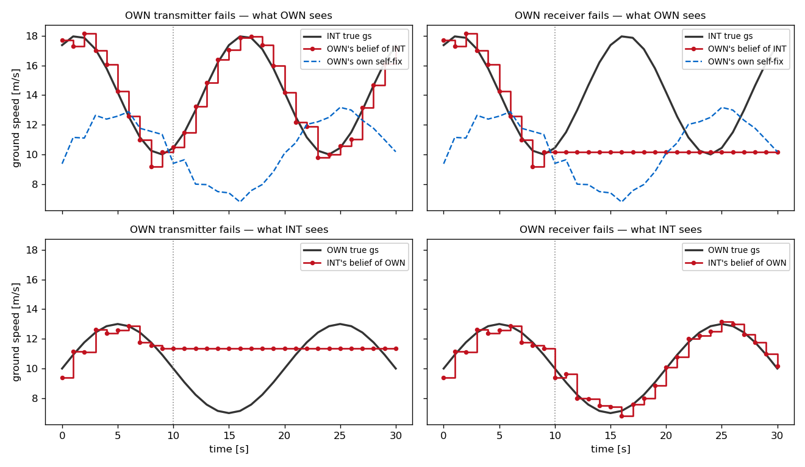
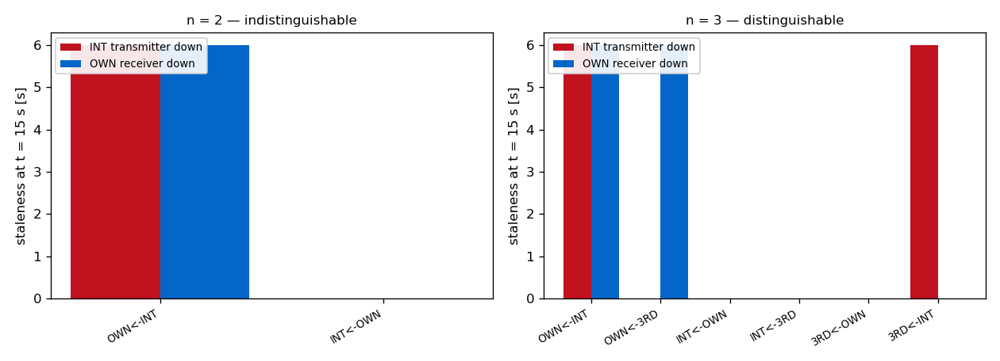

# A failed transmitter and a failed receiver are mirror images — and a pair cannot tell them apart

**Status: illustrative.** [[0006-communication-model-design|`TransceiverComm`]] splits the radio in
two because a transmitter and a receiver are separate hardware that fail independently, and the
docstring claims the two failures do opposite things: a silent aircraft still sees everyone, a deaf
one is still seen by everyone. This note measures that claim on the real stack
(`GnssNavigation` → `TransceiverComm` → [[surveillance-hold-as-is|`LastKnown`]]) and turns up a
second result that was not the question: at **n = 2 the two failures are not distinguishable at
all**. Written 2026-07-30. Reproduce with

    PYTHONPATH=. python scripts/transceiver_outage_demo.py

(two aircraft, broadcast 1 s, reception 1.0 so nothing is lost but the outage, GNSS pos 10 m /
vel 0.8 m/s CI95, both ground speeds sinusoidal so a frozen belief diverges visibly, radio down at
t = 10 s and never recovering; all four hazard rates are 0 and the outage is written onto the
`RadioState` directly, so the failure lands on the named tick rather than on a lucky draw — the
trick the gate tests in `tests/test_cns_transceiver.py` already use.)

## The two failures corrupt opposite halves of the picture

Ground speed at t = 30 s, twenty seconds into the outage:

| OWN's radio | OWN's belief of INT | INT's belief of OWN | OWN's own fix |
|---|---|---|---|
| **transmitter down** | 17.23 vs 17.37 true (−0.14) — tracking | 11.35 vs 10.00 true (**+1.35**) — frozen | 10.19 — intact |
| **receiver down** | 10.15 vs 17.37 true (**−7.21**) — frozen | 10.19 vs 10.00 true (+0.19) — tracking | 10.19 — intact |

- **Transmitter down: silent, not blind.** OWN's own picture of INT keeps updating — top-left, the
  red staircase still rides the black truth. What breaks is *everyone else's* picture of OWN, frozen
  at the last message it managed to send (11.35 m/s) while OWN really decelerates to 10.0 and swings
  back. The failed aircraft has no symptom to notice.
- **Receiver down: blind, not silent.** OWN's belief of INT freezes at 10.15 m/s while INT actually
  climbs to 17.9 and back — a **−7.2 m/s, 42 % error** by t = 30, the flat red line under the black
  sine in the top-right. INT meanwhile still sees OWN perfectly.

The residual errors in the two *tracking* cells (−0.14, +0.19) are not staleness: they are one
broadcast interval of zero-order hold plus the GNSS velocity noise, which is what the link looks
like when it is working.

**The self-fix survives both.** OWN reads its own ground speed as 10.19 m/s in either case, because
an aircraft's own measurement never goes over the air — [[0004-layered-directed-design-for-multiaircraft-and-ips|the
directed design]] routes only *other* aircraft through the comm layer. So a radio failure degrades
what you know about others and what others know about you, never what you know about yourself. For
a DAA study that is the asymmetry that matters: the ownship's own state stays trustworthy exactly
when its traffic picture stops being.

## A pairwise encounter cannot see which radio failed

Ask the neighbouring question — *whose* radio broke — and n = 2 has no answer. "INT's transmitter
died" and "OWN's receiver died" sever the **same single directed link** OWN←INT, and produce a
bit-identical `CommState`. The left panel is two bars on one link with nothing to separate them.

At n = 3 they come apart, because each failure severs a different *pair* of links: INT's transmitter
going down stales OWN←INT and 3RD←INT (everyone loses INT), while OWN's receiver going down stales
OWN←INT and OWN←3RD (OWN loses everyone). They overlap on OWN←INT — precisely the one link a pair
can see — and disagree everywhere else.

The consequence is an experimental-design one. A study that sweeps `tx_fail_rate` against
`rx_fail_rate` on a **pairwise** encounter is sweeping one parameter twice: the two rates enter
through the same severed link and the IPR cannot resolve them. Distinguishing transmitter from
receiver reliability needs n ≥ 3, and [[fleet-lossy-ipr|the fleet runner]] is where to do it.

## What this is and isn't

- **Is:** the shipped `TransceiverComm` / `LastKnown` / `GnssNavigation` models driven through
  `CNS.sense`, the same call `run_fleet` makes, with the outage scripted so the picture is
  deterministic.
- **Isn't:** a run with CDR in the loop. No detector, no resolver, no dynamics feedback — both
  aircraft fly scripted speed profiles so the staleness is legible. What an outage costs in *IPR*
  is a separate measurement, and per the warning in [[important-ips-gap]] it has to be plain MC:
  radio failure is a discrete jump `min_sep` carries no information about, so IPS shells cannot
  steer toward it.
- **Isn't:** evidence about intermittent radios. Both recover rates are 0 here, so the failure
  latches for the rest of the run — the pessimistic case, and the one worth seeing first.

## Relations

- Measures the gate semantics specified in [[0006-communication-model-design]]; the staleness it
  leaves behind is [[surveillance-hold-as-is]] doing zero-order hold with no dead reckoning.
- The n ≥ 3 half is the outage analogue of [[surveillance-asymmetric-perception]] — same lesson,
  that perception is per directed link and not per fleet, reached from the failure side.
- Distinct from the per-message loss of [[communication-reception-latency]]: `reception_prob` redraws
  every tick and has no memory, so it cannot express a radio that is *out* for a stretch of time.
  That difference is why an outage is not the same experiment as `reception_prob = 0`.
- The range- and time-dependence an outage does *not* model is filed as
  [[time-varying-reception-probability]].
