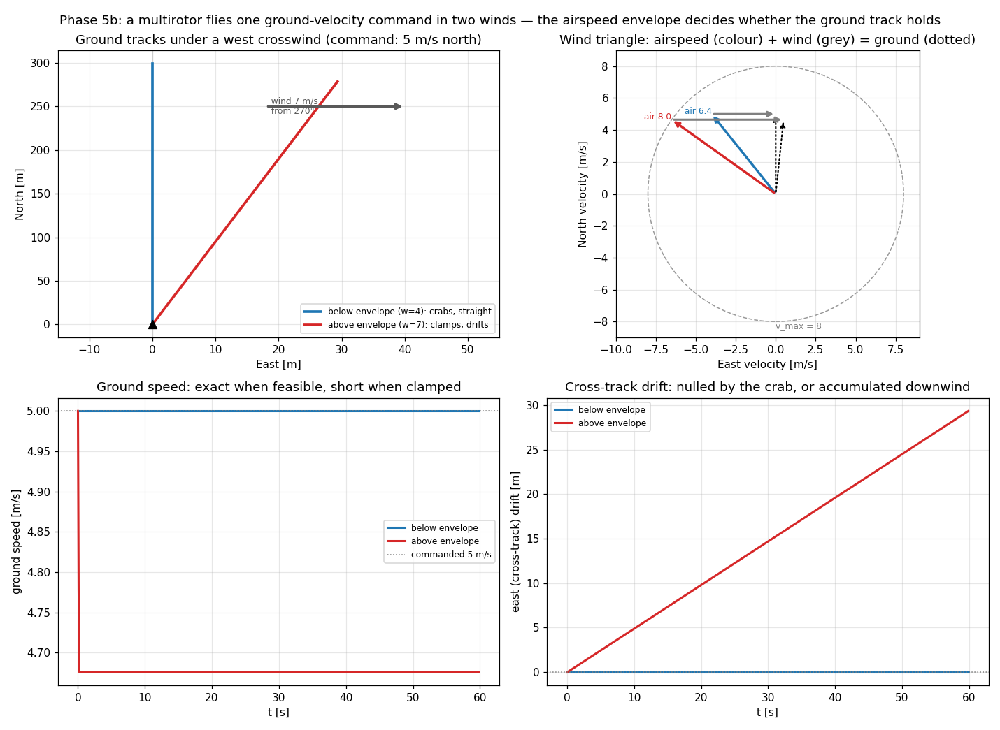
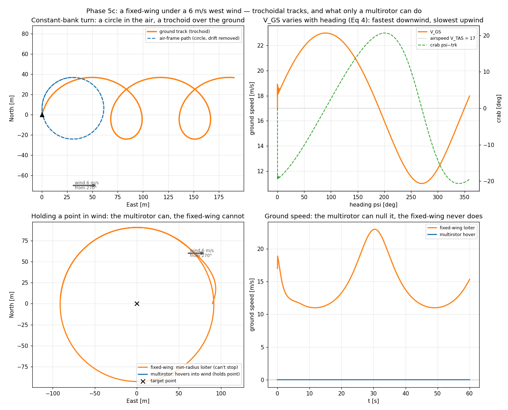

# Wind: multirotor vs fixed-wing

**Status: validated (Phase 5b/5c gate green).** The qualitative payoff of the wind model — how the
*same* steady wind reshapes each airframe's motion, before the quantitative IPR-under-wind sweep
(5d). Joins [[controlling-dubins-vs-holonomic]] and [[mixed-fleet-dubins-holonomic]] as the
airframe-contrast series, now with the physical effect being *wind* rather than the turn model.
Written 2026-07-24. Reproduce with
[`scripts/wind_multirotor_demo.py`](../../scripts/wind_multirotor_demo.py) and
[`scripts/wind_fixedwing_demo.py`](../../scripts/wind_fixedwing_demo.py).

The one relation both airframes obey is the Eq-9 vector sum — **ground velocity = airspeed vector +
wind**. What differs is *which* quantity each airframe controls and limits, and the wind makes that
difference visible.

## Multirotor: the envelope is on airspeed, so a ground command holds until it can't

`target_velocity` is a **ground** velocity, but `v_max`/`ax` limit the **airspeed** (ADR 0016 /
decision 4). A small multirotor (`v_max = 8`) commanded 5 m/s north in a west crosswind:

- **Below the envelope** (`w = 4`, required airspeed `√41 ≈ 6.4 ≤ 8`): it **crabs** into the wind
  and the ground track stays exactly north — the command is met to the metre, wind invisible in the
  track. The wind triangle (top-right) shows the airspeed vector *inside* the `v_max` circle.
- **Above the envelope** (`w = 7`, required airspeed `√74 ≈ 8.6 > 8`): the airspeed **clamps on the
  `v_max` circle**, the drift can't be fully cancelled, and the ground track **bows downwind** —
  ground speed 4.68 instead of 5, cross-track drift accumulating linearly. Not silently obeyed: the
  shortfall is what the state reports.

The crossover is a clean `√(5² + w²) ≤ v_max` — below it the multirotor is wind-blind, above it it
degrades gracefully.

## Fixed-wing: constant airspeed, so a turn is a trochoid and it can never stop

The fixed-wing flies its **airspeed** at a bank-limited heading; the wind is added on top (the Eq-9
term, wired since 5a). A constant-bank turn is therefore a **circle in the air frame** and a
**trochoid over the ground**:

- **Circle in air, trochoid over ground** (top-left): removing the steady drift `wind × t` collapses
  the looping ground track onto a clean closed circle — one revolution's net ground displacement is
  exactly `wind × turn-period` (the paper's Fig. 4; pinned analytically in `test_fixedwing_wind.py`).
- **Ground speed varies with heading** (top-right): `V_GS` sweeps `11 → 23 m/s = V_TAS ± V_WS`
  (17 ± 6) — fastest downwind, slowest upwind (Eq 4) — and the airframe crabs `± ~20°` to make good a
  ground course (Eq 3). This is why a fixed-wing feels wind the multirotor with a slack envelope does
  not: its speed over the ground is *never* constant.
- **Holding a point** (bottom): the sharpest difference. A multirotor commanded zero ground velocity
  **hovers into wind** — ground speed nulled to `0.000`, it stays on the target. A fixed-wing
  **cannot stop** (`V_TAS ≥ v_stall`), so the best it can do is a **min-radius loiter**, perpetually
  circling with its ground speed oscillating `11–23 m/s` and never reaching zero.

## Why this is the right thing to check

- **Both airframes share one wind relation, and it's analytically validated, not eyeballed.** The
  Eq-4 ground speed and Eq-3 crab match independent closed forms; the trochoid's net drift matches
  `wind × period` (the [[0002-analytical-validation-of-dynamics]] discipline).
- **`V_WS = 0` reproduces Phase 4 byte-for-byte.** Wind is inert until a non-zero field is supplied
  (the 5a gate); the MVP/VO anchors never moved, and both airframes' `NO_WIND` steps are pinned equal
  to omitting the argument.
- **CD/CR/CRR are untouched.** They read the wind-blown *ground* track (`velocity_enu`), which is
  exactly the threat geometry a resolver should see — the reason the IPR-under-wind sweep (5d) is a
  one-argument change to `run_encounter`.

## What this still doesn't cover

Steady, uniform wind only — gusts, shear, turbulence, and any spatial/temporal field are deferred
(the `WindField` type is the seam, decision 2), matching the paper's own §3.1 future-work boundary.
The unachievable-course case (`|(V_WS/V_TAS)·sin(θ_wa − χ)| > 1`, downwind-dominated) steers the
closest achievable course; a resolver demanding a ground velocity outside the airspeed envelope
clamps and drifts (reported, not flagged as an infeasibility signal). The quantitative
**IPR-under-wind** result is the next rung ([[phase-5-plan|5d]]).
